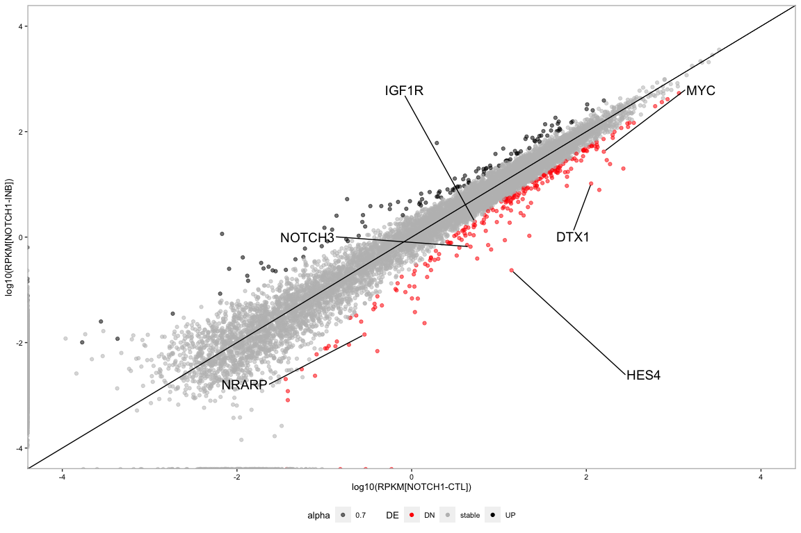

## Number of superenhancer 


```r
#
df = data.frame("NOTCH1-CTL" = 612, "NOTCH1-INB" = 456, "RUNX1-CTL" = 332, "RUNX1-KD" = 180) %>% melt()
ggplot(df, aes(variable, value)) +
  geom_col() +
  xlab("") +
  ylab("Number of superenhancer") +
  theme_linedraw()
```

<!-- -->


## Differential regions for all marks


```r
#ac
x = read.table("../Data/Scatter_DE/KOPTK1_RUNX1-On-Off_H3K27ac.numReads")
h3k27ac = tibble(Width = x$V3-x$V2,  FC = (x$V4/61148753)/(x$V5/68715022), Mark = "H3K27ac", Cell = "RUNX1-KD") %>%
    filter(Width >= 400)

x = read.table("../Data/Scatter_DE/KOPTK1_RUNX1-On-Off_H3K4me1.numReads")
h3k4me1 = tibble(Width = x$V3-x$V2,  FC = (x$V4/45490827)/(x$V5/56524982), Mark = "H3K4me1", Cell = "RUNX1-KD") %>%
    filter(Width >= 400)

x = read.table("../Data/Scatter_DE/KOPTK1_RUNX1-On-Off_H3K4me3.numReads")
h3k4me3 = tibble(Width = x$V3-x$V2,  FC = (x$V4/32663162)/(x$V5/35120313), Mark = "H3K4me3", Cell = "RUNX1-KD") %>%
    filter(Width >= 400)

x = read.table("../Data/Scatter_DE/KOPTK1_RUNX1-On-Off_H3K27me3.numReads")
h3k27me3 = tibble(Width = x$V3-x$V2,  FC = (x$V4/61249493)/(x$V5/87788899), Mark = "H3K27me3", Cell = "RUNX1-KD") %>%
    filter(Width >= 400)

x = read.table("../Data/Scatter_DE/KOPTK1_RUNX1-On-Off_H3K36me3.numReads")
h3k36me3 = tibble(Width = x$V3-x$V2,  FC = (x$V4/60987506)/(x$V5/42573520), Mark = "H3K36me3", Cell = "RUNX1-KD") %>%
    filter(Width >= 400)

x = read.table("../Data/Scatter_DE/KOPTK1_RUNX1-On-Off_H3K9me3.numReads")
h3k9me3 = tibble(Width = x$V3-x$V2,  FC = (x$V4/51937264)/(x$V5/58605730), Mark = "H3K9me3", Cell = "RUNX1-KD") %>%
    filter(Width >= 400)

runx1 = rbind(h3k27ac, h3k4me1, h3k4me3 ,h3k36me3, h3k27me3, h3k9me3) %>%
    mutate(DE = ifelse(FC >= 2, "Loss", ifelse(FC <= 0.5, "Gain", "Stable")))

runx1$DE = factor(runx1$DE, levels = c("Loss", "Stable", "Gain"))
runx1$Mark = factor(runx1$Mark, levels = c("H3K27ac", "H3K4me1", "H3K4me3" ,"H3K36me3", "H3K27me3", "H3K9me3"))

#notch1
x = read.table("../Data/Scatter_DE/KOPTK1_NOTCH1-On-Off_H3K27ac.numReads")
h3k27ac = tibble(Width = x$V3-x$V2,  FC = (x$V4/48017639)/(x$V5/59238945), Mark = "H3K27ac", Cell = "NOTCH1-KD") %>%
    filter(Width >= 400)

x = read.table("../Data/Scatter_DE/KOPTK1_NOTCH1-On-Off_H3K4me1.numReads")
h3k4me1 = tibble(Width = x$V3-x$V2,  FC = (x$V4/57236029)/(x$V5/62007100), Mark = "H3K4me1", Cell = "NOTCH1-KD") %>%
    filter(Width >= 400)

x = read.table("../Data/Scatter_DE/KOPTK1_NOTCH1-On-Off_H3K4me3.numReads")
h3k4me3 = tibble(Width = x$V3-x$V2,  FC = (x$V4/45935803)/(x$V5/52821680), Mark = "H3K4me3", Cell = "NOTCH1-KD") %>%
    filter(Width >= 400)

x = read.table("../Data/Scatter_DE/KOPTK1_NOTCH1-On-Off_H3K27me3.numReads")
h3k27me3 = tibble(Width = x$V3-x$V2,  FC = (x$V4/47291388)/(x$V5/29095309), Mark = "H3K27me3", Cell = "NOTCH1-KD") %>%
    filter(Width >= 400)

x = read.table("../Data/Scatter_DE/KOPTK1_NOTCH1-On-Off_H3K36me3.numReads")
h3k36me3 = tibble(Width = x$V3-x$V2,  FC = (x$V4/54316676)/(x$V5/42176769), Mark = "H3K36me3", Cell = "NOTCH1-KD") %>%
    filter(Width >= 400)

x = read.table("../Data/Scatter_DE/KOPTK1_NOTCH1-On-Off_H3K9me3.numReads")
h3k9me3 = tibble(Width = x$V3-x$V2,  FC = (x$V4/57270772)/(x$V5/52553902), Mark = "H3K9me3", Cell = "NOTCH1-KD") %>%
    filter(Width >= 400)

notch1 = rbind(h3k27ac, h3k4me1, h3k4me3 ,h3k36me3, h3k27me3, h3k9me3) %>%
    mutate(DE = ifelse(FC >= 2, "Loss", ifelse(FC <= 0.5, "Gain", "Stable")))

notch1$DE = factor(notch1$DE, levels = c("Loss", "Stable", "Gain"))
notch1$Mark = factor(notch1$Mark, levels = c("H3K27ac", "H3K4me1", "H3K4me3" ,"H3K36me3", "H3K27me3", "H3K9me3"))


#print summary
runx1 %>%
  group_by(Mark, DE) %>%
  summarize(n = n()) %>%
  mutate(freq = n / sum(n)) 
```

```
## # A tibble: 18 x 4
## # Groups:   Mark [6]
##    Mark     DE          n   freq
##    <fct>    <fct>   <int>  <dbl>
##  1 H3K27ac  Loss    30718 0.501 
##  2 H3K27ac  Stable  23193 0.378 
##  3 H3K27ac  Gain     7382 0.120 
##  4 H3K4me1  Loss    19415 0.137 
##  5 H3K4me1  Stable 110630 0.783 
##  6 H3K4me1  Gain    11290 0.0799
##  7 H3K4me3  Loss     6487 0.312 
##  8 H3K4me3  Stable  11381 0.547 
##  9 H3K4me3  Gain     2937 0.141 
## 10 H3K36me3 Loss    15051 0.0913
## 11 H3K36me3 Stable 135087 0.820 
## 12 H3K36me3 Gain    14649 0.0889
## 13 H3K27me3 Loss    29662 0.192 
## 14 H3K27me3 Stable  91656 0.593 
## 15 H3K27me3 Gain    33255 0.215 
## 16 H3K9me3  Loss    25177 0.153 
## 17 H3K9me3  Stable 115671 0.705 
## 18 H3K9me3  Gain    23285 0.142
```

```r
r = runx1 %>%
  group_by(Mark, DE) %>%
  summarize(n = n()) %>%
  mutate(freq = n / sum(n))  %>%
  mutate(Cell = rep("RUNX1-KD", 3))

##print summary

#number of marged peaks

#number of marged peaks
runx1 %>%
  group_by(Mark) %>%
  summarize(n = n())
```

```
## # A tibble: 6 x 2
##   Mark          n
##   <fct>     <int>
## 1 H3K27ac   61293
## 2 H3K4me1  141335
## 3 H3K4me3   20805
## 4 H3K36me3 164787
## 5 H3K27me3 154573
## 6 H3K9me3  164133
```

```r
notch1 %>%
  group_by(Mark) %>%
  summarize(n = n())
```

```
## # A tibble: 6 x 2
##   Mark          n
##   <fct>     <int>
## 1 H3K27ac   75318
## 2 H3K4me1  129105
## 3 H3K4me3   21848
## 4 H3K36me3 163631
## 5 H3K27me3 204438
## 6 H3K9me3  171366
```

```r
#number of peaks by mark
notch1 %>%
  group_by(Mark, DE) %>%
  summarize(n = n()) %>%
  mutate(freq = n / sum(n)) 
```

```
## # A tibble: 18 x 4
## # Groups:   Mark [6]
##    Mark     DE          n   freq
##    <fct>    <fct>   <int>  <dbl>
##  1 H3K27ac  Loss    12716 0.169 
##  2 H3K27ac  Stable  56458 0.750 
##  3 H3K27ac  Gain     6144 0.0816
##  4 H3K4me1  Loss    13444 0.104 
##  5 H3K4me1  Stable 110295 0.854 
##  6 H3K4me1  Gain     5366 0.0416
##  7 H3K4me3  Loss      632 0.0289
##  8 H3K4me3  Stable  20974 0.960 
##  9 H3K4me3  Gain      242 0.0111
## 10 H3K36me3 Loss    22357 0.137 
## 11 H3K36me3 Stable 133887 0.818 
## 12 H3K36me3 Gain     7387 0.0451
## 13 H3K27me3 Loss    78397 0.383 
## 14 H3K27me3 Stable  73888 0.361 
## 15 H3K27me3 Gain    52153 0.255 
## 16 H3K9me3  Loss    22406 0.131 
## 17 H3K9me3  Stable 119892 0.700 
## 18 H3K9me3  Gain    29068 0.170
```

```r
n = notch1 %>%
  group_by(Mark, DE) %>%
  summarize(n = n()) %>%
  mutate(freq = n / sum(n)) %>%
  mutate(Cell = rep("NOTCH1-KD", 3))

#
rbind( n, r ) %>%
  ggplot(aes(DE, freq)) +
  geom_bar(stat = "identity") +
  facet_grid(Cell~Mark, scales="free") 
```

<!-- -->

```r
##############
####write DE bed files
#sh58
x = read.table("../Data/Scatter_DE/KOPTK1_RUNX1-On-Off_H3K27ac.numReads")
h3k27ac = tibble(x, Width = x$V3-x$V2,  FC = (x$V4/61148753)/(x$V5/68715022)) %>%
    filter(Width >= 400)
dn = h3k27ac %>% filter(FC >= 2)
up = h3k27ac %>% filter(FC <= .5)
st = h3k27ac %>% filter(FC >= .5 & FC <=2) 

write.table(dn, "../Data/Scatter_DE/loss_h3k27ac.bed", quote = F, col.names = F, row.names = F)
write.table(up, "../Data/Scatter_DE/gain_h3k27ac.bed", quote = F, col.names = F, row.names = F)
write.table(st, "../Data/Scatter_DE/stable_h3k27ac.bed", quote = F, col.names = F, row.names = F)

#sh59
x = read.table("../Data/Scatter_DE/KOPTK1_RUNX1-Off2_H3K27ac_merged_H3K27ac.numreads")
h3k27ac = tibble(x, Width = x$V3-x$V2,  FC = (x$V4/61148753)/(x$V5/61815667)) %>%
    filter(Width >= 400)
dn = h3k27ac %>% filter(FC >= 2)
up = h3k27ac %>% filter(FC <= .5)
st = h3k27ac %>% filter(FC >= .5 & FC <=2) 

write.table(dn, "../Data/Scatter_DE/shRUNX1-59_loss_h3k27ac.bed", quote = F, col.names = F, row.names = F)
write.table(up, "../Data/Scatter_DE/shRUNX1-59_gain_h3k27ac.bed", quote = F, col.names = F, row.names = F)
write.table(st, "../Data/Scatter_DE/shRUNX1-59_stable_h3k27ac.bed", quote = F, col.names = F, row.names = F)

#cutll1
x = read.table("../Data/Scatter_DE/CUTLL1_RUNX1-On-Off_H3K27ac.numreads")
h3k27ac = tibble(x, Width = x$V3-x$V2,  FC = (x$V4/55290155)/(x$V5/49955013)) %>%
    filter(Width >= 400)
dn = h3k27ac %>% filter(FC >= 2)
up = h3k27ac %>% filter(FC <= .5)
st = h3k27ac %>% filter(FC >= .5 & FC <=2) 

write.table(dn, "../Data/Scatter_DE/cutll1_loss_h3k27ac.bed", quote = F, col.names = F, row.names = F)
write.table(up, "../Data/Scatter_DE/cutll1_gain_h3k27ac.bed", quote = F, col.names = F, row.names = F)
write.table(st, "../Data/Scatter_DE/cutll1_stable_h3k27ac.bed", quote = F, col.names = F, row.names = F)

#notch1-inb h3k27me3
x = read.table("../Data/Scatter_DE/KOPTK1_NOTCH1-On-Off_H3K27me3.numReads")
h3k27me3 = tibble(x, Width = x$V3-x$V2,  FC = (x$V4/47291388)/(x$V5/29095309)) %>%
    filter(Width >= 400)

dn = h3k27me3 %>% filter(FC >= 2)
up = h3k27me3 %>% filter(FC <= .5)
st = h3k27me3 %>% filter(FC >= .5 & FC <=2) 

write.table(dn, "../Data/Scatter_DE/koptk1_notch1-inb_loss_h3k27me3.bed", quote = F, col.names = F, row.names = F)
write.table(up, "../Data/Scatter_DE/koptk1_notch1-inb_gain_h3k27me3.bed", quote = F, col.names = F, row.names = F)
write.table(st, "../Data/Scatter_DE/koptk1_notch1-inb_stable_h3k27me3.bed", quote = F, col.names = F, row.names = F)

#
dn = h3k27me3 %>% filter(FC >= 2) %>% mutate(DE = rep("Loss", 78397)) %>% select(Width, DE)
up = h3k27me3 %>% filter(FC <= .5) %>% mutate(DE = rep("Gain", 52153)) %>% select(Width, DE)
st = h3k27me3 %>% filter(FC >= .5 & FC <=2) %>% mutate(DE = rep("Stable", 73888)) %>% select(Width, DE)

rbind(dn, up, st) %>%
    ggplot(aes(DE, log10(Width))) +
    ylim(2.5,3.5) +
    xlab("") +
    geom_boxplot() +
    theme_bw()
```

<!-- -->

```r
##############
#scatter sh59 and cutll1
#sh59
x = read.table("../Data/Scatter_DE/CUTLL1_RUNX1-On-Off_H3K27ac.numreads")
x2 = tibble(Width = x$V3-x$V2,  FC = (x$V4/61148753)/(x$V5/61815667), Mark = "H3K27ac", Cell = "KOPTK1 (shRUNX1-59)") %>%
    filter(Width >= 400)

#cutll1
x = read.table("../Data/Scatter_DE/CUTLL1_RUNX1-On-Off_H3K27ac.numreads")
y2 = tibble(Width = x$V3-x$V2,  FC = (x$V4/55290155)/(x$V5/49955013), Mark = "H3K27ac", Cell = "CUTLL1 (shRUNX1-90)") %>%
    filter(Width >= 400)

bx = rbind(x2, y2)

bx2 = bx %>% mutate(DE = ifelse(FC >= 2, "DN", ifelse(FC <= 0.5, "UP", "Stable"))) %>% filter(DE == "UP" | DE == "DN" | DE == "Stable")
bx2$DE = factor(bx2$DE, levels = c("DN", "Stable", "UP"))


#make new scatter plot
ggplot(bx2, aes(x = log10(Width), y = -log10(FC),colour = DE)) +
    geom_point(alpha = .5, size = .5, shape = 1) + 
    scale_color_manual(values = c('#FF0000', '#bdbdbd', '#000000')) + 
    facet_grid(Mark~Cell) +
    xlab("log10(Peak width)") + 
    ylab("log10(RUNX1-CTL / RUNX1-KD)") +
    geom_hline(yintercept = log10(2)) +
    geom_hline(yintercept = log10(0.5)) + 
        geom_hline(yintercept = 0, color='gray') + 
    xlim(2.6, 4.5) +  #width <400 was removed
    ylim(-1.5, 1.5) +
    theme(panel.background = element_rect(fill = "white"),
        panel.border = element_rect(fill = NA, colour = "gray", size = 1),
        strip.text = element_text(face = "bold", size = 12),
        strip.background =element_rect(fill="white"),
        text = element_text(size=12, face = "bold"),
        axis.text = element_text(color = "black")) +
    theme(legend.position="none")
```

<!-- -->

## profile for de peaks


```r
x = read.table("../Data/Scatter_DE/DE_h3k27ac.profile.colMean.all.55_lib", head = T)[1:500,]
colnames(x) = c("Gain", "Loss", "Stable")

ks.test(x$Stable, x$Gain)$p.value
```

```
## [1] 0
```

```r
ks.test(x$Loss, x$Gain)$p.value
```

```
## [1] 0
```

```r
ks.test(x$Stable, x$Gain)$p.value
```

```
## [1] 0
```

```r
t = x[1,]
x2 = (t(x)/as.numeric(t))
x3 = data.frame(t(x2))
k.ac = x3
k.ac2 = data.frame(k.ac, x = c((-250:-1)*20,(1:250)*20))
k.ac3 = melt(k.ac2, id.vars = "x")

#k.ac5$X1 <- factor(k.ac5$X1, levels = c("KOPTK1", "Jurkat" ))

k.ac3 %>% 
    ggplot(aes(x, value, color = variable)) +
    geom_line(size = 1) +
     xlab("") +
    ylab("RUNX1 coverage") +
    scale_color_manual(values = c('black', 'red', '#bdbdbd')) +
    theme(panel.background = element_rect(fill = "white"),
        panel.border = element_rect(fill = NA, colour = "gray", size = 1),
        strip.text = element_text(size = 10),
        strip.background =element_rect(fill="white"),
        text = element_text(size=10),
        axis.text = element_text(color = "black"),
        legend.position = "none") 
```

<!-- -->

```r
#    theme(axis.text = element_text(color = "black", angle = 00, hjust = 1))

ggsave("../Paper_submission/Illustrator/Plots/RUNX1-cov.pdf", width = 6, height = 6, units = "cm")
```

## H3K27ac peak width distribution


```r
x = read.table("../Data/KOPTK1_RUNX1-On_H3K27ac_peakCenter_tss_dist.bed")[,c(5, 13)]
x2 = data.frame(x, Cell = rep("RUNX1-CTL", nrow(x)))
y = read.table("../Data/KOPTK1_RUNX1-Off_H3K27ac_peakCenter_tss_dist.bed")[,c(5, 13)]
y2 = data.frame(y, Cell = rep("RUNX1-KD", nrow(y)))

xy = rbind(x2,y2)

ggplot(xy, aes(Cell, log10(V5))) +
    geom_boxplot() +
    ylim(2.5,4) +
    xlab("") +
    ylab("log10(Peak width)") +
     theme(panel.background = element_rect(fill = "white"),
        panel.border = element_rect(fill = NA, colour = "gray", size = 1),
        strip.text = element_text(face = "bold", size = 15),
        strip.background =element_rect(fill="white"),
        text = element_text(size=15, face = "bold"),
        axis.text = element_text(color = "black"))
```

<!-- -->

```r
ggsave("/Users/rashedulislam/GoogleDrive/T-ALL_manuscript/Plots/h3k27ac_len_dist.pdf", width = 10, height = 15, units = "cm")

xy %>%
ggplot(aes(V13, V5)) +
    geom_hline(yintercept = 10000, color = "gray") +
    geom_point(aes(alpha = .3), color = "blue") +
    #geom_hex(bins = 120) +
    facet_grid(Cell~.) +
    #theme_classic() +
    ylim(0,20000) +
    xlab("Peak center to TSS (bp)") +
    ylab("Peak width") +
     theme(panel.background = element_rect(fill = "white"),
        panel.border = element_rect(fill = NA, colour = "gray", size = 1),
        strip.text = element_text(face = "bold", size = 15),
        strip.background =element_rect(fill="white"),
        text = element_text(size=15, face = "bold"),
        axis.text = element_text(color = "black"))
```

<!-- -->

```r
#ggsave("/Users/rashedulislam/GoogleDrive/T-ALL_manuscript/Plots/len_dist.pdf", width = 10, height = 15, units = "cm")
```

## RUNX1 DE genes


```r
library(tidyverse)
library(ggrepel)

x = read.table("../Data/DEfine_out_manuscript/KOPTK1_exCUTLL1_RUNX1-On-Off/RUNX1-Off_RUNX1-On.RPKM.corrected")

# MYC, HES4, NOTCH3,  DTX1, IL4, CDC25A, FGR, IGF1R, NRAS, RUNX1; not added: egr1/2, 

x2 = x %>% mutate(gene = ifelse(V1 == "ENSG00000136997", "MYC",
                                ifelse(V1 == "ENSG00000188290", "HES4",
                                       ifelse(V1 == "ENSG00000074181", "NOTCH3",
                                              ifelse(V1 == "ENSG00000135144", "DTX1",
                                                     ifelse(V1 == "ENSG00000113520", "IL4",
                                                            ifelse(V1 == "ENSG00000164045", "CDC25A",
                                                                   ifelse(V1 == "ENSG00000000938", "FGR",
                                                                          ifelse(V1 == "ENSG00000140443", "IGF1R",
                                                                                 ifelse(V1 == "ENSG00000213281", "NRAS",
                                                                                        ifelse(V1 == "ENSG00000159216", "RUNX1",
                                                                          
                                "others"))))))))))) 
#  mutate(DE = ifelse(V9 <= 0.05, "DE", "stable"))

#need to add DE color by DN/UP file ids. V9 is not FDR

UP = read.table("../Data/DEfine_out_manuscript/KOPTK1_exCUTLL1_RUNX1-On-Off/UP.RUNX1-Off_RUNX1-On.FDR_0.05.rmin_0.005.Nmin_10")[,1]

DN = read.table("../Data/DEfine_out_manuscript/KOPTK1_exCUTLL1_RUNX1-On-Off/DN.RUNX1-Off_RUNX1-On.FDR_0.05.rmin_0.005.Nmin_10")[,1]


#
x2$DE <- ifelse(x2$V1 %in% UP, "UP", 
                          ifelse(x2$V1 %in% DN, "DN", "stable"))

ggplot(x2, aes(log10(V5), log10(V3))) +
  geom_point(aes(color = DE, alpha = .7)) +
  xlim(-4,4) +
  ylim(-4,4) +
    xlab("log10(RPKM[RUNX1-CTL])") +
    ylab("log10(RPKM[RUNX1-KD])") +
    scale_color_manual(values = c("red", "gray", "black")) +
  geom_abline(color = "black") +
    theme(panel.background = element_rect(fill = "white"),
        panel.border = element_rect(fill = NA, colour = "gray", size = 1),
        strip.text = element_text( size = 10),
        strip.background =element_rect(fill="white"),
        text = element_text(size=10),
        axis.text = element_text(color = "black"),
        legend.position = "bottom") +
  geom_text_repel(
    data = subset(x2, x2$gene %in% c("MYC", "HES4", "NOTCH3",  "DTX1", "IL4", "CDC25A", "FGR", "IGF1R", "NRAS", "RUNX1")),
    aes(label = gene),
    size = 5,
    box.padding = unit(6, "lines"),
    point.padding = unit(0.3, "lines"))
```

<!-- -->

```r
ggsave("../Paper_submission/Illustrator/Plots/KOPTK1_R-On-off_rpkm.png", width = 16, height = 16, units = "cm")
```

## NOTCH1 DE genes


```r
x = read.table("../Data/DEfine_out_manuscript/KOPTK1_exCUTLL1_NOTCH1-On-Off/NOTCH1-Off_NOTCH1-On.RPKM.corrected")

x2 = x %>% mutate(gene = ifelse(V1 == "ENSG00000136997", "MYC",
                                ifelse(V1 == "ENSG00000188290", "HES4",
                                       ifelse(V1 == "ENSG00000074181", "NOTCH3",
                                              ifelse(V1 == "ENSG00000135144", "DTX1",
                                                     ifelse(V1 == "ENSG00000168685", "IL7R",
                                                            ifelse(V1 == "ENSG00000198435", "NRARP",
                                                                   ifelse(V1 == "ENSG00000140443", "IGF1R",
                                "others")))))))) 
#  mutate(DE = ifelse(V9 <= 0.05, "DE", "stable"))

#need to add DE color by DN/UP file ids. V9 is not FDR

UP = read.table("../Data/DEfine_out_manuscript/KOPTK1_exCUTLL1_NOTCH1-On-Off/UP.NOTCH1-Off_NOTCH1-On.FDR_0.05.rmin_0.005.Nmin_10")[,1]

DN = read.table("../Data/DEfine_out_manuscript/KOPTK1_exCUTLL1_NOTCH1-On-Off/DN.NOTCH1-Off_NOTCH1-On.FDR_0.05.rmin_0.005.Nmin_10")[,1]


#
x2$DE <- ifelse(x2$V1 %in% UP, "UP", 
                          ifelse(x2$V1 %in% DN, "DN", "stable"))

ggplot(x2, aes(log10(V5), log10(V3))) +
  geom_point(aes(color = DE, alpha = .7)) +
  xlim(-4,4) +
  ylim(-4,4) +
    xlab("log10(RPKM[NOTCH1-CTL])") +
    ylab("log10(RPKM[NOTCH1-INB])") +
    scale_color_manual(values = c("red", "gray", "black")) +
  geom_abline(color = "black") +
    theme(panel.background = element_rect(fill = "white"),
        panel.border = element_rect(fill = NA, colour = "gray", size = 1),
        strip.text = element_text( size = 10),
        strip.background =element_rect(fill="white"),
        text = element_text(size=10),
        axis.text = element_text(color = "black"),
        legend.position = "bottom") +
  geom_text_repel(
    data = subset(x2, x2$gene %in% c("HES4", "MYC", "NOTCH3", "DTX1", "IL7R", "NRARP", "IGF1R")),
    aes(label = gene),
    size = 5,
    box.padding = unit(6, "lines"),
    point.padding = unit(0.3, "lines"))
```

<!-- -->

```r
ggsave("../Paper_submission/Illustrator/Plots/KOPTK1_N-On-off_rpkm.png", width = 16, height = 16, units = "cm")
```

## Western blot error bar


```r
x = read.xls("../Experiment_Validation/CRISPR/H3K4me1_H3K27ac_WB.xlsx")[,1:4]
x2 = melt(x)

#anova test.
#in this case one-way anova is the best choice. see example here: http://www.sthda.com/english/wiki/one-way-anova-test-in-r

ac = x2 %>% filter(Mark == "H3K27ac")
anv.ac = aov(value ~ variable, data = ac)
summary(anv.ac) #this does not provide which pairs of groups are different. So use Tukey HSD.
```

```
##             Df Sum Sq Mean Sq F value  Pr(>F)   
## variable     2 0.4404 0.22018   11.46 0.00894 **
## Residuals    6 0.1153 0.01922                   
## ---
## Signif. codes:  0 '***' 0.001 '**' 0.01 '*' 0.05 '.' 0.1 ' ' 1
```

```r
TukeyHSD(anv.ac)
```

```
##   Tukey multiple comparisons of means
##     95% family-wise confidence level
## 
## Fit: aov(formula = value ~ variable, data = ac)
## 
## $variable
##                               diff        lwr         upr     p adj
## RUNX1.KO.AA-WT          -0.3924316 -0.7397635 -0.04509977 0.0308944
## RUNX1.KO.AC-WT          -0.5197563 -0.8670882 -0.17242446 0.0088701
## RUNX1.KO.AC-RUNX1.KO.AA -0.1273247 -0.4746565  0.22000716 0.5349839
```

```r
me = x2 %>% filter(Mark != "H3K27ac")
anv.me = aov(value ~ variable, data = me)
summary(anv.me) #this does not provide which pairs of groups are different. So use Tukey HSD.
```

```
##             Df  Sum Sq  Mean Sq F value Pr(>F)
## variable     2 0.01186 0.005931   1.117  0.434
## Residuals    3 0.01593 0.005308
```

```r
TukeyHSD(anv.me)
```

```
##   Tukey multiple comparisons of means
##     95% family-wise confidence level
## 
## Fit: aov(formula = value ~ variable, data = me)
## 
## $variable
##                                diff        lwr       upr     p adj
## RUNX1.KO.AA-WT          -0.07557761 -0.3800312 0.2288760 0.6072827
## RUNX1.KO.AC-WT           0.03012698 -0.2743266 0.3345806 0.9126739
## RUNX1.KO.AC-RUNX1.KO.AA  0.10570459 -0.1987490 0.4101582 0.4244617
```

```r
colnames(x) = c("Mark", "WT", "RUNX1-KO-AA", "RUNX1-KO-AC")
x2 = melt(x)

#
ac = x2 %>% filter(Mark == "H3K27ac")
#
dmod <- lm(value ~ variable, data=ac)
cuts_ac <- data.frame(variable = unique(ac$variable), predict(dmod, data.frame(variable =
unique(ac$variable)), se = TRUE)[c("fit", "se.fit")])

#
ac = x2 %>% filter(Mark != "H3K27ac")
#
dmod <- lm(value ~ variable, data=ac)
cuts_me1 <- data.frame(variable = unique(ac$variable), predict(dmod, data.frame(variable =
unique(ac$variable)), se = TRUE)[c("fit", "se.fit")])

cuts = data.frame(rbind(cuts_ac, cuts_me1), Mark = c(rep("H3K27ac", 3), rep("H3K4me1",3)))
#
ggplot(cuts, aes(variable, fit,
  ymin = fit - se.fit, ymax=fit + se.fit, fill = variable)) + 
  geom_bar(stat="identity") +
  geom_errorbar(width = 0.5) +
  scale_fill_brewer(palette="Set1") +
  theme(legend.position="none") +
  facet_grid(~Mark) +
  theme(panel.background = element_rect(fill = "white"),
        panel.border = element_rect(fill = NA, colour = "gray", size = 1),
        strip.text = element_text(size = 10),
        strip.background =element_rect(fill="white"),
        text = element_text(size=10),
        axis.text = element_text(color = "black")) +
  theme(axis.text = element_text(color = "black", angle = 90, hjust = 1)) +
  xlab("") +
  ylab("Ratio of (H3K27ac/H3)")
```

<!-- -->

```r
ggsave("../Paper_submission/Illustrator/Plots/kop_ac_blot.pdf", width = 6, height = 6, units = "cm")
```

## Fold enrichment of enriched regions


```r
##formula: ((NOTCH1+histone)/histone)/(NOTCH1/Genome). All values are in genomic occupancy in bp.
#fc = (n/h)/(n_bp/genome)
n = read.table("../Data/bed/FindER.1.0.0b/Hist_notch1_bound.txt")
r = read.table("../Data/bed/FindER.1.0.0b/Hist_runx1_bound.txt")
rn = read.table("../Data/bed/FindER.1.0.0b/Hist_RUNX1+NOTCH1_bound.txt")
#rn = read.table("../Data/bed/FindER.1.0.0b/Hist_NOTCH1+RUNX1_bound.txt")
h = read.table("../Data/bed/FindER.1.0.0b/Histone_bp.txt")

#occupancy of region of interests
n_bp = 19357368
r_bp = 38425087
rn_bp = 18793036
genome =2897310462

notch1 = data.frame(sample = n$V1, FC = (n$V2/h$V2)/(n_bp/genome), Type = rep("NOTCH1", 30))
runx1 = data.frame(sample = r$V1, FC = (r$V2/h$V2)/(r_bp/genome), Type = rep("RUNX1", 30))
runx1_notch1 = data.frame(sample = rn$V1, FC = (rn$V2/h$V2)/(rn_bp/genome), Type = rep("RUNX1+NOTCH1", 30))

#
runx1_notch1.2 = data.frame(str_split_fixed(runx1_notch1$sample, "_", 3), runx1_notch1)
runx1_notch1.3 = data.frame(lapply(runx1_notch1.2, gsub, pattern = ".bed", replacement = "", fixed = TRUE))
runx1_notch1.3$X2 = factor(runx1_notch1.3$X2, levels = c("NOTCH1-On", "NOTCH1-Off", "RUNX1-On", "RUNX1-Off", "RUNX1-Off2"))
runx1_notch1.3[,5] = as.numeric(as.character(runx1_notch1.3$FC))

#
x = runx1_notch1.3 %>% filter(X2 == "NOTCH1-On") 
x2 = runx1_notch1.3 %>% filter(X2 == "NOTCH1-Off")

x.x2 = data.frame(FC = x2$FC/x$FC, Mark = x$X3, Sample = rep("NOTCH1-KD", nrow(x)))

y = runx1_notch1.3 %>% filter(X2 == "RUNX1-On")
y2 = runx1_notch1.3 %>% filter(X2 == "RUNX1-Off")

y.y2 = data.frame(FC = y2$FC/y$FC, Mark = y$X3, Sample = rep("RUNX1-KD", nrow(y)))

z = runx1_notch1.3 %>% filter(X2 == "RUNX1-On")
z2 = runx1_notch1.3 %>% filter(X2 == "RUNX1-Off2")

z.z2 = data.frame(FC = z2$FC/z$FC, Mark = z$X3, Sample = rep("RUNX1-KD2", nrow(z)))
  

#plot notch1
notch1.2 = data.frame(str_split_fixed(notch1$sample, "_", 3), notch1)
notch1.3 = data.frame(lapply(notch1.2, gsub, pattern = ".bed", replacement = "", fixed = TRUE))
notch1.3$X2 = factor(notch1.3$X2, levels = c("NOTCH1-On", "NOTCH1-Off", "RUNX1-On", "RUNX1-Off", "RUNX1-Off2"))
notch1.3[,5] = as.numeric(as.character(notch1.3$FC))

#
p1 = ggplot(notch1.3, aes(X2, log10(FC), group = sample, fill = X2)) +
  geom_bar(stat = "identity") +
  facet_grid(~X3, scales = "free") +
  scale_fill_brewer(palette="Set1") +
  ylab("log10(fold enrichment \n of NOTCH1 peaks)") +
  xlab("") +
  theme(panel.background = element_rect(fill = "white"),
        panel.border = element_rect(fill = NA, colour = "black", size = 1),
        strip.text = element_text(face = "bold", size = 15),
        strip.background =element_rect(fill="white"),
        text = element_text(size=15, face = "bold"),
        axis.text.x=element_blank(),
        axis.text.y = element_text(color = "black")) +
  theme(legend.position="none")

#plot runx1
runx1.2 = data.frame(str_split_fixed(runx1$sample, "_", 3), runx1)
runx1.3 = data.frame(lapply(runx1.2, gsub, pattern = ".bed", replacement = "", fixed = TRUE))
runx1.3$X2 = factor(runx1.3$X2, levels = c("NOTCH1-On", "NOTCH1-Off", "RUNX1-On", "RUNX1-Off", "RUNX1-Off2"))
runx1.3[,5] = as.numeric(as.character(runx1.3$FC))

#
p2 = ggplot(runx1.3, aes(X2, log10(FC), group = sample, fill = X2)) +
  geom_bar(stat = "identity") +
  facet_grid(~X3, scales = "free") +
  scale_fill_brewer(palette="Set1") +
  ylab("log10(fold enrichment \n of RUNX1 peaks)") +
  xlab("") +
  theme(panel.background = element_rect(fill = "white"),
        panel.border = element_rect(fill = NA, colour = "black", size = 1),
        strip.text = element_text(face = "bold", size = 15),
        strip.background =element_rect(fill="white"),
        text = element_text(size=15, face = "bold"),
        axis.text.x = element_text(color = "black", angle = 90, hjust = 1),
        axis.text.y = element_text(color = "black")) +
  theme(strip.background = element_blank(),
  strip.text.x = element_blank()) +
  theme(legend.position="none")

library("ggpubr")
ggarrange(p1, p2, ncol = 1, nrow = 2, heights =c(1, 1.15))
```

<!-- -->

## Expression of MYC in R and N cells


```r
x = read.table("../Data/table_GeneID_RPKM.txt", head =T)
y = read.table("~/Documents/research/tall/T-ALL_2015/Dataset/Genome_features/hg19v69_genes.bed")
x2 = merge(x,y, by.x = "A.geneID.RPKM", by.y = "V5", all.x = T)
x3 = x2[,c(29,1:24)]
x4 <- x3[grep("ENSG00000136997|ENSG00000159216|ENSG00000135144|ENSG00000188290|ENSG00000074181|ENSG00000105810|ENSG00000135446|ENSG00000170312|ENSG00000147883|ENSG00000067955|ENSG00000140443|ENSG00000118513", x3$A.geneID.RPKM), c(1,3:25)]

#myc expression

myc = x4 %>% filter(V6 == "MYC") %>% melt()  %>% 
  filter(!grepl("Off59", variable)) %>% 
  filter(!grepl("HPB", variable)) %>%
  filter(!grepl("CUTLL1", variable)) %>%
  mutate(Cell = ifelse(grepl("KOPT", variable, ignore.case = T), "KOPTK1", "RPMI")) %>%
  mutate(type = ifelse(grepl("NOTCH1_On", variable, ignore.case = T), "NOTCH1-CLT",
                       ifelse(grepl("NOTCH1_Off", variable, ignore.case = T), "NOTCH1-INB",
                              ifelse(grepl("RUNX1_On", variable, ignore.case = T), "RUNX1-CLT","RUNX1-KD"))))


#koptk1 notch1
z = myc %>% filter(grepl("NOTCH1", type))
dmod <- lm(value ~ type, data=z)
cuts <- data.frame(type=unique(z$type), predict(dmod, data.frame(type = unique(z$type)), se=TRUE)[c("fit","se.fit")])

g1 = ggplot(cuts, aes(type, fit,
  ymin = fit - se.fit, ymax=fit + se.fit, fill = type)) + 
  geom_bar(stat="identity") +
  geom_errorbar(width = 0.5) +
  scale_fill_brewer(palette="Set1") +
  theme(legend.position="none") +
  theme(panel.background = element_rect(fill = "white"),
        panel.border = element_rect(fill = NA, colour = "gray", size = 1),
        strip.text = element_text(face = "bold", size = 15),
        text = element_text(size=15, face = "bold"),
        axis.text = element_text(color = "black")) +
  theme(axis.text = element_text(color = "black", angle = 90, hjust = 1)) +
  xlab("") +
  ylab("MYC")

#koptk1 runx1
z = myc %>% filter(grepl("KOPTK1_RUNX1", variable))
dmod <- lm(value ~ type, data=z)
cuts <- data.frame(type=unique(z$type), predict(dmod, data.frame(type = unique(z$type)), se=TRUE)[c("fit","se.fit")])

g2 = ggplot(cuts, aes(type, fit,
  ymin = fit - se.fit, ymax=fit + se.fit, fill = type)) + 
  geom_bar(stat="identity") +
  geom_errorbar(width = 0.5) +
  scale_fill_brewer(palette="Set1") +
  theme(legend.position="none") +
  theme(panel.background = element_rect(fill = "white"),
        panel.border = element_rect(fill = NA, colour = "gray", size = 1),
        strip.text = element_text(face = "bold", size = 15),
        text = element_text(size=15, face = "bold"),
        axis.text = element_text(color = "black")) +
  theme(axis.text = element_text(color = "black", angle = 90, hjust = 1)) +
  xlab("") +
  ylab("")

#rpmi runx1
z = myc %>% filter(grepl("RPMI_RUNX1", variable))
dmod <- lm(value ~ type, data=z)
cuts <- data.frame(type=unique(z$type), predict(dmod, data.frame(type = unique(z$type)), se=TRUE)[c("fit","se.fit")])

g3 = ggplot(cuts, aes(type, fit,
  ymin = fit - se.fit, ymax=fit + se.fit, fill = type)) + 
  geom_bar(stat="identity") +
  geom_errorbar(width = 0.5) +
  scale_fill_brewer(palette="Set1") +
  theme(legend.position="none") +
  theme(panel.background = element_rect(fill = "white"),
        panel.border = element_rect(fill = NA, colour = "gray", size = 1),
        strip.text = element_text(face = "bold", size = 15),
        text = element_text(size=15, face = "bold"),
        axis.text = element_text(color = "black")) +
  theme(axis.text = element_text(color = "black", angle = 90, hjust = 1)) +
  xlab("") +
  ylab("")

library(patchwork)

(g1 | g2 | g3)
```

<!-- -->

```r
ggsave("../Paper_submission/Illustrator/Plots/myc_mrna.pdf", height = 5, width = 8)
```


## GSEA leadging edge genes of NOTCH1 target genes


```r
library(gdata)
library(reshape2)
library(tidyverse)
library(pheatmap)

x = read.table("../Data/table_GeneID_RPKM.txt", head =T)
y = read.table("~/Documents/research/tall/T-ALL_2015/Dataset/Genome_features/hg19v75_genes")[,c(1,7)]
x2 = merge(x,y, by.x = "A.geneID.RPKM", by.y = "V1", all.x = T)


#plot DE genes in KOPTK1-RUNX1-KD
a = read.table("../Data/DEfine_out_manuscript/KOPTK1_exCUTLL1_RUNX1-On-Off/DN.RUNX1-Off_RUNX1-On.FDR_0.05.rmin_0.005.Nmin_10.sortID.geneName")
b = read.table("../Data/DEfine_out_manuscript/KOPTK1_miseq_NSC.1_shRUNX158.1/DN.RUNX1-Off_RUNX1-On.FDR_0.05.rmin_0.005.Nmin_10.sortID.geneName")
c = read.table("../Data/DEfine_out_manuscript/KOPTK1_miseq_NSC.2_shRUNX158.2/DN.RUNX1-Off_RUNX1-On.FDR_0.05.rmin_0.005.Nmin_10.sortID.geneName")
#notch1 de genes
p = read.table("../Data/DEfine_out_manuscript/KOPTK1_exCUTLL1_NOTCH1-On-Off/DN.NOTCH1-Off_NOTCH1-On.FDR_0.05.rmin_0.005.Nmin_10.sortID.withGeneName")[,2]
k = read.table("../Data/DEfine_out_manuscript/KOPTK1_NOTCH1-On-Off_2ndBatch/DN.NOTCH1-Off_NOTCH1-On.FDR_0.05.rmin_0.005.Nmin_10.sortID.geneName")[,1]

#r
length(union(union(a$V1, b$V1), c$V1))
```

```
## [1] 595
```

```r
#n
length(union(p,k))
```

```
## [1] 587
```

```r
r.de = data.frame(V7 = intersect(union(union(a$V1, b$V1), c$V1), union(p,k)))
#write.table(data.frame(r.de), "../Data/78_genes_N_R.txt", quote = F, row.names = F, col.names = F)

#runx1 dn union = 595
#notch1 dn union = 587
sum(dhyper(78:587, 595, 21196 - 595, 587))
```

```
## [1] 6.870593e-31
```

```r
#sum(dhyper(intersect:smaller_sub, larger_sub, population_size(all genes in genome) - larger_sub, smaller_sub))
fisher.test(matrix(c(21196, 587,595, 78), nrow=2), alternative="greater")
```

```
## 
## 	Fisher's Exact Test for Count Data
## 
## data:  matrix(c(21196, 587, 595, 78), nrow = 2)
## p-value < 2.2e-16
## alternative hypothesis: true odds ratio is greater than 1
## 95 percent confidence interval:
##  3.794346      Inf
## sample estimates:
## odds ratio 
##   4.733434
```

```r
#make heatmap
x3 = x2 %>% select(-A.geneID.RPKM) %>% inner_join(r.de) %>% select(contains("KOP"), contains("V7")) %>% select(-contains("Off59")) 
ctl = x3 %>% select(contains("On"))
kd = x3 %>% select(contains("Off"))

df = data.frame(ctl, kd)
rownames(df) = x3$V7

#plot.new()
#pdf("../Paper_submission/Illustrator/Plots/78_n.r.gene.expression.pdf", width = 12, height = 8)
pheatmap(t(df), cluster_rows = F, fontsize = 10, show_colnames = T, show_rownames = T, scale = "column", border_color = NA, gaps_row = 5, color = colorRampPalette(c("blue", "white", "red"))(20))
```

<!-- -->

```r
#dev.off()


# boxplot of fc
#load normalied read density at tss.pc
x = read.table("~/GoogleDrive/T-ALL_manuscript/Data/NumReads/TSS2kb_numRead.32lib")
y = read.table("~/GoogleDrive/T-ALL_manuscript/Data/NumReads/TSS2kb_numRead.32lib.totalReads") #edit manually
x2 = x[,(6:ncol(x))]
x3 = data.frame(t(t(x2)/y$V2))
x4 = data.frame(x$V5, x3)
colnames(x4) = c("id", as.character(y$V1)) 
g = read.table("~/GoogleDrive/T-ALL_2015/Dataset/Genome_features/hg19v75_genes")
x5 = merge(x4, g, by.x = "id", "V1")
x6 = merge(r.de, x5, by = c("V7" = "V7"))

fc = data.frame(n.me = x6$`KOPTK1_NOTCH1-Off_H3K27me3`/x6$`KOPTK1_NOTCH1-On_H3K27me3`, 
                r.me = x6$`KOPTK1_RUNX1-Off_H3K27me3`/x6$`KOPTK1_RUNX1-On_H3K27me3`,
                n.ac = x6$`KOPTK1_NOTCH1-Off_H3K27ac`/x6$`KOPTK1_NOTCH1-On_H3K27ac`, 
                r.ac = x6$`KOPTK1_RUNX1-Off_H3K27ac`/x6$`KOPTK1_RUNX1-On_H3K27ac`)

fc2 = melt(fc) %>% 
  mutate(mark = ifelse(grepl("me", variable), "H3K27me3", "H3K27ac")) %>% 
           mutate(kd = ifelse(grepl("n.", variable), "NOTCH1-INB", "RUNX1-KD"))

head(fc2)
```

```
##   variable     value     mark         kd
## 1     n.me 3.8799767 H3K27me3 NOTCH1-INB
## 2     n.me 1.6253956 H3K27me3 NOTCH1-INB
## 3     n.me 1.3653323 H3K27me3 NOTCH1-INB
## 4     n.me 0.8126978 H3K27me3 NOTCH1-INB
## 5     n.me 1.4388748 H3K27me3 NOTCH1-INB
## 6     n.me 3.5894153 H3K27me3 NOTCH1-INB
```

```r
fc2 %>% ggplot(aes(variable, log2(value), color = mark)) +
    geom_jitter(alpha = 1, width = .1) +
    geom_boxplot(alpha = 0) +
    geom_hline(yintercept=0, linetype="dashed", color = "gray") +
    scale_color_manual(values = c("blue", "brown")) +
    xlab("") +
    ylab("log2(fold change of normalized read densities at promoters)") +
    theme(panel.background = element_rect(fill = "white"),
        panel.border = element_rect(fill = NA, colour = "gray"),
        axis.text = element_text(color = "black", angle = 90, hjust = 1),
        strip.background =element_rect(fill="white"),
        legend.position = "none")
```

<!-- -->

```r
t.test(fc$n.me, fc$r.me)
```

```
## 
## 	Welch Two Sample t-test
## 
## data:  fc$n.me and fc$r.me
## t = 4.7111, df = 106.04, p-value = 7.511e-06
## alternative hypothesis: true difference in means is not equal to 0
## 95 percent confidence interval:
##  0.5155113 1.2646838
## sample estimates:
## mean of x mean of y 
##  2.404598  1.514500
```

```r
t.test(fc$n.ac, fc$r.ac)
```

```
## 
## 	Welch Two Sample t-test
## 
## data:  fc$n.ac and fc$r.ac
## t = 3.7427, df = 146.72, p-value = 0.0002607
## alternative hypothesis: true difference in means is not equal to 0
## 95 percent confidence interval:
##  0.05931325 0.19202912
## sample estimates:
## mean of x mean of y 
## 0.6696658 0.5439946
```

```r
ggsave("../Paper_submission/Illustrator/Plots/78_n.r.gene.27me-ac.pdf", width = 20, height = 16, units = "cm")
```


## GSEA leadging edge genes of cell cycle genes


```r
l2= read.xls("/Users/rashedulislam/GoogleDrive/T-ALL_manuscript/GSEA/REACTOME_CELL_CYCLE/leading_edge_analysis.xlsx")
l = l2 %>% filter(grepl("Yes", CORE.ENRICHMENT))
#
x = read.table("../Data/table_GeneID_RPKM.txt", head =T)
y = read.table("~/Documents/research/tall/T-ALL_2015/Dataset/Genome_features/hg19v69_genes.bed")
x2 = merge(x,y, by.x = "A.geneID.RPKM", by.y = "V5", all.x = T)
x3 = x2[,c(29,1:24)]

length(intersect(l$DESCRIPTION.br..from.dataset.,x3$A.geneID.RPKM ))
```

```
## [1] 132
```

```r
length(intersect(l$PROBE,x3$V6))
```

```
## [1] 132
```

```r
#
xl = merge(l,x3, by.x = "PROBE", by.y = "V6", all.x = T)
xl = subset(xl, !duplicated(xl$PROBE))
xl2 = xl[,-(2:10)]
xl3 = xl2[,-1]
rownames(xl3) = xl2$PROBE
xl4 = xl3 %>% select(-contains("CUT"))  %>% select(-contains("Off59")) %>% select(-contains("NOTCH"))
xl4.on = xl4 %>% select(contains("On"))
xl4.off = xl4 %>% select(contains("Off"))
p = data.frame(cbind(xl4.on, xl4.off))
pheatmap(t(p), cluster_rows = F, fontsize = 12, show_colnames = F, scale = "column", gaps_row = 7, border_color = NA, color = colorRampPalette(c("blue", "white", "red"))(100), main = "Expression of 132 leading edge genes")
```

<!-- -->

```r
#plot DE genes in KOPTK1-RUNX1-KD
a = read.table("../Data/DEfine_out_manuscript/KOPTK1_exCUTLL1_RUNX1-On-Off/DN.RUNX1-Off_RUNX1-On.FDR_0.05.rmin_0.005.Nmin_10.sortID.geneName")
b = read.table("../Data/DEfine_out_manuscript/KOPTK1_miseq_NSC.1_shRUNX158.1/DN.RUNX1-Off_RUNX1-On.FDR_0.05.rmin_0.005.Nmin_10.sortID.geneName")
c = read.table("../Data/DEfine_out_manuscript/KOPTK1_miseq_NSC.2_shRUNX158.2/DN.RUNX1-Off_RUNX1-On.FDR_0.05.rmin_0.005.Nmin_10.sortID.geneName")
length(intersect(a$V1, xl2$PROBE))
```

```
## [1] 14
```

```r
length(intersect(b$V1, xl2$PROBE))
```

```
## [1] 4
```

```r
length(intersect(c$V1, xl2$PROBE))
```

```
## [1] 11
```

```r
intersect(intersect(c$V1,intersect(a$V1,b$V1)), xl2$PROBE)
```

```
## [1] "CDC25A" "YWHAE"
```

```r
t = data.frame(union(union(intersect(a$V1, xl2$PROBE),intersect(b$V1, xl2$PROBE)),intersect(c$V1, xl2$PROBE)))
colnames(t) = "V1"
#conclusion: only 5 genes overlap between intersection of 3 replicates and leading edge genes. So i will use only the hiseq  DE genes.

xl4 = xl3 %>% select(contains("KOPT")) %>% select(-contains("Off59")) %>% select(-contains("NOTCH"))
xl4.on = xl4 %>% select(contains("On"))
xl4.off = xl4 %>% select(contains("Off"))
p = data.frame(cbind(xl4.on, xl4.off))
ap = merge(t, p, by.x = "V1", by.y = 'row.names')
ap2 = ap[,2:7]
rownames(ap2) = ap$V1
#

#add annotation for terms
x = read.csv("../Data/22gene_cellcyle_reactome.csv")
#Cell_Cycle_Checkpoints
x = data.frame(gene = c("YWHAE", "SEH1L", "HIST1H2BK", "DYNLL1", "CDC25A", "CCNB1", "DBF4", "CHEK1", "B9D2", "BUB3", "HIST1H4C", "BUB1", "HIST1H2BD", "HIST1H4E", "HIST1H2BC"), val = rep(1,15))
#G0_and_Early_G1
x2 = data.frame(gene = c("RBBP4", "E2F1", "MYBL2", "E2F5", "CDC25A"), val = rep(1,5))
#M_Phase
x3 = data.frame(gene = c("YWHAE","SEH1L","HIST1H2BK","TUBB4B","DYNLL1","CCNB1","B9D2","BUB3","HIST1H4C","BUB1","HIST1H2BD","HIST1H4E","HIST1H2BC"), val = rep(1,13))
#"Mitotic_G1-G1/S_phases"
x4 = data.frame(gene =c("CCNB1","DBF4","RBBP4","E2F1","MYBL2","E2F5","CDC25A"), val = rep(1,7))
#"Mitotic G2-G2/M phases"
x5 = data.frame(gene = c("YWHAE","CCNB1","RBBP4","E2F1","MYBL2","TUBB4B","DYNLL1","CDC25A"), val = rep(1,8))

y = data.frame(gene = rownames(ap2))
y2 = left_join(y, x, by = c("gene" = "gene"))
y3 = left_join(y2, x2, by = c("gene" = "gene"))
y4 = left_join(y3, x3, by = c("gene" = "gene"))
y5 = left_join(y4, x4, by = c("gene" = "gene"))
annotation = left_join(y5, x5, by = c("gene" = "gene"))
#colnames(annotation) = c("Cell Cycle Checkpoints", "G0 and Early G1", "M Phase", "Mitotic G1-G1/S phases", "Mitotic G2-G2/M phases")
annotation2 = annotation[,2:6]
#colnames(annotation2) = letters[0:5]
colnames(annotation2) = c("Cell Cycle Checkpoints", "G0 and Early G1", "M Phase", "Mitotic G1-G1/S phases", "Mitotic G2-G2/M phases")
rownames(annotation2) = annotation[,1]
annotation2[is.na(annotation2)] <- 0
t = data.frame(t(ap2))
#pheatmap(t, annotation = annotation2)
#

xx <- pheatmap(t, annotation = annotation2, annotation_legend = F, cluster_rows = F, fontsize = 14, show_colnames = T, scale = "column", border_color = NA, gaps_row = 3, color = colorRampPalette(c("blue", "white", "red"))(100), main = "Expression of 22 leading edge cell cycle genes")
```

<!-- -->

```r
#save heatmap
save_pheatmap_pdf <- function(x, filename, width=10, height=6) {
   stopifnot(!missing(x))
   stopifnot(!missing(filename))
   pdf(filename, width=width, height=height)
   grid::grid.newpage()
   grid::grid.draw(x$gtable)
   dev.off()
}

save_pheatmap_pdf(xx, "../Paper_submission/Illustrator/Plots/cellcycle-heatmap.pdf")
```

```
## quartz_off_screen 
##                 2
```

```r
#CDKs does not show consistent gene expression change. Path: plots fig- 'CDKs_exp'

x = read.csv("../Data/22gene_cellcyle_reactome.csv")
x2 = x[c(1:4,11,12,68,86,91,132),c(2,7)]
colnames(x2) = c("pathway", "FDR")

ggplot(x2, aes(x = reorder(pathway, -FDR), y = -log(FDR), fill =  -log(FDR))) +
         geom_bar(stat = "identity") +
  theme(panel.background = element_rect(fill = "white"),
        panel.border = element_rect(fill = NA, colour = "black", size = 1),
        strip.text = element_text(face = "bold", size = 15),
        strip.background =element_rect(fill="white"),
        text = element_text(size=15, face = "bold"),
        axis.text = element_text(color = "black"),
        axis.text.x = element_text(color = "black", angle = 90, hjust = 1)) +
  coord_flip() +
  scale_fill_gradient(low = "blue", high = "red") +
  ylab(" -log(FDR)") +
  xlab("") +
  theme(legend.position="none") 
```

<!-- -->

## Promoter signal for 22 cell cycle genes


```r
x = read.table("../Data/table_GeneID_RPKM.txt", head =T)
y = read.table("~/Documents/research/tall/T-ALL_2015/Dataset/Genome_features/hg19v69_genes.bed")
x2 = merge(x,y, by.x = "A.geneID.RPKM", by.y = "V5", all.x = T)
x3 = x2[,c(29,1:24)]

ptk2 = x3 %>% filter(V6 == "PTK2") 
#chek1 expression
x4 <- x3[grep("ENSG00000149554", x3$A.geneID.RPKM), c(1,3:25)] %>%
  select(-KOPTK1_RUNX1_Off59)

p = melt(select(x4, contains("KOPTK1_NOTCH1_On")))
p2 = data.frame(p, type = rep("NOTCH1.On", nrow(p)))
q = melt(select(x4, contains("KOPTK1_NOTCH1_Off")))
q2 = data.frame(q, type = rep("NOTCH1.Off", nrow(q)))
r = melt(select(x4, contains("KOPTK1_RUNX1_On")))
r2 = data.frame(r, type = rep("RUNX1_On", nrow(r)))
s = melt(select(x4, contains("KOPTK1_RUNX1_Off")))
s2 = data.frame(s, type = rep("RUNX1_Off", nrow(s)))

z = rbind(p2, q2, r2, s2)
#t.test
t = data.frame(melt(z %>% filter(grepl("NOTCH1_On", variable))), melt(z %>% filter(grepl("NOTCH1_Off", variable))))
t.test(t$value, t$value.1)
```

```
## 
## 	Welch Two Sample t-test
## 
## data:  t$value and t$value.1
## t = 2.6369, df = 1.0002, p-value = 0.2307
## alternative hypothesis: true difference in means is not equal to 0
## 95 percent confidence interval:
##  -15.62269  23.80909
## sample estimates:
## mean of x mean of y 
##   35.7278   31.6346
```

```r
#end t.test

dmod <- lm(value ~ type, data=z)
cuts <- data.frame(type=unique(z$type), predict(dmod, data.frame(type = unique(z$type)), se=TRUE)[c("fit","se.fit")])

g1 = ggplot(cuts, aes(type, fit,
  ymin = fit - se.fit, ymax=fit + se.fit, fill = type)) + 
  geom_bar(stat="identity") +
  geom_errorbar(width = 0.5) +
  scale_fill_brewer(palette="Set1") +
  theme(legend.position="none") +
  theme(panel.background = element_rect(fill = "white"),
        panel.border = element_rect(fill = NA, colour = "black", size = 1),
        strip.text = element_text(face = "bold", size = 15),
        text = element_text(size=15, face = "bold"),
        axis.text = element_text(color = "black")) +
  theme(axis.text = element_text(color = "black", angle = 90, hjust = 1)) +
  xlab("") +
  ylab("CHEK1 RPKM") 

#cdc25a expression
x4 <- x3[grep("ENSG00000164045", x3$A.geneID.RPKM), c(1,3:25)] %>%
  select(-KOPTK1_RUNX1_Off59)

p = melt(select(x4, contains("KOPTK1_NOTCH1_On")))
p2 = data.frame(p, type = rep("NOTCH1.On", nrow(p)))
q = melt(select(x4, contains("KOPTK1_NOTCH1_Off")))
q2 = data.frame(q, type = rep("NOTCH1.Off", nrow(q)))
r = melt(select(x4, contains("KOPTK1_RUNX1_On")))
r2 = data.frame(r, type = rep("RUNX1_On", nrow(r)))
s = melt(select(x4, contains("KOPTK1_RUNX1_Off")))
s2 = data.frame(s, type = rep("RUNX1_Off", nrow(s)))

z = rbind(p2, q2, r2, s2)
dmod <- lm(value ~ type, data=z)
cuts <- data.frame(type=unique(z$type), predict(dmod, data.frame(type = unique(z$type)), se=TRUE)[c("fit","se.fit")])

#t.test
t = data.frame(melt(z %>% filter(grepl("NOTCH1_On", variable))), melt(z %>% filter(grepl("NOTCH1_Off", variable))))
t.test(t$value, t$value.1)
```

```
## 
## 	Welch Two Sample t-test
## 
## data:  t$value and t$value.1
## t = 1.1879, df = 1.9798, p-value = 0.3579
## alternative hypothesis: true difference in means is not equal to 0
## 95 percent confidence interval:
##  -11.96434  20.96774
## sample estimates:
## mean of x mean of y 
##  41.89255  37.39085
```

```r
#end t.test

g2 = ggplot(cuts, aes(type, fit,
  ymin = fit - se.fit, ymax=fit + se.fit, fill = type)) + 
  geom_bar(stat="identity") +
  geom_errorbar(width = 0.5) +
  scale_fill_brewer(palette="Set1") +
  theme(legend.position="none") +
  theme(panel.background = element_rect(fill = "white"),
        panel.border = element_rect(fill = NA, colour = "gray", size = 1),
        strip.text = element_text(size = 10),
        text = element_text(size=10),
        axis.text = element_text(color = "black")) +
  theme(axis.text = element_text(color = "black", angle = 90, hjust = 1)) +
  xlab("") +
  ylab("CDC25A RPKM")

ggsave("../Paper_submission/Illustrator/Plots/cdc25a-RPKM.pdf", height = 4, width = 5)

library("ggpubr")
ggarrange(g1, g2, ncol = 2, nrow = 1)
```

<!-- -->

```r
#runx1-kd only
x = read.table("../Data/table_GeneID_RPKM.txt", head =T)
y = read.table("~/Documents/research/tall/T-ALL_2015/Dataset/Genome_features/hg19v69_genes.bed")
x2 = merge(x,y, by.x = "A.geneID.RPKM", by.y = "V5", all.x = T)
x3 = x2[,c(29,1:24)]
#chek1 expression
x4 <- x3[grep("ENSG00000149554", x3$A.geneID.RPKM), c(1,3:25)] %>%
  select(-KOPTK1_RUNX1_Off59)

#t.test
t = data.frame(melt(x4 %>% select(contains("On"))), melt(x4 %>% select(contains("Off"))))
t.test(t$value, t$value.1)
```

```
## 
## 	Welch Two Sample t-test
## 
## data:  t$value and t$value.1
## t = 2.8671, df = 19.489, p-value = 0.009696
## alternative hypothesis: true difference in means is not equal to 0
## 95 percent confidence interval:
##   2.356187 15.018740
## sample estimates:
## mean of x mean of y 
##  27.29706  18.60960
```

```r
#end t.test


p = melt(select(x4, contains("KOPTK1_NOTCH1_On")))
p2 = data.frame(p, type = rep("NOTCH1.On", nrow(p)))
q = melt(select(x4, contains("KOPTK1_NOTCH1_Off")))
q2 = data.frame(q, type = rep("NOTCH1.Off", nrow(q)))
r = melt(select(x4, contains("KOPTK1_RUNX1_On")))
r2 = data.frame(r, type = rep("RUNX1_On", nrow(r)))
s = melt(select(x4, contains("KOPTK1_RUNX1_Off")))
s2 = data.frame(s, type = rep("RUNX1_Off", nrow(s)))

z = rbind(p2, q2, r2, s2)
dmod <- lm(value ~ type, data=z)
cuts <- data.frame(type=unique(z$type), predict(dmod, data.frame(type = unique(z$type)), se=TRUE)[c("fit","se.fit")])

target <- c("RUNX1_On", "RUNX1_Off")

g1 = cuts %>% filter(type %in% target) %>% 
  ggplot(aes(type, fit, ymin = fit - se.fit, ymax=fit + se.fit, fill = type)) + 
  geom_bar(stat="identity") +
  geom_errorbar(width = 0.5) +
  scale_fill_brewer(palette="Set1") +
  theme(legend.position="none") +
  theme(panel.background = element_rect(fill = "white"),
        panel.border = element_rect(fill = NA, colour = "black", size = 1),
        strip.text = element_text(face = "bold", size = 15),
        text = element_text(size=15, face = "bold"),
        axis.text = element_text(color = "black")) +
  theme(axis.text = element_text(color = "black", angle = 90, hjust = 1)) +
  xlab("") +
  ylab("CHEK1 RPKM") 

#cdc25a expression
x4 <- x3[grep("ENSG00000164045", x3$A.geneID.RPKM), c(1,3:25)] %>%
  select(-KOPTK1_RUNX1_Off59)

#t.test
t = data.frame(melt(x4 %>% select(contains("On"))), melt(x4 %>% select(contains("Off"))))
t.test(t$value, t$value.1)
```

```
## 
## 	Welch Two Sample t-test
## 
## data:  t$value and t$value.1
## t = 6.9794, df = 14.634, p-value = 5.071e-06
## alternative hypothesis: true difference in means is not equal to 0
## 95 percent confidence interval:
##  15.11432 28.44634
## sample estimates:
## mean of x mean of y 
##  43.16775  21.38742
```

```r
#end t.test

p = melt(select(x4, contains("KOPTK1_NOTCH1_On")))
p2 = data.frame(p, type = rep("NOTCH1.On", nrow(p)))
q = melt(select(x4, contains("KOPTK1_NOTCH1_Off")))
q2 = data.frame(q, type = rep("NOTCH1.Off", nrow(q)))
r = melt(select(x4, contains("KOPTK1_RUNX1_On")))
r2 = data.frame(r, type = rep("RUNX1_On", nrow(r)))
s = melt(select(x4, contains("KOPTK1_RUNX1_Off")))
s2 = data.frame(s, type = rep("RUNX1_Off", nrow(s)))

z = rbind(p2, q2, r2, s2)
dmod <- lm(value ~ type, data=z)
cuts <- data.frame(type=unique(z$type), predict(dmod, data.frame(type = unique(z$type)), se=TRUE)[c("fit","se.fit")])

g2 = cuts %>% filter(type %in% target) %>% 
  ggplot(aes(type, fit, ymin = fit - se.fit, ymax=fit + se.fit, fill = type)) + 
  geom_bar(stat="identity") +
  geom_errorbar(width = 0.5) +
  scale_fill_brewer(palette="Set1") +
  theme(legend.position="none") +
  theme(panel.background = element_rect(fill = "white"),
        panel.border = element_rect(fill = NA, colour = "black", size = 1),
        strip.text = element_text(face = "bold", size = 15),
        text = element_text(size=15, face = "bold"),
        axis.text = element_text(color = "black")) +
  theme(axis.text = element_text(color = "black", angle = 90, hjust = 1)) +
  xlab("") +
  ylab("CDC25A RPKM")


library("ggpubr")
ggarrange(g1, g2, ncol = 2, nrow = 1)
```

<!-- -->

```r
#signal at promoter of 22 genes
g = read.table("~/Documents/research/tall/T-ALL_2015/Dataset/Genome_features/hg19v69_genes.bed")
t = read.table("../Data/22_cellCyclegenes.txt")
gene = merge(t, g, by.x = "V1", by.y = "V6", all.x = T)
#gene2 = gene[,c(2:6,1)]

#load normalied read density at tss.pc
x = read.table("../Data/NumReads/TSS2kb_numRead.32lib")
y = read.table("../Data/NumReads/TSS2kb_numRead.32lib.totalReads") #edit manually
x2 = x[,(6:ncol(x))]
x3 = data.frame(t(t(x2)/y$V2))
x4 = data.frame(x$V5, x3)
colnames(x4) = c("id", as.character(y$V1)) 
x5 = merge(x4, gene, by.x = "id", "V5")
x6 = x5 %>% select(matches("H3K27ac|27me3|4me3")) %>% select(contains("RUNX1"))
xm = melt(x6)

#anova test.ac
ac = xm %>% filter(grepl("H3K27ac", variable))
anv.ac = aov(value ~ variable, data = ac)
summary(anv.ac)
```

```
##             Df    Sum Sq  Mean Sq F value   Pr(>F)    
## variable     2 1.428e-10 7.14e-11    15.2 4.12e-06 ***
## Residuals   63 2.960e-10 4.70e-12                     
## ---
## Signif. codes:  0 '***' 0.001 '**' 0.01 '*' 0.05 '.' 0.1 ' ' 1
```

```r
TukeyHSD(anv.ac)
```

```
##   Tukey multiple comparisons of means
##     95% family-wise confidence level
## 
## Fit: aov(formula = value ~ variable, data = ac)
## 
## $variable
##                                                             diff           lwr
## KOPTK1_RUNX1-Off_H3K27ac-KOPTK1_RUNX1-On_H3K27ac   -3.114267e-06 -4.683060e-06
## KOPTK1_RUNX1-Off2_H3K27ac-KOPTK1_RUNX1-On_H3K27ac  -3.126196e-06 -4.694989e-06
## KOPTK1_RUNX1-Off2_H3K27ac-KOPTK1_RUNX1-Off_H3K27ac -1.192830e-08 -1.580721e-06
##                                                              upr     p adj
## KOPTK1_RUNX1-Off_H3K27ac-KOPTK1_RUNX1-On_H3K27ac   -1.545474e-06 0.0000340
## KOPTK1_RUNX1-Off2_H3K27ac-KOPTK1_RUNX1-On_H3K27ac  -1.557403e-06 0.0000318
## KOPTK1_RUNX1-Off2_H3K27ac-KOPTK1_RUNX1-Off_H3K27ac  1.556865e-06 0.9998164
```

```r
#anova test.27me
ac = xm %>% filter(grepl("H3K27me3", variable))
anv.ac = aov(value ~ variable, data = ac)
summary(anv.ac)
```

```
##             Df    Sum Sq   Mean Sq F value   Pr(>F)    
## variable     2 4.167e-12 2.084e-12   12.22 3.26e-05 ***
## Residuals   63 1.074e-11 1.704e-13                     
## ---
## Signif. codes:  0 '***' 0.001 '**' 0.01 '*' 0.05 '.' 0.1 ' ' 1
```

```r
TukeyHSD(anv.ac)
```

```
##   Tukey multiple comparisons of means
##     95% family-wise confidence level
## 
## Fit: aov(formula = value ~ variable, data = ac)
## 
## $variable
##                                                              diff           lwr
## KOPTK1_RUNX1-Off_H3K27me3-KOPTK1_RUNX1-On_H3K27me3   1.781298e-07 -1.206579e-07
## KOPTK1_RUNX1-Off2_H3K27me3-KOPTK1_RUNX1-On_H3K27me3  5.992995e-07  3.005119e-07
## KOPTK1_RUNX1-Off2_H3K27me3-KOPTK1_RUNX1-Off_H3K27me3 4.211697e-07  1.223821e-07
##                                                               upr     p adj
## KOPTK1_RUNX1-Off_H3K27me3-KOPTK1_RUNX1-On_H3K27me3   4.769174e-07 0.3313184
## KOPTK1_RUNX1-Off2_H3K27me3-KOPTK1_RUNX1-On_H3K27me3  8.980872e-07 0.0000284
## KOPTK1_RUNX1-Off2_H3K27me3-KOPTK1_RUNX1-Off_H3K27me3 7.199574e-07 0.0034921
```

```r
#anova test.4me3
ac = xm %>% filter(grepl("H3K4me3", variable))
anv.ac = aov(value ~ variable, data = ac)
summary(anv.ac)
```

```
##             Df    Sum Sq   Mean Sq F value   Pr(>F)    
## variable     2 1.424e-09 7.122e-10   23.95 1.84e-08 ***
## Residuals   63 1.874e-09 2.970e-11                     
## ---
## Signif. codes:  0 '***' 0.001 '**' 0.01 '*' 0.05 '.' 0.1 ' ' 1
```

```r
TukeyHSD(anv.ac)
```

```
##   Tukey multiple comparisons of means
##     95% family-wise confidence level
## 
## Fit: aov(formula = value ~ variable, data = ac)
## 
## $variable
##                                                             diff           lwr
## KOPTK1_RUNX1-Off_H3K4me3-KOPTK1_RUNX1-On_H3K4me3   -8.496107e-06 -1.244319e-05
## KOPTK1_RUNX1-Off2_H3K4me3-KOPTK1_RUNX1-On_H3K4me3  -1.080436e-05 -1.475144e-05
## KOPTK1_RUNX1-Off2_H3K4me3-KOPTK1_RUNX1-Off_H3K4me3 -2.308251e-06 -6.255338e-06
##                                                              upr     p adj
## KOPTK1_RUNX1-Off_H3K4me3-KOPTK1_RUNX1-On_H3K4me3   -4.549020e-06 0.0000077
## KOPTK1_RUNX1-Off2_H3K4me3-KOPTK1_RUNX1-On_H3K4me3  -6.857271e-06 0.0000000
## KOPTK1_RUNX1-Off2_H3K4me3-KOPTK1_RUNX1-Off_H3K4me3  1.638835e-06 0.3451514
```

```r
#end anova

df2 = data.frame(str_split_fixed(xm$variable, "_", 3), xm)


df2 = data.frame(str_split_fixed(xm$variable, "_", 3), xm)

df2$X2 = factor(df2$X2, levels = c("RUNX1-On", "RUNX1-Off", "RUNX1-Off2" ))
ggplot(df2, aes(X2, log10(value), fill = X2)) +
  geom_violin() +
  geom_boxplot(width = 0.05, fill = "white") +
  facet_grid(~X3) +
  ylab("log10(normalized promoter signal)") +
  xlab("") +
  theme(panel.background = element_rect(fill = "white"),
        panel.border = element_rect(fill = NA, colour = "black", size = 1),
        strip.text = element_text(face = "bold", size = 15),
        strip.background =element_rect(fill="white"),
        text = element_text(size=15, face = "bold"),
        axis.text.y = element_text(color = "black"),
        axis.text.x = element_text(color = "black", angle = 90, hjust = 1),
        legend.position="none")
```

<!-- -->

## Expression of CDC25A and CHEK1 in cancer vs normal tissues.


```r
cemt = read.table("../Data/table_CEMT54_RPKM_with_tissueName.txt", header = T)
rdmap = read.table("../Data/table_roadmap59_RPKM_with_tissueName.txt", header = T)
tall = read.table("../Data/24T-ALL_RPKM_HiSeq_MiSeq_libraries.txt", header = T)
primary = read.table("../Data/table_10_primary.rpkm", header = T)
colnames(primary) = c("geneID","Primary_10", "Primary_1", "Primary_2", "Primary_3", "Primary_4", "Primary_5", "Primary_6", "Primary_7", "Primary_8", "Primary_9")
#4star cells are ESC cells. See roadmap supplementary.
all = inner_join(tall, cemt) %>%
  inner_join(rdmap) %>%
  inner_join(primary)

#get runx1 gene rpkm. row number brd4 = 8044, runx1= 10141. Myc=7264, cdk6 = 3154, nras = 17791, pim1 = 7297, bcl2 = 12886, tal1 10518, 11012=cdc25a, 9068 = chek1
all2 = all[8044,3:149]
#rownames(all2) = all$geneID
T_ALL = select(all2, contains(".On"))
Penis = select(all2, contains("penis"))
Brain = select(all2, contains("Brain"), contains("Neuro"))
Brain_c = select(Brain, contains("malig"))
Brain_n = select(Brain, -contains("malig"), contains("Neuros"))
Colon = select(all2, contains("Colon"))
Colon_c = select(Colon, -contains("normal"))
Colon_n = select(Colon, contains("normal"))
Blood = select(all2, contains("blood"),  contains("CD"), contains("Thymus"))
#cord blood cell has 50.17 rpkm and hsc has <1 rpkm.
T_cell = select(all2, contains("cd4"),  contains("cd8"), contains("Thymus"))
CLL = select(all2, contains("cll"))
Breast = select(all2, contains("Brea"))
Breast_n = select(Breast, -contains("malig"))
Thyroid = select(all2, contains("Thyroid"))
Thyroid_c = select(Thyroid, -contains("normal"))
Thyroid_n = select(Thyroid, contains("normal"))
hESC_n = select(all2, contains("hESC"))
cord_cd34= select(all2, contains("cd34"), contains("cord"))
Other = select(all2, contains("ovary"), contains("lung"), contains("spleen"), contains("pancre"), contains("muscle"), contains("ventricle"), contains("intestine"), contains("atrium"), contains("liver"), contains("liver"), contains("gastric"), contains("esophagus"), contains("aorta"), contains("adren"))
primary = select(all2, contains("Primary"))

#normal tissue
Breast_n2 = data.frame(melt(Breast_n), Type = rep("Breast (8)", nrow(melt(Breast_n))))
Penis2 = data.frame(melt(Penis), Type = rep("Penis foreskin (7)", nrow(melt(Penis))))
Brain_n2 = data.frame(melt(Brain_n), Type = rep("Brain tissues (6)", nrow(melt(Brain_n))))
Colon_n2 = data.frame(melt(Colon_n), Type = rep("Colon (15)", nrow(melt(Colon_n))))
T_cell2 = data.frame(melt(T_cell), Type = rep("T-cell (4)", nrow(melt(T_cell))))
Thyroid_n2 = data.frame(melt(Thyroid_n), Type = rep("Thyroid  (4)", nrow(melt(Thyroid_n))))
hESC_n2 = data.frame(melt(hESC_n), Type = rep("hESC (3)", nrow(melt(hESC_n))))
cord_cd342 = data.frame(melt(cord_cd34), Type = rep("CB & CD34+ (2)", nrow(melt(cord_cd34))))
Other2 = data.frame(melt(Other), Type = rep("Other (17)", nrow(melt(Other))))
all_n = rbind(cord_cd342, Breast_n2, T_cell2, Penis2, Colon_n2, hESC_n2, Brain_n2, Thyroid_n2, Other2)
all_n2 = data.frame(all_n, Category = rep("Normal", nrow((all_n))))
#cancer tissue
T_ALL2 = data.frame(melt(T_ALL), Type = rep("T-ALL cell line (12)", nrow(melt(T_ALL))))
Brain_c2 = data.frame(melt(Brain_c), Type = rep("Brain tissues (5)", nrow(melt(Brain_c))))
Colon_c2 = data.frame(melt(Colon_c), Type = rep("Colon (8)", nrow(melt(Colon_c))))
CLL2 = data.frame(melt(CLL), Type = rep("CLL (10)", nrow(melt(CLL))))
Thyroid_c2 = data.frame(melt(Thyroid_c), Type = rep("Thyroid (4)", nrow(melt(Thyroid_c))))
primary2 = data.frame(melt(primary), Type = rep("T-ALL primary (10)", nrow(melt(primary))))
#
all_c = rbind(primary2, T_ALL2, CLL2, Colon_c2, Thyroid_c2, Brain_c2)
all_c2 = data.frame(all_c, Category = rep("Malignant", nrow((all_c))))

all_n_c = data.frame(rbind(all_n2, all_c2))
#
dmod <- lm(value ~ Type, data=all_n_c)
cuts <- data.frame(Type=unique(all_n_c$Type), predict(dmod, data.frame(Type = unique(all_n_c$Type)), se=TRUE)[c("fit","se.fit")])
cuts2 = data.frame(cuts, Category = c(rep("Normal", 9), rep("Malignant", 6)))
#
ggplot(cuts2, aes(Type, fit,
  ymin = fit - se.fit, ymax=fit + se.fit, fill = Category)) + 
  geom_bar(stat="identity") +
  geom_errorbar(width = 0.5) +
  scale_fill_brewer(palette="Set1") +
  theme(legend.position="none") +
  theme(panel.background = element_rect(fill = "white"),
        panel.border = element_rect(fill = NA, colour = "black", size = 1),
        strip.text = element_text(face = "bold", size = 25),
        text = element_text(size=25, face = "bold"),
        axis.text = element_text(color = "black")) +
  xlab("") +
  ylab("RPKM") +
  coord_flip()
```

<!-- -->

```r
#lymphoid cells
cuts3 = cuts2[c(10,11,3,12),]
cuts3$cell = (c("tall", "tall", "other", "other"))
cuts3$Type = factor(cuts3$Type, levels = c("CLL (10)", "T-cell (4)", "T-ALL primary (10)", "T-ALL cell line (12)"))
cuts3$cell = factor(cuts3$cell, levels = c("tall", "other"))
#
cdc25a = cuts3
ggplot(cdc25a, aes(Type, fit,
  ymin = fit - se.fit, ymax=fit + se.fit, fill = cell)) + 
  geom_bar(stat="identity") +
  geom_errorbar(width = 0.5) +
  scale_fill_brewer(palette="Set1") +
  theme(legend.position="none") +
  theme(panel.background = element_rect(fill = "white"),
        panel.border = element_rect(fill = NA, colour = "gray", size = 1),
        strip.text = element_text(size = 10),
        text = element_text(size=10),
        axis.text = element_text(color = "black")) +
  xlab("") +
  ylab("CDC25A expression") +
  coord_flip()
```

<!-- -->

```r
ggsave("../Paper_submission/Illustrator/Plots/cdc25a-exp.pdf", height = 4, width = 5)
```


## Gene expression 


```r
x = read.table("../Data/table_GeneID_RPKM.txt", head =T)
y = read.table("~/Documents/research/tall/T-ALL_2015/Dataset/Genome_features/hg19v69_genes.bed")
x2 = merge(x,y, by.x = "A.geneID.RPKM", by.y = "V5", all.x = T)
x3 = x2[,c(29,1:24)]

#HES4 expression
x4 <- x3[grep("ENSG00000188290", x3$A.geneID.RPKM), c(1,3:25)] %>%
  select(-KOPTK1_RUNX1_Off59)

p = melt(select(x4, contains("KOPTK1_NOTCH1_On")))
p2 = data.frame(p, type = rep("NOTCH1.On", nrow(p)))
q = melt(select(x4, contains("KOPTK1_NOTCH1_Off")))
q2 = data.frame(q, type = rep("NOTCH1.Off", nrow(q)))
r = melt(select(x4, contains("KOPTK1_RUNX1_On")))
r2 = data.frame(r, type = rep("RUNX1_On", nrow(r)))
s = melt(select(x4, contains("KOPTK1_RUNX1_Off")))
s2 = data.frame(s, type = rep("RUNX1_Off", nrow(s)))

z = rbind(p2, q2, r2, s2)

#significance. not sig by t.test or wilcox. but sig in DE ananlsis.
a = (z %>% filter(type == "NOTCH1.On") %>% select(value))
b = (z %>% filter(type == "NOTCH1.Off") %>% select(value))
wilcox.test(a$value, b$value)
```

```
## 
## 	Wilcoxon rank sum exact test
## 
## data:  a$value and b$value
## W = 4, p-value = 0.3333
## alternative hypothesis: true location shift is not equal to 0
```

```r
dmod <- lm(value ~ type, data=z)
cuts <- data.frame(type=unique(z$type), predict(dmod, data.frame(type = unique(z$type)), se=TRUE)[c("fit","se.fit")])
#cuts2 = data.frame(cuts, Category = c(rep("Normal", 9), rep("Malignant", 6)))

g1 = ggplot(cuts, aes(type, fit,
  ymin = fit - se.fit, ymax=fit + se.fit, fill = type)) + 
  geom_bar(stat="identity") +
  geom_errorbar(width = 0.5) +
  scale_fill_brewer(palette="Set1") +
  theme(legend.position="none") +
  theme(panel.background = element_rect(fill = "white"),
        panel.border = element_rect(fill = NA, colour = "gray", size = 1),
        strip.text = element_text(face = "bold", size = 15),
        text = element_text(size=15, face = "bold"),
        axis.text = element_text(color = "black")) +
  theme(axis.text = element_text(color = "black", angle = 90, hjust = 1)) +
  xlab("") +
  ylab("HES4") +
  theme(axis.title.x=element_blank(), #remove x axis labels
        axis.text.x=element_blank(),
        axis.ticks.x=element_blank())

#DTX1 expression
x4 <- x3[grep("ENSG00000135144", x3$A.geneID.RPKM), c(1,3:25)] %>%
  select(-KOPTK1_RUNX1_Off59)

p = melt(select(x4, contains("KOPTK1_NOTCH1_On")))
p2 = data.frame(p, type = rep("NOTCH1.On", nrow(p)))
q = melt(select(x4, contains("KOPTK1_NOTCH1_Off")))
q2 = data.frame(q, type = rep("NOTCH1.Off", nrow(q)))
r = melt(select(x4, contains("KOPTK1_RUNX1_On")))
r2 = data.frame(r, type = rep("RUNX1_On", nrow(r)))
s = melt(select(x4, contains("KOPTK1_RUNX1_Off")))
s2 = data.frame(s, type = rep("RUNX1_Off", nrow(s)))

z = rbind(p2, q2, r2, s2)
dmod <- lm(value ~ type, data=z)
cuts <- data.frame(type=unique(z$type), predict(dmod, data.frame(type = unique(z$type)), se=TRUE)[c("fit","se.fit")])
#cuts2 = data.frame(cuts, Category = c(rep("Normal", 9), rep("Malignant", 6)))

g2 = ggplot(cuts, aes(type, fit,
  ymin = fit - se.fit, ymax=fit + se.fit, fill = type)) + 
  geom_bar(stat="identity") +
  geom_errorbar(width = 0.5) +
  scale_fill_brewer(palette="Set1") +
  theme(legend.position="none") +
  theme(panel.background = element_rect(fill = "white"),
        panel.border = element_rect(fill = NA, colour = "gray", size = 1),
        strip.text = element_text(face = "bold", size = 15),
        text = element_text(size=15, face = "bold"),
        axis.text = element_text(color = "black")) +
  theme(axis.text = element_text(color = "black", angle = 90, hjust = 1)) +
  xlab("") +
  ylab("DTX1") +
  theme(axis.title.x=element_blank(), #remove x axis labels
        axis.text.x=element_blank(),
        axis.ticks.x=element_blank())

#NOTCH3 expression
x4 <- x3[grep("ENSG00000074181", x3$A.geneID.RPKM), c(1,3:25)] %>%
  select(-KOPTK1_RUNX1_Off59)

p = melt(select(x4, contains("KOPTK1_NOTCH1_On")))
p2 = data.frame(p, type = rep("NOTCH1.On", nrow(p)))
q = melt(select(x4, contains("KOPTK1_NOTCH1_Off")))
q2 = data.frame(q, type = rep("NOTCH1.Off", nrow(q)))
r = melt(select(x4, contains("KOPTK1_RUNX1_On")))
r2 = data.frame(r, type = rep("RUNX1_On", nrow(r)))
s = melt(select(x4, contains("KOPTK1_RUNX1_Off")))
s2 = data.frame(s, type = rep("RUNX1_Off", nrow(s)))

z = rbind(p2, q2, r2, s2)
dmod <- lm(value ~ type, data=z)
cuts <- data.frame(type=unique(z$type), predict(dmod, data.frame(type = unique(z$type)), se=TRUE)[c("fit","se.fit")])
#cuts2 = data.frame(cuts, Category = c(rep("Normal", 9), rep("Malignant", 6)))

g3 = ggplot(cuts, aes(type, fit,
  ymin = fit - se.fit, ymax=fit + se.fit, fill = type)) + 
  geom_bar(stat="identity") +
  geom_errorbar(width = 0.5) +
  scale_fill_brewer(palette="Set1") +
  theme(legend.position="none") +
  theme(panel.background = element_rect(fill = "white"),
        panel.border = element_rect(fill = NA, colour = "gray", size = 1),
        strip.text = element_text(face = "bold", size = 15),
        text = element_text(size=15, face = "bold"),
        axis.text = element_text(color = "black")) +
  theme(axis.text = element_text(color = "black", angle = 90, hjust = 1)) +
  xlab("") +
  ylab("NOTCH3") 

#RASAL1 expression
x4 <- x3[grep("ENSG00000111344", x3$A.geneID.RPKM), c(1,3:25)] %>%
  select(-KOPTK1_RUNX1_Off59)

p = melt(select(x4, contains("KOPTK1_NOTCH1_On")))
p2 = data.frame(p, type = rep("NOTCH1.On", nrow(p)))
q = melt(select(x4, contains("KOPTK1_NOTCH1_Off")))
q2 = data.frame(q, type = rep("NOTCH1.Off", nrow(q)))
r = melt(select(x4, contains("KOPTK1_RUNX1_On")))
r2 = data.frame(r, type = rep("RUNX1_On", nrow(r)))
s = melt(select(x4, contains("KOPTK1_RUNX1_Off")))
s2 = data.frame(s, type = rep("RUNX1_Off", nrow(s)))

z = rbind(p2, q2, r2, s2)
dmod <- lm(value ~ type, data=z)
cuts <- data.frame(type=unique(z$type), predict(dmod, data.frame(type = unique(z$type)), se=TRUE)[c("fit","se.fit")])
#cuts2 = data.frame(cuts, Category = c(rep("Normal", 9), rep("Malignant", 6)))

g4 = ggplot(cuts, aes(type, fit,
  ymin = fit - se.fit, ymax=fit + se.fit, fill = type)) + 
  geom_bar(stat="identity") +
  geom_errorbar(width = 0.5) +
  scale_fill_brewer(palette="Set1") +
  theme(legend.position="none") +
  theme(panel.background = element_rect(fill = "white"),
        panel.border = element_rect(fill = NA, colour = "gray", size = 1),
        strip.text = element_text(face = "bold", size = 15),
        text = element_text(size=15, face = "bold"),
        axis.text = element_text(color = "black")) +
  theme(axis.text = element_text(color = "black", angle = 90, hjust = 1)) +
  xlab("") +
  ylab("RASAL1") +
  theme(axis.title.x=element_blank(), #remove x axis labels
        axis.text.x=element_blank(),
        axis.ticks.x=element_blank())

library(patchwork)

#(g1 / g2 / g4 / g3)
(g1 + g2 + g4 + g3)
```

<!-- -->

```r
ggsave("../Paper_submission/Illustrator/Plots/4gene-exp.pdf", height = 8, width = 12)


#MYC expression
x4 <- x3[grep("ENSG00000136997", x3$A.geneID.RPKM), c(1,3:25)] 

p = melt(select(x4, contains("KOPTK1_NOTCH1_On")))
p2 = data.frame(p, type = rep("NOTCH1.On", nrow(p)))
q = melt(select(x4, contains("KOPTK1_NOTCH1_Off")))
q2 = data.frame(q, type = rep("NOTCH1.Off", nrow(q)))
r = melt(select(x4, contains("KOPTK1_RUNX1_On")))
r2 = data.frame(r, type = rep("RUNX1_On", nrow(r)))
s = melt(select(x4, contains("KOPTK1_RUNX1_Off")))
s2 = data.frame(s, type = rep("RUNX1_Off", nrow(s)))

z = rbind(p2, q2, r2, s2) %>% filter(variable != "KOPTK1_RUNX1_Off59")
dmod <- lm(value ~ type, data=z)
cuts <- data.frame(type=unique(z$type), predict(dmod, data.frame(type = unique(z$type)), se=TRUE)[c("fit","se.fit")])
#cuts2 = data.frame(cuts, Category = c(rep("Normal", 9), rep("Malignant", 6)))

ggplot(cuts, aes(type, fit,
  ymin = fit - se.fit, ymax=fit + se.fit, fill = type)) + 
  geom_bar(stat="identity") +
  geom_errorbar(width = 0.5) +
  scale_fill_brewer(palette="Set1") +
  theme(legend.position="none") +
  theme(panel.background = element_rect(fill = "white"),
        panel.border = element_rect(fill = NA, colour = "black", size = 1),
        strip.text = element_text(face = "bold", size = 25),
        text = element_text(size=25, face = "bold"),
        axis.text = element_text(color = "black")) +
  theme(axis.text = element_text(color = "black", angle = 90, hjust = 1)) +
  xlab("") +
  ylab("MYC expression")
```

<!-- -->

```r
#FGR expression
x4 <- x3[grep("ENSG00000000938", x3$A.geneID.RPKM), c(1,3:25)] 

p = melt(select(x4, contains("KOPTK1_NOTCH1_On")))
p2 = data.frame(p, type = rep("NOTCH1.On", nrow(p)))
q = melt(select(x4, contains("KOPTK1_NOTCH1_Off")))
q2 = data.frame(q, type = rep("NOTCH1.Off", nrow(q)))
r = melt(select(x4, contains("KOPTK1_RUNX1_On")))
r2 = data.frame(r, type = rep("RUNX1_On", nrow(r)))
s = melt(select(x4, contains("KOPTK1_RUNX1_Off")))
s2 = data.frame(s, type = rep("RUNX1_Off", nrow(s)))

z = rbind(p2, q2, r2, s2) %>% filter(variable != "KOPTK1_RUNX1_Off59")
dmod <- lm(value ~ type, data=z)
cuts <- data.frame(type=unique(z$type), predict(dmod, data.frame(type = unique(z$type)), se=TRUE)[c("fit","se.fit")])
#cuts2 = data.frame(cuts, Category = c(rep("Normal", 9), rep("Malignant", 6)))

cuts %>% filter(type != "NOTCH1.On")  %>% filter(type != "NOTCH1.Off") %>%
ggplot(aes(type, fit,
  ymin = fit - se.fit, ymax=fit + se.fit, fill = type)) + 
  geom_bar(stat="identity") +
  geom_errorbar(width = 0.5) +
  scale_fill_brewer(palette="Set1") +
  theme(legend.position="none") +
  theme(panel.background = element_rect(fill = "white"),
        panel.border = element_rect(fill = NA, colour = "black", size = 1),
        strip.text = element_text(size = 10),
        text = element_text(size=10),
        axis.text = element_text(color = "black")) +
  theme(axis.text = element_text(color = "black", angle = 90, hjust = 1)) +
  xlab("") +
  ylab("FGR expression")
```

<!-- -->

```r
ggsave("../Paper_submission/Illustrator/Plots/FGR-exp.pdf", width = 6, height = 12, units = "cm")
```

## Expression of genes RUNX1-KD, NOTCH1-INB


```r
x = read.table("../Data/table_GeneID_RPKM.txt", head =T)
x2 = melt(x) %>% mutate(type = ifelse(grepl("NOTCH1_Off", variable), "NOTCH1-INB",
                        ifelse(grepl("NOTCH1_On", variable), "NOTCH1-CTL", 
                               ifelse(grepl("RUNX1_On", variable), "RUNX1-CTL", "RUNX1-KD")))) %>%
  filter(grepl("KOP", variable)) %>%
  filter(!grepl("CUT|Off59", variable))

unique(x2$variable)
```

```
##  [1] KOPTK1_NOTCH1_Off2 KOPTK1_NOTCH1_Off  KOPTK1_NOTCH1_On2  KOPTK1_NOTCH1_On  
##  [5] KOPTK1_RUNX1_Off2  KOPTK1_RUNX1_Off3  KOPTK1_RUNX1_Off   KOPTK1_RUNX1_On2  
##  [9] KOPTK1_RUNX1_On3   KOPTK1_RUNX1_On   
## 23 Levels: CUTLL1_NOTCH1_Off CUTLL1_NOTCH1_On ... RPMI_RUNX1_On
```

```r
#hes4
z = x2 %>% filter( A.geneID.RPKM == "ENSG00000188290")

dmod <- lm(value ~ type, data=z)
cuts <- data.frame(type=unique(z$type), predict(dmod, data.frame(type = unique(z$type)), se=TRUE)[c("fit","se.fit")])
#cuts2 = data.frame(cuts, Category = c(rep("Normal", 9), rep("Malignant", 6)))

g1 = ggplot(cuts, aes(type, fit,
  ymin = fit - se.fit, ymax=fit + se.fit, fill = type)) + 
  geom_bar(stat="identity") +
  geom_errorbar(width = 0.5) +
  scale_fill_brewer(palette="Set1") +
  theme(legend.position="none") +
  theme(panel.background = element_rect(fill = "white"),
        panel.border = element_rect(fill = NA, colour = "gray", size = 1),
        strip.text = element_text(face = "bold", size = 15),
        text = element_text(size=15),
        axis.text = element_text(color = "black")) +
  theme(axis.text = element_text(color = "black", angle = 90, hjust = 1)) +
  xlab("") +
  ylab("HES4") +
  theme(axis.title.x=element_blank(), #remove x axis labels
        axis.text.x=element_blank(),
        axis.ticks.x=element_blank())


a = (z %>% filter(type == "NOTCH1-CTL") %>% select(value))
b = (z %>% filter(type == "NOTCH1-INB") %>% select(value))
t.test(a$value, b$value)$p.value
```

```
## [1] 0.1919291
```

```r
mean(a$value)/mean(b$value)
```

```
## [1] 91.04028
```

```r
a = (z %>% filter(type == "RUNX1-CTL") %>% select(value))
b = (z %>% filter(type == "RUNX1-KD") %>% select(value))
t.test(a$value, b$value)$p.value
```

```
## [1] 0.1391283
```

```r
mean(a$value)/mean(b$value)
```

```
## [1] 5.485587
```

```r
#cr2
z = x2 %>% filter( A.geneID.RPKM == "ENSG00000117322")

dmod <- lm(value ~ type, data=z)
cuts <- data.frame(type=unique(z$type), predict(dmod, data.frame(type = unique(z$type)), se=TRUE)[c("fit","se.fit")])
#cuts2 = data.frame(cuts, Category = c(rep("Normal", 9), rep("Malignant", 6)))

g2 = ggplot(cuts, aes(type, fit,
  ymin = fit - se.fit, ymax=fit + se.fit, fill = type)) + 
  geom_bar(stat="identity") +
  geom_errorbar(width = 0.5) +
  scale_fill_brewer(palette="Set1") +
  theme(legend.position="none") +
  theme(panel.background = element_rect(fill = "white"),
        panel.border = element_rect(fill = NA, colour = "gray", size = 1),
        strip.text = element_text(face = "bold", size = 15),
        text = element_text(size=15),
        axis.text = element_text(color = "black")) +
  theme(axis.text = element_text(color = "black", angle = 90, hjust = 1)) +
  xlab("") +
  ylab("CR2") +
  theme(axis.title.x=element_blank(), #remove x axis labels
        axis.text.x=element_blank(),
        axis.ticks.x=element_blank())


a = (z %>% filter(type == "NOTCH1-CTL") %>% select(value))
b = (z %>% filter(type == "NOTCH1-INB") %>% select(value))
t.test(a$value, b$value)$p.value
```

```
## [1] 0.2216105
```

```r
mean(a$value)/mean(b$value)
```

```
## [1] 24.79563
```

```r
a = (z %>% filter(type == "RUNX1-CTL") %>% select(value))
b = (z %>% filter(type == "RUNX1-KD") %>% select(value))
t.test(a$value, b$value)$p.value
```

```
## [1] 0.06221883
```

```r
mean(a$value)/mean(b$value)
```

```
## [1] 3.244615
```

```r
#myo1b
z = x2 %>% filter( A.geneID.RPKM == "ENSG00000128641")

dmod <- lm(value ~ type, data=z)
cuts <- data.frame(type=unique(z$type), predict(dmod, data.frame(type = unique(z$type)), se=TRUE)[c("fit","se.fit")])
#cuts2 = data.frame(cuts, Category = c(rep("Normal", 9), rep("Malignant", 6)))

g3 = ggplot(cuts, aes(type, fit,
  ymin = fit - se.fit, ymax=fit + se.fit, fill = type)) + 
  geom_bar(stat="identity") +
  geom_errorbar(width = 0.5) +
  scale_fill_brewer(palette="Set1") +
  theme(legend.position="none") +
  theme(panel.background = element_rect(fill = "white"),
        panel.border = element_rect(fill = NA, colour = "gray", size = 1),
        strip.text = element_text(face = "bold", size = 15),
        text = element_text(size=15),
        axis.text = element_text(color = "black")) +
  theme(axis.text = element_text(color = "black", angle = 90, hjust = 1)) +
  xlab("") +
  ylab("MYO1B") +
  theme(axis.title.x=element_blank(), #remove x axis labels
        axis.text.x=element_blank(),
        axis.ticks.x=element_blank())

t.test((z %>% filter(type == "NOTCH1-CTL") %>% select(value)), (z %>% filter(type == "NOTCH1-INB") %>% select(value)))
```

```
## 
## 	Welch Two Sample t-test
## 
## data:  (z %>% filter(type == "NOTCH1-CTL") %>% select(value)) and (z %>% filter(type == "NOTCH1-INB") %>% select(value))
## t = 6.5425, df = 1.6416, p-value = 0.03623
## alternative hypothesis: true difference in means is not equal to 0
## 95 percent confidence interval:
##  0.5709156 5.6468344
## sample estimates:
## mean of x mean of y 
##  6.870055  3.761180
```

```r
#p-value = 0.03623

t.test((z %>% filter(type == "RUNX1-CTL") %>% select(value)), (z %>% filter(type == "RUNX1-KD") %>% select(value)))
```

```
## 
## 	Welch Two Sample t-test
## 
## data:  (z %>% filter(type == "RUNX1-CTL") %>% select(value)) and (z %>% filter(type == "RUNX1-KD") %>% select(value))
## t = 1.833, df = 3.9897, p-value = 0.1409
## alternative hypothesis: true difference in means is not equal to 0
## 95 percent confidence interval:
##  -1.312373  6.396499
## sample estimates:
## mean of x mean of y 
##  9.797310  7.255247
```

```r
#p-value = 0.1409


a = (z %>% filter(type == "NOTCH1-CTL") %>% select(value))
b = (z %>% filter(type == "NOTCH1-INB") %>% select(value))
t.test(a$value, b$value)$p.value
```

```
## [1] 0.03623036
```

```r
mean(a$value)/mean(b$value)
```

```
## [1] 1.826569
```

```r
a = (z %>% filter(type == "RUNX1-CTL") %>% select(value))
b = (z %>% filter(type == "RUNX1-KD") %>% select(value))
t.test(a$value, b$value)$p.value
```

```
## [1] 0.1409251
```

```r
mean(a$value)/mean(b$value)
```

```
## [1] 1.350376
```

```r
library(patchwork)

(g1 / g2 / g3)
```

<!-- -->

```r
ggsave("../Paper_submission/Illustrator/Plots/R+N_three_genes_v2.pdf", width = 14, height = 30, units = "cm")
```

# Scatter plot for histone makrs 


```r
x = read.table("../Data/NumReads/KOPTK1_H3K27ac_RUNX1-On.12lib")
y = read.table("../Data/NumReads/KOPTK1_histone_10lib.totalReads")
x2 = x[,(6:15)]
x3 = data.frame(t(t(x2)/y$V2))
x4 = data.frame(x$V5, x3, x$V16, x$V17)

#x2 = x[,(5:17)]
colnames(x4) = c("id", as.character(y$V1), "RUNX1", "NOTCH1") 
x4[x4 == 0] <- 1

#s=shrx58 27ac
s = data.frame(x4[,1:3], CutOff = x4$`KOPTK1_RUNX1-On_H3K27ac`/x4$`KOPTK1_RUNX1-Off_H3K27ac`)
colnames(s) = c("id", "RUNX1.On","RUNX1.Off","CutOff")
s$Cell = rep("shRUNX1-58", nrow(x4))

#s2=shrx59 27ac
s2 = data.frame(x4[,c(1, 2,4)], CutOff = x4$`KOPTK1_RUNX1-On_H3K27ac`/x4$`KOPTK1_RUNX1-Off2_H3K27ac`)
colnames(s2) = c("id", "RUNX1.On","RUNX1.Off","CutOff")
s2$Cell = rep("shRUNX1-59", nrow(x4))

#s3=notch 27ac
x = read.table("../Data/NumReads/KOPTK1_NOTCH1-On_H3K27ac.bed.4lib2")
y = read.table("../Data/NumReads/KOPTK1_NOTCH1-On_H3K27ac.bed.4lib.totalReads")
x2 = x[,(2:5)]
x3 = data.frame(t(t(x2)/y$V2))
x4 = x3
s3 = data.frame(x$V1, x4[,1:2], CutOff = x4$V2/x4$V3)
colnames(s3) = c("id", "RUNX1.On","RUNX1.Off","CutOff")
s3$Cell = rep("NOTCH1", nrow(x4))

####rx59,59 h3k27ac Ron-off
rbind(s,s2,s3) %>%
  mutate(Type = ifelse(CutOff >= 2, "Loss", ifelse(CutOff <= 0.5, "Gain", "Stable"))) %>% 
  ggplot(aes(x = log10(RUNX1.On*10e3), y = log10(RUNX1.Off*10e3),colour = Type)) + 
  #geom_point(alpha = 1, size = 1.5, shape = 1) + 
  geom_point() + 
  scale_fill_brewer(palette="Set1") +
  scale_color_manual(values = c('#000000', '#FF0000', '#808080')) + 
  xlab("log(RPKM) of H3K27ac peaks (On)") +
  ylab("log(RPKM) of H3K27ac peaks (Off)") +
  #xlab("Normalized read counts at peaks (On)") +
  #ylab("Normalized read counts at peaks (Off)") +
  theme(legend.position="none") +
  facet_grid(.~Cell) +
  xlim(-4, 2) +
  ylim(-4, 2) +
  geom_abline() +
  theme(panel.background = element_rect(fill = "white"),
        panel.border = element_rect(fill = NA, colour = "black", size = 1),
        strip.text = element_text(face = "bold", size = 30),
        strip.background =element_rect(fill="white"),
        text = element_text(size=15, face = "bold"),
        axis.text = element_text(color = "black"))
```

<!-- -->

```r
rbind(s,s2) %>%
  mutate(Type = ifelse(CutOff >= 2, "Loss", ifelse(CutOff <= 0.5, "Gain", "Stable"))) %>% 
  ggplot(aes(x = log10(RUNX1.On*10e3), y = log10(RUNX1.Off*10e3),colour = Type)) + 
  #geom_point(alpha = 1, size = 1.5, shape = 1) + 
  geom_point() + 
  scale_fill_brewer(palette="Set1") +
  scale_color_manual(values = c('#000000', '#FF0000', '#808080')) + 
  xlab("log(RPKM) of H3K27ac peaks (RUNX1-On)") +
  ylab("log(RPKM) of H3K27ac peaks (RUNX1-Off)") +
  #xlab("Normalized read counts at peaks (On)") +
  #ylab("Normalized read counts at peaks (Off)") +
  theme(legend.position="none") +
  facet_grid(.~Cell) +
  xlim(-4, 2) +
  ylim(-4, 2) +
  geom_abline() +
  theme(panel.background = element_rect(fill = "white"),
        panel.border = element_rect(fill = NA, colour = "black", size = 1),
        strip.text = element_text(face = "bold", size = 30),
        strip.background =element_rect(fill="white"),
        text = element_text(size=15, face = "bold"),
        axis.text = element_text(color = "black"))
```

<!-- -->

```r
#
all = rbind(s,s2,s3)
all2 =  mutate(all, Cell = all$Cell, Type = ifelse(CutOff >= 2, "Loss", ifelse(CutOff <= 0.5, "Gain", "Stable")))

c = all2 %>%
  group_by(Type, Cell) %>% 
  mutate(count = n()) %>% 
  distinct(Type, Cell, count) #rem dups

library(knitr)
kable(c, caption = "up dn stats of E1")
```


Table: up dn stats of E1

|Cell       |Type   | count|
|:----------|:------|-----:|
|shRUNX1-58 |Stable | 18588|
|shRUNX1-58 |Loss   | 33776|
|shRUNX1-58 |Gain   |    63|
|shRUNX1-59 |Stable | 34757|
|shRUNX1-59 |Loss   | 17610|
|shRUNX1-59 |Gain   |    60|
|NOTCH1     |Stable | 45399|
|NOTCH1     |Loss   | 15562|
|NOTCH1     |Gain   |    30|

```r
#
c$Type = factor(c$Type, levels = c("Loss", "Stable", "Gain"))
ggplot(c, aes(x = Cell, y = (count))) + 
  geom_bar(stat = "identity", aes(fill = Type)) +
  #facet_grid(~Mark) +
  scale_fill_brewer(palette="Set1") + 
  ylab("Number of peaks") +
  theme(panel.background = element_rect(fill = "white"),
        panel.border = element_rect(fill = NA, colour = "black", size = 1),
        strip.text = element_text(face = "bold", size = 15),
        strip.background =element_rect(fill="white"),
        text = element_text(size=15, face = "bold"),
        axis.text = element_text(color = "black", angle = 90, hjust = 1)) +
  theme(strip.background = element_blank(),
  strip.text.x = element_blank())
```

<!-- -->

```r
####write the up and dn bed fiels
library(stringr)
#s
dn = subset(s, s$CutOff >=2)
dn2 = data.frame(str_split_fixed(dn$id, "_", 3))
dn2$X1 <- sub("^", "chr", dn2$X1)

stable = subset(s, s$CutOff >0.5 & s$CutOff <2)
stable2 = data.frame(str_split_fixed(stable$id, "_", 3))
stable2$X1 <- sub("^", "chr", stable2$X1)
#
#write.table(dn2, "../Data/NumReads/DE_peaks/DN_2FC_KOPTK1_RUNX1-Off_H3K27ac.bed", row.names = F, col.names = F, quote = F, sep = "\t")
#write.table(stable2, "../Data/NumReads/DE_peaks/Stable_KOPTK1_RUNX1-Off_H3K27ac.bed", row.names = F, col.names = F, quote = F, sep = "\t")

#59
dn59 = subset(s2, s2$CutOff >=2)
dn59.2 = data.frame(str_split_fixed(dn59$id, "_", 3))
dn59.2$X1 <- sub("^", "chr", dn59.2$X1)

stable59 = subset(s2, s2$CutOff >0.5 & s2$CutOff <2)
stable59.2 = data.frame(str_split_fixed(stable59$id, "_", 3))
stable59.2$X1 <- sub("^", "chr", stable59.2$X1)
#
#write.table(dn59.2, "../Data/NumReads/DE_peaks/DN_2FC_KOPTK1_RUNX1-Off2_H3K27ac.bed", row.names = F, col.names = F, quote = F, sep = "\t")
#write.table(stable59.2, "../Data/NumReads/DE_peaks/Stable_KOPTK1_RUNX1-Off2_H3K27ac.bed", row.names = F, col.names = F, quote = F, sep = "\t")

#notch
dn.n = subset(s3, s3$CutOff >=2)
dn.n.2 = data.frame(str_split_fixed(dn.n$id, "_", 3))
dn.n.2$X1 <- sub("^", "chr", dn.n.2$X1)

stable59 = subset(s3, s3$CutOff >0.5 & s3$CutOff <2)
stable59.2 = data.frame(str_split_fixed(stable59$id, "_", 3))
stable59.2$X1 <- sub("^", "chr", stable59.2$X1)
#
#write.table(dn.n.2, "../Data/NumReads/DE_peaks/DN_2FC_KOPTK1_NOTCH1-Off_H3K27ac.bed", row.names = F, col.names = F, quote = F, sep = "\t")
#write.table(stable59.2, "../Data/NumReads/DE_peaks/Stable_KOPTK1_NOTCH1-Off_H3K27ac.bed", row.names = F, col.names = F, quote = F, sep = "\t")

#get num of up and dn peaks
#dn in runx-kd 58
dn = subset(s, s$CutOff >=2)
up = subset(s, s$CutOff <= 0.5)
#s2: #dn in runx-kd 59
dns2 = subset(s2, s2$CutOff >=2)
up = subset(s2, s2$CutOff <= 0.5)
length(intersect(dn$id, dns2$id))
```

```
## [1] 12815
```

```r
#s2: #dn in runx-kd 59
dns3 = subset(s3, s3$CutOff >=2)
up = subset(s3, s3$CutOff <= 0.5)
#overlap DN between rx58 vs notch = 3498

#TSS2k.pc associated DN peaks
tss58 = read.table("../Data/NumReads/DE_peaks/DN_2FC_KOPTK1_RUNX1-Off_H3K27ac_TSS2k.pc.bed")
tss59 = read.table("../Data/NumReads/DE_peaks/DN_2FC_KOPTK1_RUNX1-Off2_H3K27ac_TSS2k.pc.bed")
tssnotch = read.table("../Data/NumReads/DE_peaks/DN_2FC_KOPTK1_NOTCH1-Off_H3K27ac_TSS2k.pc.bed")

dn58.tss = inner_join(dn, tss58, by = c('id' = 'V4'))
dn58.enh = anti_join(dn, tss58, by = c('id' = 'V4'))
dn59.tss = inner_join(dn59, tss59, by = c('id' = 'V4'))
dn59.enh = anti_join(dn59, tss59, by = c('id' = 'V4'))
notch.tss = inner_join(dn.n, tssnotch, by = c('id' = 'V4'))
notch.enh = anti_join(dn.n, tssnotch, by = c('id' = 'V4'))

t = data.frame(rbind(dn58.tss[,1:5], dn58.enh, dn59.tss[,1:5], dn59.enh, notch.tss[,1:5], notch.enh), Feature =
               c(rep("Promoter", nrow(dn58.tss)),
               rep("Enhancer", nrow(dn58.enh)),
               rep("Promoter", nrow(dn59.tss)),
               rep("Enhancer", nrow(dn59.enh)),
               rep("Promoter", nrow(notch.tss)),
               rep("Enhancer", nrow(notch.enh))))

t %>% filter(!grepl("NOTCH1", Cell)) %>%
  ggplot(aes(x=Feature, y=log10(CutOff), color = Feature, alpha = .5)) + 
  geom_jitter(position=position_jitter(0.2)) +
  geom_boxplot(color="black", outlier.shape = NA, show.legend=F)+ 
  facet_grid(~Cell) +
  scale_color_brewer(palette="Set1") + 
  xlab("") +
  ylab ("log10(fold change)") +
  theme(panel.background = element_rect(fill = "white"),
        panel.border = element_rect(fill = NA, colour = "black", size = 1),
        strip.text = element_text(face = "bold", size = 15),
        strip.background =element_rect(fill="white"),
        text = element_text(size=15, face = "bold"),
        axis.text = element_text(color = "black", angle = 90, hjust = 1)) +
  theme(legend.position="none")
```

<!-- -->

```r
t2 = t %>% filter(!grepl("NOTCH1", Cell))

c = t2 %>%
  group_by(Cell,  Feature) %>% 
  mutate(count = n()) %>% 
  distinct(Cell, Feature, count) #rem dups

library(knitr)
kable(c, caption = "proportion of dn peaks")
```


Table: proportion of dn peaks

|Cell       |Feature  | count|
|:----------|:--------|-----:|
|shRUNX1-58 |Promoter |  7085|
|shRUNX1-58 |Enhancer | 26691|
|shRUNX1-59 |Promoter |  3492|
|shRUNX1-59 |Enhancer | 14118|

```r
#Line plot
x = read.table("../Data/NumReads/KOPTK1_H3K27ac_RUNX1-On.12lib")
y = read.table("../Data/NumReads/KOPTK1_histone_10lib.totalReads")
x2 = x[,(6:15)]
x3 = data.frame(t(t(x2)/y$V2))
x4 = data.frame(x$V5, x3, x$V16, x$V17)
#x2 = x[,(5:17)]
colnames(x4) = c("id", as.character(y$V1), "RUNX1", "NOTCH1") 
x4[x4 == 0] <- 1

#
c = data.frame(RUNX1.On = x4$`KOPTK1_RUNX1-On_H3K27ac`, RUNX1.Off = x4$`KOPTK1_RUNX1-Off_H3K27ac`, RUNX1 = x4$RUNX1)
c2 = c[order(c$RUNX1),]
c3 = data.frame(c2[,1:2], rank = 1:nrow(c2))
cm = melt(c3, id.vars = "rank")
cm$Cell = rep("shRUNX1-58", nrow(cm))

c = data.frame(RUNX1.On = x4$`KOPTK1_RUNX1-On_H3K27ac`, RUNX1.Off = x4$`KOPTK1_RUNX1-Off2_H3K27ac`, RUNX1 = x4$RUNX1)
c2 = c[order(c$RUNX1),]
c3 = data.frame(c2[,1:2], rank = 1:nrow(c2))
cm2 = melt(c3, id.vars = "rank")
cm2$Cell = rep("shRUNX1-59", nrow(cm2))

#line plot
rbind(cm, cm2) %>%
ggplot(aes(x = rank, y= (value*10e3), colour = variable)) +
  geom_smooth(size = 2.5) +
  scale_color_manual(values=c('black', 'red'))+
  scale_fill_manual(values=c("#999999", "#E69F00")) +
  ylab("RPKM at H3K27ac peaks") + xlab("H3K27ac peaks ranked \n by RUNX1 signal") +
  ylim(0, 0.1) +
  #theme(legend.position="none") +
  facet_grid(Cell~., scales = "free") +
  scale_x_continuous(labels = scales::scientific, breaks = c(1, 20000, 40000)) +
    theme(panel.background = element_rect(fill = "white"),
        panel.border = element_rect(fill = NA, colour = "black", size = 1),
        strip.text = element_text(face = "bold", size = 25),
        strip.background =element_rect(fill="white"),
        text = element_text(size=25, face = "bold"),
        axis.text.y = element_text(color = "black"),
        axis.text.x = element_text(color = "black")) +
    theme(legend.title = element_blank())
```

<!-- -->

> NOTCH1 and RUNX1 enrichment


```r
## new analysis
x = read.table("../Data/NOTCH1_peakSummit_5k.profile.colMean.KOPTK1.35lib", header = T)[2:501,]
#x = read.table("../Data/RUNX1+NOTCH1_summit_5kb.profile.colMean.KOPTK1.35lib", header = T)[2:501,]
#x = read.table("../Data/RUNX1+NOTCH1_summit_5kb.profile.colMean.KOPTK1.35lib", header = T)[2:501,]

x= data.frame(
H3K27me3_NOTCH1.On = x$KOPTK1_NOTCH1.On_H3K27me3.Notch_w4h_peaks_summit_5kb.bed.profile.colMean,
H3K27me3_NOTCH1.Off = x$KOPTK1_NOTCH1.Off_H3K27me3.Notch_w4h_peaks_summit_5kb.bed.profile.colMean,
H3K27ac_NOTCH1.On = x$KOPTK1_NOTCH1.On_H3K27ac.Notch_w4h_peaks_summit_5kb.bed.profile.colMean,
H3K27ac_NOTCH1.Off = x$KOPTK1_NOTCH1.Off_H3K27ac.Notch_w4h_peaks_summit_5kb.bed.profile.colMean)

t = x[1,]
x2 = (t(x)/as.numeric(t))
x3 = data.frame(t(x2))
k.ac = x3
k.ac2 = data.frame(k.ac, x = c((-250:-1)*20,(1:250)*20))
k.ac2 = k.ac2[1:499,]
k.ac3 = melt(k.ac2, id.vars = "x")
k.ac4 = data.frame(str_split_fixed(k.ac3$variable, "_", 4), x = k.ac3$x, value = k.ac3$value, group = k.ac3$variable)
k.ac5 = k.ac4 %>%
  mutate(Mark = ifelse(grepl("H3K27me3", group, ignore.case = T), "H3K27me3", "H3K27ac")) %>%
  mutate(Line = ifelse(grepl("On", group, ignore.case = T), "On", "Off")) %>%
  mutate(Gene = ifelse(grepl("NOTCH1", group, ignore.case = T), "NOTCH1", "RUNX1")) 

k.ac5$Mark = factor(k.ac5$Mark, levels = c("H3K27me3", "H3K27ac"))
k.ac5$Line = factor(k.ac5$Line, levels = c("On", "Off"))

p1 = k.ac5 %>% 
  ggplot( aes(x, value, group = group, color = Line)) +
  #geom_line(size = 1.5, alpha=1, aes(color = Mark, linetype=Line)) +
  geom_smooth(se=FALSE) +
  facet_grid(X1~Gene, scales = "free") +
  xlab("") + 
  ylab("") +
  geom_hline(yintercept=1, linetype="dashed", color = "gray") +
  scale_color_manual(values=c("black", "red")) +
  guides(colour = guide_legend(override.aes = list(size=10))) +
  #scale_fill_discrete(name="Sample") +
  theme(panel.background = element_rect(fill = "white"),
        panel.border = element_rect(fill = NA, colour = "gray", size = 1),
        strip.text = element_text( size = 18),
        strip.background =element_rect(fill="white"),
        text = element_text(size=18),
        axis.text = element_text(color = "black"),
        legend.position = "none") 


#
#x = read.table("../Data/NOTCH1_peakSummit_5k.profile.colMean.KOPTK1.35lib", header = T)[2:501,]
x = read.table("../Data/RUNX1_peakSummit_5k.profile.colMean.36lib", header = T)[2:501,]
#x = read.table("../Data/RUNX1+NOTCH1_summit_5kb.profile.colMean.KOPTK1.35lib", header = T)[2:501,]

x= data.frame(
H3K27me3_RUNX1.On = x$KOPTK1_RUNX1.On_H3K27me3.RUNX1_peaks_summit_5kb.bed.profile.colMean,
H3K27me3_RUNX1.Off = x$KOPTK1_RUNX1.Off_H3K27me3.RUNX1_peaks_summit_5kb.bed.profile.colMean,
H3K27ac_RUNX1.On = x$KOPTK1_RUNX1.On_H3K27ac.RUNX1_peaks_summit_5kb.bed.profile.colMean,
H3K27ac_RUNX1.Off = x$KOPTK1_RUNX1.Off_H3K27ac.RUNX1_peaks_summit_5kb.bed.profile.colMean)

t = x[1,]
x2 = (t(x)/as.numeric(t))
x3 = data.frame(t(x2))
k.ac = x3
k.ac2 = data.frame(k.ac, x = c((-250:-1)*20,(1:250)*20))
k.ac2 = k.ac2[1:499,]
k.ac3 = melt(k.ac2, id.vars = "x")
k.ac4 = data.frame(str_split_fixed(k.ac3$variable, "_", 4), x = k.ac3$x, value = k.ac3$value, group = k.ac3$variable)
k.ac5 = k.ac4 %>%
  mutate(Mark = ifelse(grepl("H3K27me3", group, ignore.case = T), "H3K27me3", "H3K27ac")) %>%
  mutate(Line = ifelse(grepl("On", group, ignore.case = T), "On", "Off")) %>%
  mutate(Gene = ifelse(grepl("NOTCH1", group, ignore.case = T), "NOTCH1", "RUNX1")) 

k.ac5$Mark = factor(k.ac5$Mark, levels = c("H3K27me3", "H3K27ac"))
k.ac5$Line = factor(k.ac5$Line, levels = c("On", "Off"))

p2 = k.ac5 %>% 
  ggplot( aes(x, value, group = group, color = Line)) +
  #geom_line(size = 1.5, alpha=1, aes(color = Mark, linetype=Line)) +
  geom_smooth(se=FALSE) +
  facet_grid(X1~Gene, scales = "free") +
  #scale_color_brewer(palette='Set1') +
  xlab("") + 
  ylab("") +
  geom_hline(yintercept=1, linetype="dashed", color = "gray") +
  scale_color_manual(values=c("black", "red")) +
  guides(colour = guide_legend(override.aes = list(size=10))) +
  #scale_fill_discrete(name="Sample") +
  theme(panel.background = element_rect(fill = "white"),
        panel.border = element_rect(fill = NA, colour = "gray", size = 1),
        strip.text = element_text(size = 18),
        strip.background =element_rect(fill="white"),
        text = element_text(size=18),
        axis.text = element_text(color = "black"),
        legend.position = "none") 

library(patchwork)

(p1 | p2)
```

<!-- -->

```r
ggsave("../Paper_submission/Illustrator/Plots/R_N_27ac-me3.pdf", width = 20, height = 14, units = "cm")
```


## Supplementary 

## Clustering of RPKM of T-ALL and normal bood tissue.


```r
library(dendextend)

k = read.table("../Data/25T-ALL_RPKM_HiSeq_MiSeq_libraries.txt", header = T)
primary = read.table("../Data/table_10_primary.rpkm", header = T)
colnames(primary) = c("geneID","T-ALL.0", "T-ALL.1", "T-ALL.2", "T-ALL.3", "T-ALL.4", "T-ALL.5", "T-ALL.6", "T-ALL.7", "T-ALL.8", "T-ALL.9")
k2 = merge(k, primary)
k3 = k2 %>% select(-contains("CUTLL"), -contains("90.pc"))
names(k3) = gsub(pattern = ".pc.rpkm", replacement = "", x = names(k3))
names(k3) = gsub(pattern = "HPBALL_", replacement = " ", x = names(k3))
names(k3) = gsub(pattern = "RPMI_", replacement = " ", x = names(k3))
names(k3) = gsub(pattern = "KOPTK1_", replacement = " ", x = names(k3))

#cluster with cell line and primary
#k4 = k3[,2:30]

#cluster without cell line
k4 = k3[,2:20]
cl = na.omit(k4)
hc <- hclust(as.dist(1-cor(cl[,1:ncol(cl)], method="spearman")), method="complete")
par(mar=c(6,3,1,1))
#par(oma=c(10,2,0,0) )
d <- as.dendrogram(hc)
d <- d %>% color_branches(k=3) %>% 
  set("branches_lwd", 3) %>% 
  set("labels_col", c("black")) %>%
  set("leaves_pch", 19) %>%
  set("leaves_cex", 1) %>% 
  set("leaves_col", "black") 
plot(d, horiz  = F)
```

<!-- -->

## H3K27ac and rpkm correlaion


```r
x = read.table("../Data/NumReads/TSS2kb_numRead.32lib")
y = read.table("../Data/NumReads/TSS2kb_numRead.32lib.totalReads") #edit manually
x2 = x[,(6:ncol(x))]
x3 = data.frame(t(t(x2)/y$V2))
x4 = data.frame(x$V5, x3)
colnames(x4) = c("id", as.character(y$V1))
n.on = select(x4, contains("KOPTK1_NOTCH1-On"))
n.off = select(x4, contains("KOPTK1_NOTCH1-Off"))
r.on = select(x4, contains("KOPTK1_RUNX1-On"))
r.off = select(x4, starts_with("KOPTK1_RUNX1-Off_"))
r.off2 = select(x4, starts_with("KOPTK1_RUNX1-Off2"))

k = read.table("../Data/25T-ALL_RPKM_HiSeq_MiSeq_libraries.txt", header = T)
k2 = data.frame(NOTCH1.On = k$KOPTK1_NOTCH1.On.pc.rpkm, NOTCH1.Off = k$KOPTK1_NOTCH1.Off.pc.rpkm,
                RUNX1.On = k$KOPTK1_RUNX1.On.pc.rpkm, RUNX1.Off = k$KOPTK1_RUNX1.Off.pc.rpkm, RUNX1.Off2 = k$KOPTK1_RUNX1.Off59.pc.rpkm)

#n.on
for (i in 1:6) {
  print(colnames(n.on)[i])
  }
```

```
## [1] "KOPTK1_NOTCH1-On_H3K27ac"
## [1] "KOPTK1_NOTCH1-On_H3K27me3"
## [1] "KOPTK1_NOTCH1-On_H3K4me3"
## [1] "KOPTK1_NOTCH1-On_H3K4me1"
## [1] "KOPTK1_NOTCH1-On_H3K36me3"
## [1] "KOPTK1_NOTCH1-On_H3K9me3"
```

```r
for (i in 1:6) {
  print(cor(n.on[,i], k2$NOTCH1.On, method = "spearman"))
  }
```

```
## [1] 0.7407771
## [1] -0.5796607
## [1] 0.7661882
## [1] 0.5597596
## [1] 0.502378
## [1] -0.5416989
```

```r
#n.off
for (i in 1:6) {
  print(colnames(n.off)[i])
  }
```

```
## [1] "KOPTK1_NOTCH1-Off_H3K27ac"
## [1] "KOPTK1_NOTCH1-Off_H3K27me3"
## [1] "KOPTK1_NOTCH1-Off_H3K4me3"
## [1] "KOPTK1_NOTCH1-Off_H3K4me1"
## [1] "KOPTK1_NOTCH1-Off_H3K36me3"
## [1] "KOPTK1_NOTCH1-Off_H3K9me3"
```

```r
for (i in 1:6) {
  print(cor(n.off[,i], k2$NOTCH1.Off, method = "spearman"))
  }
```

```
## [1] 0.7252419
## [1] -0.3274535
## [1] 0.7463717
## [1] 0.496605
## [1] 0.4176442
## [1] -0.4918069
```

```r
#r.on
for (i in 1:6) {
  print(colnames(r.on)[i])
  }
```

```
## [1] "KOPTK1_RUNX1-On_H3K27ac"
## [1] "KOPTK1_RUNX1-On_H3K27me3"
## [1] "KOPTK1_RUNX1-On_H3K4me3"
## [1] "KOPTK1_RUNX1-On_H3K4me1"
## [1] "KOPTK1_RUNX1-On_H3K36me3"
## [1] "KOPTK1_RUNX1-On_H3K9me3"
```

```r
for (i in 1:6) {
  print(cor(r.on[,i], k2$RUNX1.On, method = "spearman"))
  }
```

```
## [1] 0.7429882
## [1] -0.5783109
## [1] 0.7594811
## [1] 0.5382188
## [1] 0.4596209
## [1] -0.5401295
```

```r
#r.off
for (i in 1:6) {
  print(colnames(r.off)[i])
  }
```

```
## [1] "KOPTK1_RUNX1-Off_H3K27ac"
## [1] "KOPTK1_RUNX1-Off_H3K27me3"
## [1] "KOPTK1_RUNX1-Off_H3K4me3"
## [1] "KOPTK1_RUNX1-Off_H3K4me1"
## [1] "KOPTK1_RUNX1-Off_H3K36me3"
## [1] "KOPTK1_RUNX1-Off_H3K9me3"
```

```r
for (i in 1:6) {
  print(cor(r.off[,i], k2$RUNX1.Off, method = "spearman"))
}
```

```
## [1] 0.4981754
## [1] -0.4949846
## [1] 0.7160516
## [1] 0.4475732
## [1] 0.2120935
## [1] -0.5709469
```

```r
#r.off2
for (i in 1:6) {
  print(colnames(r.off2)[i])
  }
```

```
## [1] "KOPTK1_RUNX1-Off2_H3K27ac"
## [1] "KOPTK1_RUNX1-Off2_H3K27me3"
## [1] "KOPTK1_RUNX1-Off2_H3K4me3"
## [1] "KOPTK1_RUNX1-Off2_H3K4me1"
## [1] "KOPTK1_RUNX1-Off2_H3K36me3"
## [1] "KOPTK1_RUNX1-Off2_H3K9me3"
```

```r
for (i in 1:6) {
  print(cor(r.off2[,i], k2$RUNX1.Off2, method = "spearman"))
  }
```

```
## [1] 0.6205113
## [1] -0.3741188
## [1] 0.7340065
## [1] 0.3777179
## [1] 0.2183877
## [1] -0.4849971
```

```r
library(gdata)
library(pheatmap)
df = read.xls("../Data/rpkm_TSSsignal_cor.xlsx")
df2 = df[,2:6]
rownames(df2) = df$Mark
pheatmap(df2, border_color = "Black", display_numbers = T, number_color = "black", fontsize_number = 16, fontsize = 16)
```

<!-- -->

## NOTCH1 and RUNX1 mutation and their overlap


```r
#T-ALL samples
#T-ALL details mutation files
n = read.delim("../Data/COSMIC/T-ALL NOTCH1 variant details Jun 15 2017.tsv", fill = T, head =T)
r = read.delim("../Data/COSMIC/T-ALL RUNX1 variant details Jun 15 2017.tsv", fill = T, head =T)
#T-ALL details mutation count files
nc = read.delim("../Data/COSMIC/T-ALL NOTCH1 variant count Jun 15 2017.tsv", fill = T, head =T)
rc = read.delim("../Data/COSMIC/T-ALL RUNX1 variant count Jun 15 2017.tsv", fill = T, head =T)

#plot
#dom <- data.frame(Gene = c("NOTCH1", "NOTCH1","NOTCH1", "NOTCH1", "NOTCH1", "NOTCH1", "RUNX1","RUNX1"), Position = c(1571,1622, 1674,1722, 2311,2556, 49,182))
dom <- data.frame(Gene = c("NOTCH1", "NOTCH1", "NOTCH1", "NOTCH1", "RUNX1","RUNX1"), Position = c(1571,1722, 2311,2556, 49,182))

nc2 = data.frame(nc, Gene = rep("NOTCH1", nrow(nc)))
rc2 = data.frame(rc, Gene = rep("RUNX1", nrow(rc)))
#plot.new()
#pdf("../Figures/plots_paper/N.R.mut.3.pdf", height = 4, width = 12, onefile = F)
ggplot(rbind(nc2,rc2), aes(Position, Count, color = Type)) +
  geom_point(aes(fill=Type), 
       colour="black",pch=21,size = 3) +
  #scale_color_brewer(palette="Paired") +
  geom_vline(aes(xintercept = Position), linetype= 2, dom) +
  facet_grid(~Gene, scales = "free_x") +
  xlab("") +
  ylab("Mutation count") +
  theme(panel.grid.major.y = element_line(color = "#f0f0f0"),
        panel.background = element_rect(fill = "white"),
        panel.border = element_rect(fill = NA, colour = "black", size = 1),
        strip.text = element_text(face = "bold", size = 20),
        strip.background =element_rect(fill="white"),
        text = element_text(size=20, face = "bold"),
        axis.text = element_text(color = "black"),
        legend.position = "bottom")
```

<!-- -->

```r
#dev.off()

#overlap of tested samples
print("Number of NOTCH1 samples (wt+mut)")
```

```
## [1] "Number of NOTCH1 samples (wt+mut)"
```

```r
length(unique(n$Sample.ID)) #2482 total notch samples 
```

```
## [1] 2482
```

```r
print("Number of RUNX1 samples (wt+mut)")
```

```
## [1] "Number of RUNX1 samples (wt+mut)"
```

```r
length(unique(r$Sample.ID)) #559 total runx samples 
```

```
## [1] 559
```

```r
print("Overlap of NOTCH1 and RUNX1 samples (wt+mut)")
```

```
## [1] "Overlap of NOTCH1 and RUNX1 samples (wt+mut)"
```

```r
length(intersect(n$Sample.ID, r$Sample.ID)) #469 n and r samples overlap
```

```
## [1] 469
```

## Corregulation of MYC, NOTCH1 and RUNX1 and CDC25A using GTEx data


```r
#all GTEX data is saved in "~/Documents/Data/GTEx/"
a = read.table("../Data/RUNX1_NOTCH1_MYC_expression_GTEx.txt", fill = T, head = T)[-1,]
a2 = a[,3:11690]
rownames(a2) = c("MYC", "NOTCH1", "RUNX1")
a3 = as.data.frame(t(a2))

p1 = ggplot(a3, aes(log(RUNX1), log(MYC))) +
  geom_point() +
  geom_smooth(method = "lm", se = FALSE) +
  theme(panel.background = element_rect(fill = "white"),
        panel.border = element_rect(fill = NA, colour = "black", size = 1),
        strip.text = element_text(face = "bold", size = 15),
        text = element_text(size=15, face = "bold"),
        strip.background =element_rect(fill="white"),
        axis.text = element_text(color = "black"),
        axis.text.x = element_text(color = "black"))

p2 = ggplot(a3, aes(log(NOTCH1), log(MYC))) +
  geom_point() +
  geom_smooth(method = "lm", se = FALSE) +
  theme(panel.background = element_rect(fill = "white"),
        panel.border = element_rect(fill = NA, colour = "black", size = 1),
        strip.text = element_text(face = "bold", size = 15),
        text = element_text(size=15, face = "bold"),
        strip.background =element_rect(fill="white"),
        axis.text = element_text(color = "black"),
        axis.text.x = element_text(color = "black"))

p3 = ggplot(a3, aes(log(RUNX1), log(NOTCH1))) +
  geom_point() +
  geom_smooth(method = "lm", se = FALSE) +
  theme(panel.background = element_rect(fill = "white"),
        panel.border = element_rect(fill = NA, colour = "black", size = 1),
        strip.text = element_text(face = "bold", size = 15),
        text = element_text(size=15, face = "bold"),
        strip.background =element_rect(fill="white"),
        axis.text = element_text(color = "black"),
        axis.text.x = element_text(color = "black"))

library(gridExtra)
grid.arrange(p1, p2, p3, nrow = 1)
```

<!-- -->

```r
#correlation
cor(a3$MYC,a3$NOTCH1, method = "spearman") #MYC vs NOTCH1 = 0.5408347
```

```
## [1] 0.5408347
```

```r
cor(a3[,1],a3[,3], method = "spearman") #MYC vs RUNX1 =0.6628274
```

```
## [1] 0.6628274
```

```r
cor(a3[,2],a3[,3], method = "spearman") #RUNX1 vs NOTCH1 =0.4766063
```

```
## [1] 0.4766063
```

```r
#load gTEX metadata
m = read.csv("~/Documents/Data/GTEx/GTEx_v7_Annotations_SampleAttributesDS.csv")
m2 = m[,c(1,6:7)]

a = read.table("../Data/RUNX1_NOTCH1_MYC_expression_GTEx.txt", fill = T, head = T)[-1,]
a2 = a[,3:11690]
rownames(a2) = c("MYC", "NOTCH1", "RUNX1")
a3 = as.data.frame(t(a2))
#a3$SAMPID = rownames(a3)
a3$SAMPID <- gsub('[.]', '-', rownames(a3))
#
am = left_join(a3, m2)

#expression of RUNX1
am %>%
  mutate(SMTS = fct_reorder(SMTS, RUNX1)) %>%
  ggplot(aes(x = SMTS, y = RUNX1)) + 
  geom_boxplot() + 
  coord_flip() +
  ylim(0,60) +
  ylab("RUNX1 expression (TPM)") +
  xlab("") +
  ggtitle("11,688 samples of normal tissues from GTEx ") +
  theme_bw() +
   theme(axis.text = element_text(color = "black"))
```

<!-- -->

```r
#cdc25A vs runx1
a = read.table("../Data/RUNX1_CDC25A_expression_GTEx.txt", fill = T, head = F)
#a[,1:3]
a2 = a[-2,2:11690] 

rownames(a2) = c("CDC25A", "RUNX1")
a3 = as.data.frame(t(a2))
a3 = a3[-1,]

#t = a3 %>% mutate_at("CDC25A", as.numeric)

a4 = data.frame(CDC25A = as.numeric(as.character(a3$CDC25A)), RUNX1 = as.numeric(as.character(a3$RUNX1)))

cor(a4$CDC25A,a4$RUNX1) 
```

```
## [1] -0.03722287
```

```r
cor(a4$CDC25A,a4$RUNX1, method = "spearman")
```

```
## [1] 0.1862986
```

```r
a5 = data.frame(CDC25A = log(a4$CDC25A), RUNX1 = log(a4$RUNX1)) %>% na.omit()
cor(a5$CDC25A,a5$RUNX1, method = "spearman") 
```

```
## [1] 0.1862986
```

```r
ggplot(a4, aes(log10(RUNX1), log10(CDC25A))) +
  geom_point() +
  geom_smooth(method = "lm", se = FALSE) +
  theme(panel.background = element_rect(fill = "white"),
        panel.border = element_rect(fill = NA, colour = "black", size = 1),
        strip.text = element_text(face = "bold", size = 15),
        text = element_text(size=15, face = "bold"),
        strip.background =element_rect(fill="white"),
        axis.text = element_text(color = "black"),
        axis.text.x = element_text(color = "black"))
```

<!-- -->
