###load libs

Run this chunk before you run entire rmd file.


```r
setwd("~/Documents/bcell_cll/script/")
getwd()
```

```
## [1] "/Users/rashedulislam/Documents/bcell_cll/script"
```

```r
library(gdata)
library(tidyverse)
library(pheatmap)
library(ggrepel)
library(reshape2)
library(factoextra)
library(matrixStats)
```

## PCA


```r
#h3k27ac
nbc = read_tsv("../data/de_chipseq/H3K27ac.NBC.enriched_over4cell_0.75percent_matrix.tsv")
n1 = nrow(nbc)

gcbc = read_tsv("../data/de_chipseq/H3K27ac.GCBC.enriched_over4cell_0.75percent_matrix.tsv")
n2 = nrow(gcbc)

mbc = read_tsv("../data/de_chipseq/H3K27ac.MBC.enriched_over4cell_0.75percent_matrix.tsv")
n3 = nrow(mbc)

pbc = read_tsv("../data/de_chipseq/H3K27ac.PBC.enriched_over4cell_0.75percent_matrix.tsv")
n4 = nrow(pbc)

cll = read_tsv("../data/de_chipseq/H3K27ac.CLL.enriched_over4cell_0.75percent_matrix.tsv")
n5 = nrow(cll)

ucll = read_tsv("../data/de_chipseq/H3K27ac.mCLL_uCLL_unmutated_enriched_matirx.tsv")
names(ucll)[1]<-paste("A.intersect.value")
n6 = nrow(ucll)

mcll = read_tsv("../data/de_chipseq/H3K27ac.mCLL_uCLL_mutated_enriched_matirx.tsv")
names(mcll)[1]<-paste("A.intersect.value")
n7 = nrow(mcll)

x = rbind(nbc, gcbc, mbc, pbc, cll, ucll, mcll)

x = x %>% select(-contains("MACS2NoInput")) 

nbc = x %>% select(contains("NBC"))
gcb = x %>% select(contains("GCBC"))
mbc = x %>% select(contains("MBC"))
pbc = x %>% select(contains("PBC"))

u = c("CEMT_92", "CEMT_95", "CEMT_30", "CEMT_27", "CEMT_29", "CEMT_4", "EGAN00001202788", "EGAN00001202787")
m = c("CEMT_97", "CEMT_93", "CEMT_96", "CEMT_94", "CEMT_6", "CEMT_28", "CEMT_5", "CEMT_26", "CEMT_25",  "CEMT_1", "EGAN00001202789",  "EGAN00001265750", "EGAN00001295796", "EGAN00001235813", "EGAN00001202786")

ucll = x %>% select(contains(u)) # R function does not work in this step
mcll = x %>% select(contains(m)) %>% select(-contains("CEMT_129"), -contains("CEMT_13")) #rem gcb
#setdiff(colnames(cll), union(colnames(mcll),colnames(ucll)))

x2 = cbind(nbc, gcb, mbc, pbc, ucll, mcll)

dim(x2)
```

```
## [1] 22845    45
```

```r
#num of de regions
c(n1, n2, n3, n4, n5, n6, n7)
```

```
## [1] 4571 7354  376 6897 2730  847   70
```

```r
sum(n1, n2, n3, n4, n5, n6, n7)
```

```
## [1] 22845
```

```r
#total
nrow(x2)
```

```
## [1] 22845
```

```r
#pca
x3 = data.frame(t(x2))
res.pca <- prcomp(x3, scale = TRUE)

res.pca <- prcomp(x3)
#fviz_eig(res.pca)
#fviz_pca_ind(res.pca) 

pca = data.frame(res.pca$x)

u = colnames(ucll)


pca$Cells <- ifelse(rownames(pca) %in% u, "uCLL",
                           ifelse(grepl("MBC", rownames(pca), ignore.case = T), "MBC", 
                                  ifelse(grepl("HMPC", rownames(pca), ignore.case = T), "HMPC",
                           ifelse(grepl("NBC", rownames(pca), ignore.case = T), "NBC",
                           ifelse(grepl("PBC", rownames(pca), ignore.case = T), "PBC",
                           ifelse(grepl("PreBC", rownames(pca), ignore.case = T), "PreBC",
                           ifelse(grepl("GCBC", rownames(pca), ignore.case = T), "GCBC", "mCLL")))))))

pca$Cells = factor(pca$Cells, levels = c("NBC", "GCBC", "MBC",  "PBC", "uCLL", "mCLL"))

H3K27ac = ggplot(pca, aes(PC1, PC2, color = Cells)) +
  scale_color_manual(values=c("#636363", "#35B779FF", "#26828EFF", "#3E4A89FF", "#F59EB5", "#C61D8A")) +
  geom_point(size = 6.5, alpha = 1) +
  xlab("PC1 (49%)") +
  ylab("PC2 (14%)") +
  ggtitle("H3K27ac") +
  theme(panel.background = element_rect(fill = "white"),
        panel.border = element_rect(fill = NA, colour = "gray", size = 1),
        strip.background =element_rect(fill="white"),
        axis.text=element_blank(),
        legend.position = "none")

#H3K27ac 

#H3K27me3
nbc = read_tsv("../data/de_chipseq/H3K27me3.NBC.enriched_over4cell_0.75percent_matrix.tsv")
n1 = nrow(nbc)

gcbc = read_tsv("../data/de_chipseq/H3K27me3.GCBC.enriched_over4cell_0.75percent_matrix.tsv")
n2 = nrow(gcbc)

mbc = read_tsv("../data/de_chipseq/H3K27me3.MBC.enriched_over4cell_0.75percent_matrix.tsv")
n3 = nrow(mbc)

pbc = read_tsv("../data/de_chipseq/H3K27me3.PBC.enriched_over4cell_0.75percent_matrix.tsv")
n4 = nrow(pbc)

cll = read_tsv("../data/de_chipseq/H3K27me3.CLL.enriched_over4cell_0.75percent_matrix.tsv")
n5 = nrow(cll)

ucll = read_tsv("../data/de_chipseq/H3K27me3.mCLL_uCLL_unmutated_enriched_matirx.tsv")
names(ucll)[1]<-paste("A.intersect.value")
n6 = nrow(ucll)

mcll = read_tsv("../data/de_chipseq/H3K27me3.mCLL_uCLL_mutated_enriched_matirx.tsv")
names(mcll)[1]<-paste("A.intersect.value")
n7 = nrow(mcll)

x = rbind(nbc, gcbc, mbc, pbc, cll, ucll, mcll)

x = x %>% select(-contains("MACS2NoInput")) 

nbc = x %>% select(contains("NBC"))
gcb = x %>% select(contains("GCBC"))
mbc = x %>% select(contains("MBC"))
pbc = x %>% select(contains("PBC"))

u = c("CEMT_92", "CEMT_95", "CEMT_30", "CEMT_27", "CEMT_29", "CEMT_4", "EGAN00001202788", "EGAN00001202787")
m = c("CEMT_97", "CEMT_93", "CEMT_96", "CEMT_94", "CEMT_6", "CEMT_28", "CEMT_5", "CEMT_26", "CEMT_25",  "CEMT_1", "EGAN00001202789",  "EGAN00001265750", "EGAN00001295796", "EGAN00001235813", "EGAN00001202786")

ucll = x %>% select(contains(u)) # R function does not work in this step
mcll = x %>% select(contains(m)) %>% select(-contains("CEMT_129"), -contains("CEMT_13")) #rem gcb
#setdiff(colnames(cll), union(colnames(mcll),colnames(ucll)))

x2 = cbind(nbc, gcb, mbc, pbc, ucll, mcll)

dim(x2)
```

```
## [1] 143447     49
```

```r
#num of de regions
c(n1, n2, n3, n4, n5, n6, n7)
```

```
## [1] 30710 22586 21323  5637 49874  1707 11610
```

```r
#total
nrow(x2)
```

```
## [1] 143447
```

```r
#pca
x3 = data.frame(t(x2))
res.pca <- prcomp(x3, scale = TRUE)

res.pca <- prcomp(x3)
#fviz_eig(res.pca)
#fviz_pca_ind(res.pca) 

pca = data.frame(res.pca$x)

u = colnames(ucll)


pca$Cells <- ifelse(rownames(pca) %in% u, "uCLL",
                           ifelse(grepl("MBC", rownames(pca), ignore.case = T), "MBC", 
                                  ifelse(grepl("HMPC", rownames(pca), ignore.case = T), "HMPC",
                           ifelse(grepl("NBC", rownames(pca), ignore.case = T), "NBC",
                           ifelse(grepl("PBC", rownames(pca), ignore.case = T), "PBC",
                           ifelse(grepl("PreBC", rownames(pca), ignore.case = T), "PreBC",
                           ifelse(grepl("GCBC", rownames(pca), ignore.case = T), "GCBC", "mCLL")))))))

pca$Cells = factor(pca$Cells, levels = c("NBC", "GCBC", "MBC",  "PBC", "uCLL", "mCLL"))

H3K27me3 = ggplot(pca, aes(PC1, PC2, color = Cells)) +
  scale_color_manual(values=c("#636363", "#35B779FF", "#26828EFF", "#3E4A89FF", "#F59EB5", "#C61D8A")) +
  geom_point(size = 6.5, alpha = 1) +
  xlab("PC1 (43%)") +
  ylab("PC2 (20%)") +
  ggtitle("H3K27me3") +
  theme(panel.background = element_rect(fill = "white"),
        panel.border = element_rect(fill = NA, colour = "gray", size = 1),
        strip.background =element_rect(fill="white"),
        axis.text=element_blank(),
        legend.position = "none")
#H3K27me3

#H3K36me3
nbc = read_tsv("../data/de_chipseq/H3K36me3.NBC.enriched_over4cell_0.75percent_matrix.tsv")
n1 = nrow(nbc)

gcbc = read_tsv("../data/de_chipseq/H3K36me3.GCBC.enriched_over4cell_0.75percent_matrix.tsv")
n2 = nrow(gcbc)

mbc = read_tsv("../data/de_chipseq/H3K36me3.MBC.enriched_over4cell_0.75percent_matrix.tsv")
n3 = nrow(mbc)

pbc = read_tsv("../data/de_chipseq/H3K36me3.PBC.enriched_over4cell_0.75percent_matrix.tsv")
n4 = nrow(pbc)

cll = read_tsv("../data/de_chipseq/H3K36me3.CLL.enriched_over4cell_0.75percent_matrix.tsv")
n5 = nrow(cll)

ucll = read_tsv("../data/de_chipseq/H3K36me3.mCLL_uCLL_unmutated_enriched_matirx.tsv")
names(ucll)[1]<-paste("A.intersect.value")
n6 = nrow(ucll)

mcll = read_tsv("../data/de_chipseq/H3K36me3.mCLL_uCLL_mutated_enriched_matirx.tsv")
names(mcll)[1]<-paste("A.intersect.value")
n7 = nrow(mcll)

x = rbind(nbc, gcbc, mbc, pbc, cll, ucll, mcll)

x = x %>% select(-contains("MACS2NoInput")) 

nbc = x %>% select(contains("NBC"))
gcb = x %>% select(contains("GCBC"))
mbc = x %>% select(contains("MBC"))
pbc = x %>% select(contains("PBC"))

u = c("CEMT_92", "CEMT_95", "CEMT_30", "CEMT_27", "CEMT_29", "CEMT_4", "EGAN00001202788", "EGAN00001202787")
m = c("CEMT_97", "CEMT_93", "CEMT_96", "CEMT_94", "CEMT_6", "CEMT_28", "CEMT_5", "CEMT_26", "CEMT_25",  "CEMT_1", "EGAN00001202789",  "EGAN00001265750", "EGAN00001295796", "EGAN00001235813", "EGAN00001202786")

ucll = x %>% select(contains(u)) # R function does not work in this step
mcll = x %>% select(contains(m)) %>% select(-contains("CEMT_129"), -contains("CEMT_13")) #rem gcb
#setdiff(colnames(cll), union(colnames(mcll),colnames(ucll)))

x2 = cbind(nbc, gcb, mbc, pbc, ucll, mcll)

dim(x2)
```

```
## [1] 56256    50
```

```r
#num of de regions
c(n1, n2, n3, n4, n5, n6, n7)
```

```
## [1]  9383 21171  9800  3180 10870  1418   434
```

```r
#total
nrow(x2)
```

```
## [1] 56256
```

```r
#pca
x3 = data.frame(t(x2))
res.pca <- prcomp(x3, scale = TRUE)

res.pca <- prcomp(x3)
#fviz_eig(res.pca)
#fviz_pca_ind(res.pca) 

pca = data.frame(res.pca$x)

u = colnames(ucll)


pca$Cells <- ifelse(rownames(pca) %in% u, "uCLL",
                           ifelse(grepl("MBC", rownames(pca), ignore.case = T), "MBC", 
                                  ifelse(grepl("HMPC", rownames(pca), ignore.case = T), "HMPC",
                           ifelse(grepl("NBC", rownames(pca), ignore.case = T), "NBC",
                           ifelse(grepl("PBC", rownames(pca), ignore.case = T), "PBC",
                           ifelse(grepl("PreBC", rownames(pca), ignore.case = T), "PreBC",
                           ifelse(grepl("GCBC", rownames(pca), ignore.case = T), "GCBC", "mCLL")))))))

pca$Cells = factor(pca$Cells, levels = c("NBC", "GCBC", "MBC",  "PBC", "uCLL", "mCLL"))

H3K36me3 = ggplot(pca, aes(PC1, PC2, color = Cells)) +
  scale_color_manual(values=c("#636363", "#35B779FF", "#26828EFF", "#3E4A89FF", "#F59EB5", "#C61D8A")) +
  geom_point(size = 6.5, alpha = 1) +
  xlab("PC1 (55%)") +
  ylab("PC2 (15%)") +
  ggtitle("H3K36me3") +
  theme(panel.background = element_rect(fill = "white"),
        panel.border = element_rect(fill = NA, colour = "gray", size = 1),
        strip.background =element_rect(fill="white"),
        axis.text=element_blank(),
        legend.position = "none")
#H3K36me3

#H3k4me1
nbc = read_tsv("../data/de_chipseq/H3K4me1.NBC.enriched_over4cell_0.75percent_matrix.tsv")
n1 = nrow(nbc)

gcbc = read_tsv("../data/de_chipseq/H3K4me1.GCBC.enriched_over4cell_0.75percent_matrix.tsv")
n2 = nrow(gcbc)

mbc = read_tsv("../data/de_chipseq/H3K4me1.MBC.enriched_over4cell_0.75percent_matrix.tsv")
n3 = nrow(mbc)

pbc = read_tsv("../data/de_chipseq/H3K4me1.PBC.enriched_over4cell_0.75percent_matrix.tsv")
n4 = nrow(pbc)

cll = read_tsv("../data/de_chipseq/H3K4me1.CLL.enriched_over4cell_0.75percent_matrix.tsv")
n5 = nrow(cll)

ucll = read_tsv("../data/de_chipseq/H3K4me1.mCLL_uCLL_unmutated_enriched_matirx.tsv")
names(ucll)[1]<-paste("A.intersect.value")
n6 = nrow(ucll)

mcll = read_tsv("../data/de_chipseq/H3K4me1.mCLL_uCLL_mutated_enriched_matirx.tsv")
names(mcll)[1]<-paste("A.intersect.value")
n7 = nrow(mcll)

x = rbind(nbc, gcbc, mbc, pbc, cll, ucll, mcll)

x = x %>% select(-contains("MACS2NoInput")) 

nbc = x %>% select(contains("NBC"))
gcb = x %>% select(contains("GCBC"))
mbc = x %>% select(contains("MBC"))
pbc = x %>% select(contains("PBC"))

u = c("CEMT_92", "CEMT_95", "CEMT_30", "CEMT_27", "CEMT_29", "CEMT_4", "EGAN00001202788", "EGAN00001202787")
m = c("CEMT_97", "CEMT_93", "CEMT_96", "CEMT_94", "CEMT_6", "CEMT_28", "CEMT_5", "CEMT_26", "CEMT_25",  "CEMT_1", "EGAN00001202789",  "EGAN00001265750", "EGAN00001295796", "EGAN00001235813", "EGAN00001202786")

ucll = x %>% select(contains(u)) # R function does not work in this step
mcll = x %>% select(contains(m)) %>% select(-contains("CEMT_129"), -contains("CEMT_13")) #rem gcb
#setdiff(colnames(cll), union(colnames(mcll),colnames(ucll)))

x2 = cbind(nbc, gcb, mbc, pbc, ucll, mcll)

dim(x2)
```

```
## [1] 119899     48
```

```r
#num of de regions
c(n1, n2, n3, n4, n5, n6, n7)
```

```
## [1] 18739 59430  6119 21156 11709   987  1759
```

```r
#total
nrow(x2)
```

```
## [1] 119899
```

```r
x3 = data.frame(t(x2))
res.pca <- prcomp(x3, scale = TRUE)

res.pca <- prcomp(x3)
#fviz_eig(res.pca)
#fviz_pca_ind(res.pca) 

pca = data.frame(res.pca$x)

u = colnames(ucll)


pca$Cells <- ifelse(rownames(pca) %in% u, "uCLL",
                           ifelse(grepl("MBC", rownames(pca), ignore.case = T), "MBC", 
                                  ifelse(grepl("HMPC", rownames(pca), ignore.case = T), "HMPC",
                           ifelse(grepl("NBC", rownames(pca), ignore.case = T), "NBC",
                           ifelse(grepl("PBC", rownames(pca), ignore.case = T), "PBC",
                           ifelse(grepl("PreBC", rownames(pca), ignore.case = T), "PreBC",
                           ifelse(grepl("GCBC", rownames(pca), ignore.case = T), "GCBC", "mCLL")))))))

pca$Cells = factor(pca$Cells, levels = c("NBC", "GCBC", "MBC",  "PBC", "uCLL", "mCLL"))

H3K4me1 = ggplot(pca, aes(PC1, PC2, color = Cells)) +
  scale_color_manual(values=c("#636363", "#35B779FF", "#26828EFF", "#3E4A89FF", "#F59EB5", "#C61D8A")) +
  geom_point(size = 6.5, alpha = 1) +
  xlab("PC1 (62%)") +
  ylab("PC2 (11%)") +
  ggtitle("H3K4me1") +
  theme(panel.background = element_rect(fill = "white"),
        panel.border = element_rect(fill = NA, colour = "gray", size = 1),
        strip.background =element_rect(fill="white"),
        axis.text=element_blank(),
        legend.position = "none")
#H3K4me1

#H3K4me3
nbc = read_tsv("../data/de_chipseq/H3K4me3.NBC.enriched_over4cell_0.75percent_matrix.tsv")
n1 = nrow(nbc)

gcbc = read_tsv("../data/de_chipseq/H3K4me3.GCBC.enriched_over4cell_0.75percent_matrix.tsv")
n2 = nrow(gcbc)

mbc = read_tsv("../data/de_chipseq/H3K4me3.MBC.enriched_over4cell_0.75percent_matrix.tsv")
n3 = nrow(mbc)

pbc = read_tsv("../data/de_chipseq/H3K4me3.PBC.enriched_over4cell_0.75percent_matrix.tsv")
n4 = nrow(pbc)

cll = read_tsv("../data/de_chipseq/H3K4me3.CLL.enriched_over4cell_0.75percent_matrix.tsv")
n5 = nrow(cll)

ucll = read_tsv("../data/de_chipseq/H3K4me3.mCLL_uCLL_unmutated_enriched_matirx.tsv")
names(ucll)[1]<-paste("A.intersect.value")
n6 = nrow(ucll)

mcll = read_tsv("../data/de_chipseq/H3K4me3.mCLL_uCLL_mutated_enriched_matirx.tsv")
names(mcll)[1]<-paste("A.intersect.value")
n7 = nrow(mcll)

x = rbind(nbc, gcbc, mbc, pbc, cll, ucll, mcll)

x = x %>% select(-contains("MACS2NoInput")) 

nbc = x %>% select(contains("NBC"))
gcb = x %>% select(contains("GCBC"))
mbc = x %>% select(contains("MBC"))
pbc = x %>% select(contains("PBC"))

u = c("CEMT_92", "CEMT_95", "CEMT_30", "CEMT_27", "CEMT_29", "CEMT_4", "EGAN00001202788", "EGAN00001202787")
m = c("CEMT_97", "CEMT_93", "CEMT_96", "CEMT_94", "CEMT_6", "CEMT_28", "CEMT_5", "CEMT_26", "CEMT_25",  "CEMT_1", "EGAN00001202789",  "EGAN00001265750", "EGAN00001295796", "EGAN00001235813", "EGAN00001202786")

ucll = x %>% select(contains(u)) # R function does not work in this step
mcll = x %>% select(contains(m)) %>% select(-contains("CEMT_129"), -contains("CEMT_13")) #rem gcb
#setdiff(colnames(cll), union(colnames(mcll),colnames(ucll)))

x2 = cbind(nbc, gcb, mbc, pbc, ucll, mcll)

dim(x2)
```

```
## [1] 27101    51
```

```r
#num of de regions
c(n1, n2, n3, n4, n5, n6, n7)
```

```
## [1]   819 20792  1445  3086   666   219    74
```

```r
#total
nrow(x2)
```

```
## [1] 27101
```

```r
x3 = data.frame(t(x2))
res.pca <- prcomp(x3, scale = TRUE)

res.pca <- prcomp(x3)
#fviz_eig(res.pca)
#fviz_pca_ind(res.pca) 

pca = data.frame(res.pca$x)

u = colnames(ucll)


pca$Cells <- ifelse(rownames(pca) %in% u, "uCLL",
                           ifelse(grepl("MBC", rownames(pca), ignore.case = T), "MBC", 
                                  ifelse(grepl("HMPC", rownames(pca), ignore.case = T), "HMPC",
                           ifelse(grepl("NBC", rownames(pca), ignore.case = T), "NBC",
                           ifelse(grepl("PBC", rownames(pca), ignore.case = T), "PBC",
                           ifelse(grepl("PreBC", rownames(pca), ignore.case = T), "PreBC",
                           ifelse(grepl("GCBC", rownames(pca), ignore.case = T), "GCBC", "mCLL")))))))

pca$Cells = factor(pca$Cells, levels = c("NBC", "GCBC", "MBC",  "PBC", "uCLL", "mCLL"))

H3K4me3 = ggplot(pca, aes(PC1, PC2, color = Cells)) +
  scale_color_manual(values=c("#636363", "#35B779FF", "#26828EFF", "#3E4A89FF", "#F59EB5", "#C61D8A")) +
  geom_point(size = 6.5, alpha = 1) +
  xlab("PC1 (76%)") +
  ylab("PC2 (6%)") +
  ggtitle("H3K4me3") +
  theme(panel.background = element_rect(fill = "white"),
        panel.border = element_rect(fill = NA, colour = "gray", size = 1),
        strip.background =element_rect(fill="white"),
        axis.text=element_blank(),
        legend.position = "none")
#H3K4me3


#H3K9me3
nbc = read_tsv("../data/de_chipseq/H3K9me3.NBC.enriched_over4cell_0.75percent_matrix.tsv")
n1 = nrow(nbc)

gcbc = read_tsv("../data/de_chipseq/H3K9me3.GCBC.enriched_over4cell_0.75percent_matrix.tsv")
n2 = nrow(gcbc)

mbc = read_tsv("../data/de_chipseq/H3K9me3.MBC.enriched_over4cell_0.75percent_matrix.tsv")
n3 = nrow(mbc)

pbc = read_tsv("../data/de_chipseq/H3K9me3.PBC.enriched_over4cell_0.75percent_matrix.tsv")
n4 = nrow(pbc)

cll = read_tsv("../data/de_chipseq/H3K9me3.CLL.enriched_over4cell_0.75percent_matrix.tsv")
n5 = nrow(cll)

ucll = read_tsv("../data/de_chipseq/H3K9me3.mCLL_uCLL_unmutated_enriched_matirx.tsv")
names(ucll)[1]<-paste("A.intersect.value")
n6 = nrow(ucll)

mcll = read_tsv("../data/de_chipseq/H3K9me3.mCLL_uCLL_mutated_enriched_matirx.tsv")
names(mcll)[1]<-paste("A.intersect.value")
n7 = nrow(mcll)

x = rbind(nbc, gcbc, mbc, pbc, cll, ucll, mcll)

x = x %>% select(-contains("MACS2NoInput")) 

nbc = x %>% select(contains("NBC"))
gcb = x %>% select(contains("GCBC"))
mbc = x %>% select(contains("MBC"))
pbc = x %>% select(contains("PBC"))

u = c("CEMT_92", "CEMT_95", "CEMT_30", "CEMT_27", "CEMT_29", "CEMT_4", "EGAN00001202788", "EGAN00001202787")
m = c("CEMT_97", "CEMT_93", "CEMT_96", "CEMT_94", "CEMT_6", "CEMT_28", "CEMT_5", "CEMT_26", "CEMT_25",  "CEMT_1", "EGAN00001202789",  "EGAN00001265750", "EGAN00001295796", "EGAN00001235813", "EGAN00001202786")

ucll = x %>% select(contains(u)) # R function does not work in this step
mcll = x %>% select(contains(m)) %>% select(-contains("CEMT_129"), -contains("CEMT_13")) #rem gcb
#setdiff(colnames(cll), union(colnames(mcll),colnames(ucll)))

x2 = cbind(nbc, gcb, mbc, pbc, ucll, mcll)

dim(x2)
```

```
## [1] 174281     49
```

```r
#num of de regions
c(n1, n2, n3, n4, n5, n6, n7)
```

```
## [1] 35464 58684 17857 10481 32095   210 19490
```

```r
#total
nrow(x2)
```

```
## [1] 174281
```

```r
x3 = data.frame(t(x2))
res.pca <- prcomp(x3, scale = TRUE)

res.pca <- prcomp(x3)
#fviz_eig(res.pca)
#fviz_pca_ind(res.pca) 

pca = data.frame(res.pca$x)

u = colnames(ucll)


pca$Cells <- ifelse(rownames(pca) %in% u, "uCLL",
                           ifelse(grepl("MBC", rownames(pca), ignore.case = T), "MBC", 
                                  ifelse(grepl("HMPC", rownames(pca), ignore.case = T), "HMPC",
                           ifelse(grepl("NBC", rownames(pca), ignore.case = T), "NBC",
                           ifelse(grepl("PBC", rownames(pca), ignore.case = T), "PBC",
                           ifelse(grepl("PreBC", rownames(pca), ignore.case = T), "PreBC",
                           ifelse(grepl("GCBC", rownames(pca), ignore.case = T), "GCBC", "mCLL")))))))

pca$Cells = factor(pca$Cells, levels = c("NBC", "GCBC", "MBC",  "PBC", "uCLL", "mCLL"))

H3K9me3 = ggplot(pca, aes(PC1, PC2, color = Cells)) +
  scale_color_manual(values=c("#636363", "#35B779FF", "#26828EFF", "#3E4A89FF", "#F59EB5", "#C61D8A")) +
  geom_point( size = 6.5, alpha = 1) +
  xlab("PC1 (37%)") +
  ylab("PC2 (17%)") +
  ggtitle("H3K9me3") +
  theme(panel.background = element_rect(fill = "white"),
        panel.border = element_rect(fill = NA, colour = "gray", size = 1),
        strip.background =element_rect(fill="white"),
        axis.text=element_blank(),
        legend.position = "none")
#H3K9me3

#DNAme
x = read.table("../data/DNAme/PCA.table_metValue_hg38_NA-to-0-3outliers.txt")

ucll = c("EGAN00001343492:CLL.12:12CLL", "EGAN00001343490:CLL.182:182CLL", "CLL_95", "CLL_30", "CLL_30.large", "CLL_30.small", "CLL_27", "CLL_29", "CLL_4")

x$Cells <- ifelse(x$Cell %in% ucll, "uCLL",
                           ifelse(grepl("MBC", x$Cell, ignore.case = T), "MBC", 
                                  ifelse(grepl("HMPC", x$Cell, ignore.case = T), "HMPC",
                           ifelse(grepl("NBC", x$Cell, ignore.case = T), "NBC",
                           ifelse(grepl("PBC", x$Cell, ignore.case = T), "PBC",
                           ifelse(grepl("PreBC", x$Cell, ignore.case = T), "PreBC",
                           ifelse(grepl("GCBC", x$Cell, ignore.case = T), "GCBC", "mCLL")))))))

x$Cells = factor(x$Cells, levels = c("HMPC", "PreBC", "NBC", "GCBC", "MBC", "PBC", "uCLL", "mCLL"))

DNAme = ggplot(x, aes(PC1, PC2, color = Cells)) +
  scale_color_manual(values=c("#f0f0f0", "#bdbdbd", "#636363", "#35B779FF", "#26828EFF", "#3E4A89FF", "#fa9fb5", "#c51b8a")) +
  geom_point(size = 6.5, alpha = 1) +
  xlab("PC1 (28%)") +
  ylab("PC2 (06%)") +
  ggtitle("WGBS") +
  theme(panel.background = element_rect(fill = "white"),
        panel.border = element_rect(fill = NA, colour = "gray", size = 1),
        strip.background =element_rect(fill="white"),
        axis.text=element_blank(),
        legend.position = "none")
#DNAme

#RNA
pcaData = read.table("../data/RNA-seq/PCA_RNAseq_with_HMPC.tsv") #need to use this in final plot
#pcaData = read.table("../data/RNA-seq/PCA_RNAseq.tsv") # this data exclude HMPC. We can add HMPC in future from PCA_RNAseq_with_HMPC.tsv.
#pcaData$group = factor(pcaData$group, levels = c("NBC", "GCBC", "MBC", "PBC", "uCLL", "mCLL"))
pcaData$group = factor(pcaData$group, levels = c("HMPC", "NBC", "GCBC", "MBC", "PBC", "uCLL", "mCLL"))

RNA = ggplot(pcaData, aes(PC1, PC2, color = group)) +
  scale_color_manual(values=c("#f0f0f0", "#636363", "#35B779FF", "#26828EFF", "#3E4A89FF", "#fa9fb5", "#c51b8a")) +
  geom_point(size = 5.5, alpha = 1) +
  xlab("PC1 (41%)") +
  ylab("PC2 (20%)") +
  ggtitle("RNA-seq") +
  theme(panel.background = element_rect(fill = "white"),
        panel.border = element_rect(fill = NA, colour = "gray", size = 1),
        strip.background =element_rect(fill="white"),
        axis.text=element_blank(),
        legend.position = "none")
#RNA

library(patchwork)

(H3K27ac + H3K27me3 + H3K36me3 + H3K4me1 + H3K4me3 + H3K9me3 + DNAme + RNA) + plot_layout(ncol = 4)
```

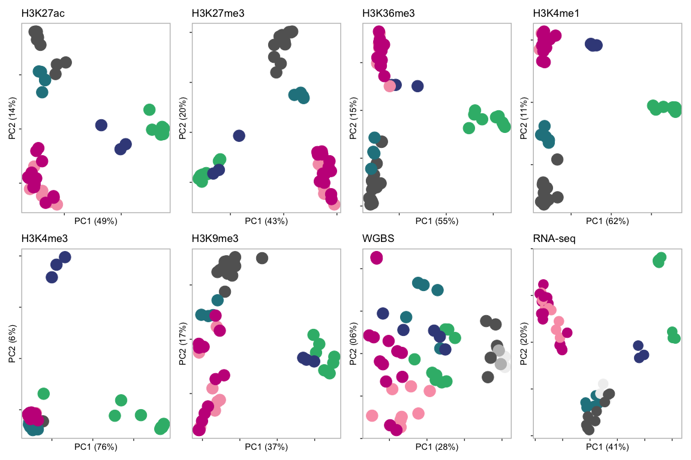<!-- -->

```r
ggsave("../plot/PCA_ALL_v2.pdf", width = 50, height = 20, units = "cm")
```


## H3K4me1 heatmap


```r
nbc = read_tsv("../data/de_chipseq/H3K4me1.NBC.enriched_over4cell_0.75percent_matrix.tsv")
n1 = nrow(nbc)

gcbc = read_tsv("../data/de_chipseq/H3K4me1.GCBC.enriched_over4cell_0.75percent_matrix.tsv")
n2 = nrow(gcbc)

mbc = read_tsv("../data/de_chipseq/H3K4me1.MBC.enriched_over4cell_0.75percent_matrix.tsv")
n3 = nrow(mbc)

pbc = read_tsv("../data/de_chipseq/H3K4me1.PBC.enriched_over4cell_0.75percent_matrix.tsv")
n4 = nrow(pbc)

cll = read_tsv("../data/de_chipseq/H3K4me1.CLL.enriched_over4cell_0.75percent_matrix.tsv")
n5 = nrow(cll)

ucll = read_tsv("../data/de_chipseq/H3K4me1.mCLL_uCLL_unmutated_enriched_matirx.tsv")
names(ucll)[1]<-paste("A.intersect.value")
n6 = nrow(ucll)

mcll = read_tsv("../data/de_chipseq/H3K4me1.mCLL_uCLL_mutated_enriched_matirx.tsv")
names(mcll)[1]<-paste("A.intersect.value")
n7 = nrow(mcll)

x = rbind(nbc, gcbc, mbc, pbc, cll, ucll, mcll)

x = x %>% select(-contains("MACS2NoInput")) 

#cll = x %>% select(contains("CLL")) %>% select(-contains("EGAN00001358538"), -contains("EGAN00001358558")) #rem unknown IGHV
#row normalize
#x$row_maximum = rowMaxs(as.matrix(x[,2:51]))
#x2 = x[,2:51]/x$row_maximum
#x2 = rescale(as.matrix(x[,2:51]))

nbc = x %>% select(contains("NBC"))
gcb = x %>% select(contains("GCBC"))
mbc = x %>% select(contains("MBC"))
pbc = x %>% select(contains("PBC"))

u = c("CEMT_92", "CEMT_95", "CEMT_30", "CEMT_27", "CEMT_29", "CEMT_4", "EGAN00001202788", "EGAN00001202787")
m = c("CEMT_97", "CEMT_93", "CEMT_96", "CEMT_94", "CEMT_6", "CEMT_28", "CEMT_5", "CEMT_26", "CEMT_25",  "CEMT_1", "EGAN00001202789",  "EGAN00001265750", "EGAN00001295796", "EGAN00001235813", "EGAN00001202786")

ucll = x %>% select(contains(u)) # R function does not work in this step
mcll = x %>% select(contains(m)) %>% select(-contains("CEMT_129"), -contains("CEMT_13")) #rem gcb
#setdiff(colnames(cll), union(colnames(mcll),colnames(ucll)))

x2 = cbind(nbc, gcb, mbc, pbc, ucll, mcll)

dim(x2)

anno = data.frame("Cell" = c(rep("NBC",ncol(nbc)),rep("GCBC",ncol(gcb)),rep("MBC",ncol(mbc)),rep("PBC",ncol(pbc)),rep("uCLL",ncol(ucll)), rep("mCLL",ncol(mcll))))
rownames(anno) = colnames(x2)

my_colour = list(
    Cell = c(NBC = "#636363", GCBC = "#35B779FF", MBC = "#26828EFF", PBC = "#3E4A89FF", uCLL = "#F59EB5", mCLL = "#C61D8A"))

#plot.new()
#png("../plot/CLL_manuscript/h3k4me1_dynamic_v8.png", width = 800, height = 1000)

pheatmap(x2, annotation_col = anno, 
         annotation_colors = my_colour,
         cluster_rows = F, 
         cluster_cols = F, 
         show_rownames = F, 
         show_colnames = F, 
         scale = "row", 
         border_color = NA,
         #gaps_col = ncol(x2)-ncol(ucll)-ncol(mcll),
         gaps_col = c(12, 12+9, 12+9+5, 12+9+5+3, 12+9+5+3+7, 12+9+5+3+7+12),
         gaps_row = c(n1, n1+n2, n1+n2+n3, n1+n2+n3+n4, n1+n2+n3+n4+n5, n1+n2+n3+n4+n5+n6, n1+n2+n3+n4+n5+n6+n7))

#dev.off()

#num of de regions
c(n1, n2, n3, n4, n5, n6, n7) #18739 59430  6119 21156 11709   987  1759
#total
nrow(x2) #119899

#comment: to make clear heatmap colors; i need to plot heatmap by cell types and merge in illustrator

#coordinates; cll specific gain of H3K4me1
#XKR6: chr8:10,864,881-11,042,575
#B4GALT1-AS1: chr9:33,168,832-33,202,131
#PMID: 25101192: More distal to the BCR are PTPN22, SHP-1, PTPN2, and PTP-PEST, which are primarily involved in downregulation of BCR signaling. PTPRN2: chr7:158,516,764-158,593,763
```


## RPKM Boxplot


```r
k = read.table("../data/table_EGA_CEMT.txt", head = T)
gene = read.table("../data/hg38v79/hg38v79_genes", header = T)[,c(1,7)]
k2 = left_join(gene, k,  by = c( "stable_id" = "ENSG")) %>% na.omit() %>% select(-stable_id)
xm = melt(k2)

mcll = c( "CLL.110", "CLL.1228",  "CLL.1525", "CLL.1532",  "CLL.3", "CLL_97", "CLL_93", "CLL_96", "CLL_94", "CLL_6", "CLL_28", "CLL_5", "CLL_26", "CLL_25",  "CLL_1")
ucll = c("CLL.12", "CLL.182", "CLL_92", "CLL_95", "CLL_30", "CLL_27", "CLL_29", "CLL_4")


cll_expr <- select(k,1, matches("CLL"))
names(cll_expr)[1] <- "NAME"
cll_expr$DESCRIPTION <- NA

cll_expr <- select(cll_expr,1,25, matches("CLL"))
cll_expr[,c(3:25)] <- cll_expr[,c(3:25)] + 0.001
write.table(cll_expr, "../data/bivalent_promoter/expression/cll_only_all_finite.txt",
            quote = FALSE,row.names = FALSE, sep = "\t", col.names = T)

xm$Cell <- ifelse(xm$variable %in% mcll, "mCLL", 
                          ifelse(xm$variable %in% ucll, "uCLL",
                           ifelse(grepl("MBC", xm$variable, ignore.case = T), "MBC", 
                                  ifelse(grepl("HMPC", xm$variable, ignore.case = T), "HMPC",
                           ifelse(grepl("NBC", xm$variable, ignore.case = T), "NBC",
                           ifelse(grepl("PBC", xm$variable, ignore.case = T), "PBC",
                           ifelse(grepl("PreBC", xm$variable, ignore.case = T), "PreBC", # no rna-seq data
                           ifelse(grepl("GCBC", xm$variable, ignore.case = T), "GCBC", 
                           ifelse(grepl("CLP", xm$variable, ignore.case = T), "CLP", "nothing")))))))))

#xm2 = xm %>% filter(Cell != "remove") 
xm2 = xm 
xm2 = xm2 %>% filter(Cell != "HMPC") %>% filter(Cell !=  "CLP")

xm2$Cell = factor(xm2$Cell, levels = c("NBC", "GCBC", "MBC", "PBC", "uCLL", "mCLL"))

xm2 %>% distinct(Cell, variable, .keep_all = TRUE) %>%
   group_by(Cell) %>% 
   summarise(replicates = n())
```

```
## # A tibble: 6 x 2
##   Cell  replicates
##   <fct>      <int>
## 1 NBC            9
## 2 GCBC           9
## 3 MBC            5
## 4 PBC            3
## 5 uCLL           8
## 6 mCLL          15
```

```r
gene_expression = function(geneName)
{
plot = xm2 %>% filter(display_label == geneName) %>%
  ggplot(aes(Cell, value, fill = Cell)) +
  scale_fill_manual(values=c("#636363", "#35B779FF", "#26828EFF", "#3E4A89FF", "#fa9fb5", "#c51b8a")) +
  geom_boxplot() +
  geom_dotplot(binaxis = "y", stackdir = "center", stackratio = .5) +
  #geom_point() +
  #geom_dotplot(binaxis = "y", stackdir = "center") +
  #theme_bw() +
  ylab("RPKM") +
  xlab(geneName) +
  scale_y_continuous(position = "right") +
  theme(panel.background = element_rect(fill = "white"),
        panel.border = element_rect(fill = NA, colour = "gray", size = 1),
        strip.background =element_rect(fill="white"),
        axis.text = element_text(color = "black"),
        axis.text.x = element_text(color = "black", angle = 90, hjust = 1),
        legend.position = "none")

print(plot)
ggsave(filename=paste("../plot/RNA-seq/", geneName,"_boxplot.pdf"), width = 16, height = 12, units = "cm", device = 'pdf')
}

# cll specific H3K4me1 gain regions (>1kb); overlap with cosmic onco
#[1] "ARNT"    "ATF1"    "BCL2"    "BRD4"    "CACNA1D" "CARD11"  "CBFA2T3" "CCND2"   "CREB3L2" "CREBBP"  "CRTC1"   "ETV6"    "FLT3"   
#[14] "FOXP1"   "JAK1"    "KAT6B"   "LCK"     "LEF1"    "LPP"     "MAML2"   "MAP2K1"  "MAP2K2"  "MAPK1"   "MSI2"    "MTOR"    "PTPN11" 
#[27] "RAD51B"  "RPL22"   "SH3GL1"  "STAT5B"  "TAF15"   "TCF7L2" 

#uniquely expressed in CLL
gene_expression("LEF1") #chr4:108,040,003-108,181,134
```

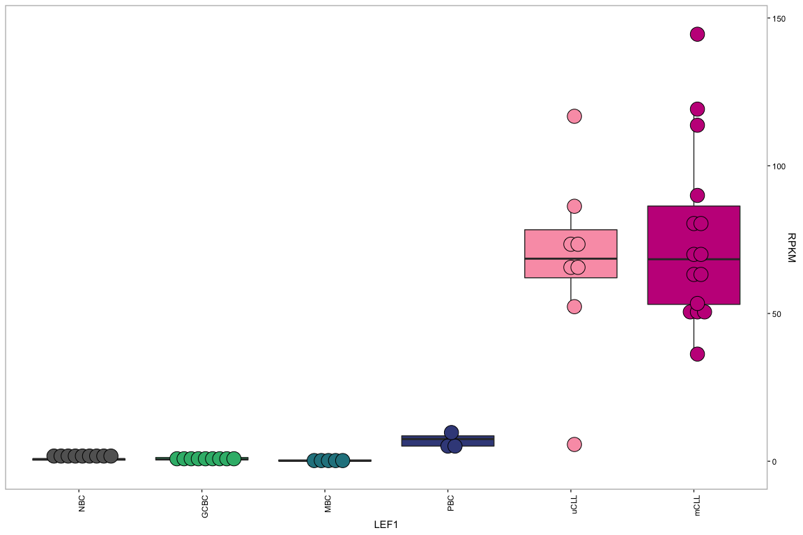<!-- -->

```r
gene_expression("BCL2") #chr18:63,120,162-63,324,334
```

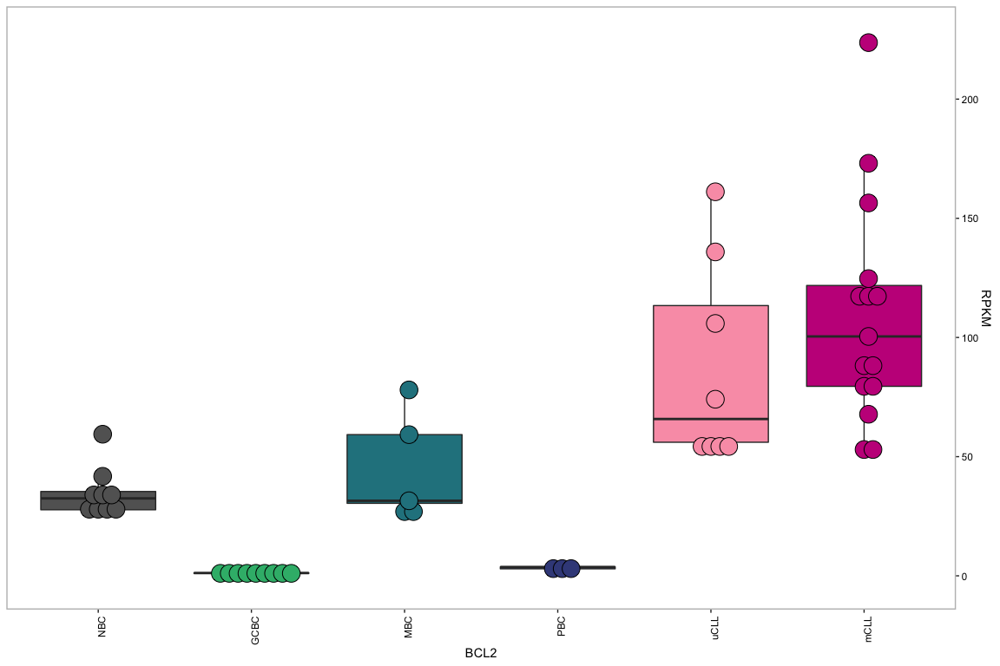<!-- -->

```r
gene_expression("CBFA2T3") #final: chr16:88,869,712-88,950,221; other views: chr16:88,861,001-88,910,000; chr16:88,869,155-88,980,514; 
```

<!-- -->

```r
gene_expression("CRTC1") #chr19:18,679,431-18,780,982
```

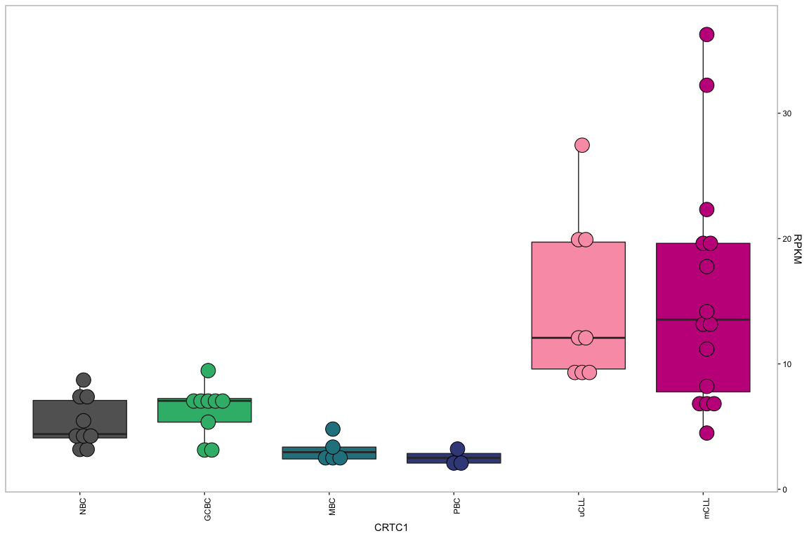<!-- -->

```r
gene_expression("WNT3") 
```

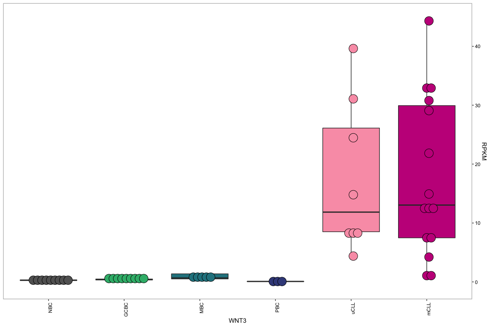<!-- -->

```r
gene_expression("WNT10A") 
```

<!-- -->

```r
gene_expression("ROR1") 
```

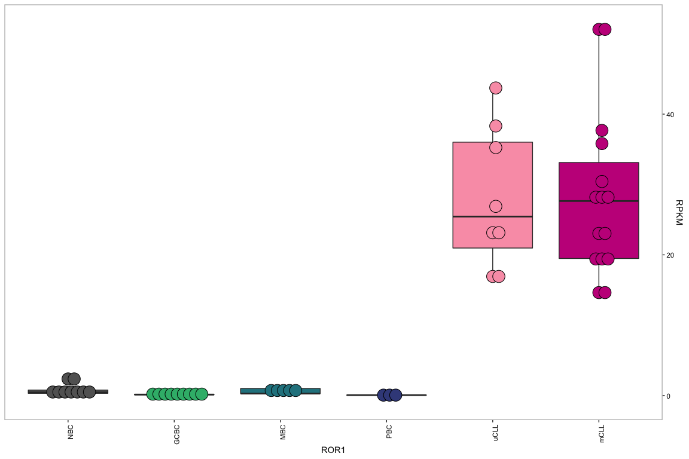<!-- -->

```r
gene_expression("MAPK3") 
```

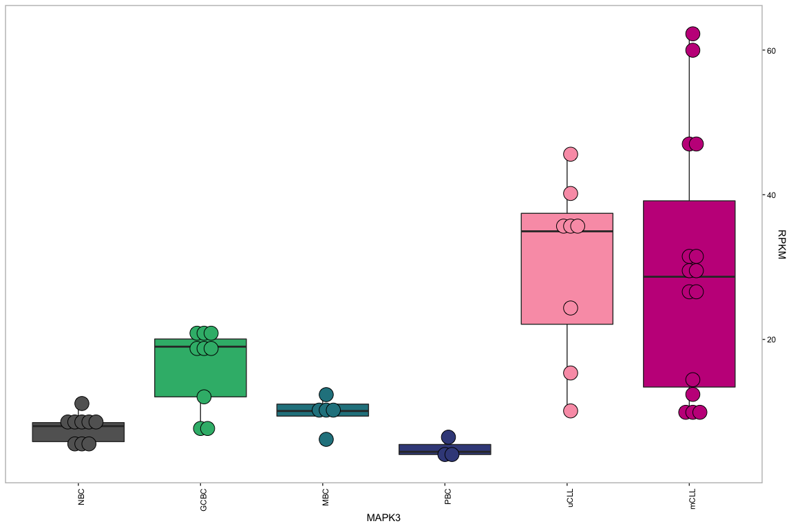<!-- -->

```r
gene_expression("LILRB3")
```

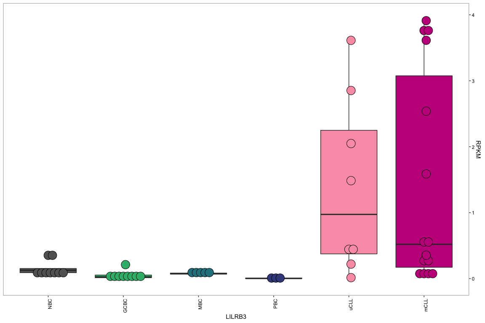<!-- -->

## DE regions


```r
## cll vs others
#total de count
x = read.table("../data/cll_bcell/count_enriched_u.mcll.txt")
x$V2 = factor(x$V2, levels = c("H3K27ac", "H3K4me3", "H3K36me3",  "H3K4me1", "H3K27me3", "H3K9me3"))


ggplot(x, aes(V2, V1, fill = V3)) +
  geom_bar(stat = "identity") +
  xlab("") +
  ylab("Number of DE regions") +
  geom_hline(yintercept = 0) +
  scale_fill_manual(values = c("#3E4A89FF", "#c51b8a")) +
   theme(panel.background = element_rect(fill = "white"),
        panel.border = element_rect(fill = NA, colour = "gray", size = 1),
        strip.background =element_rect(fill="white"),
        axis.text = element_text(color = "black")) +
  coord_flip()
```

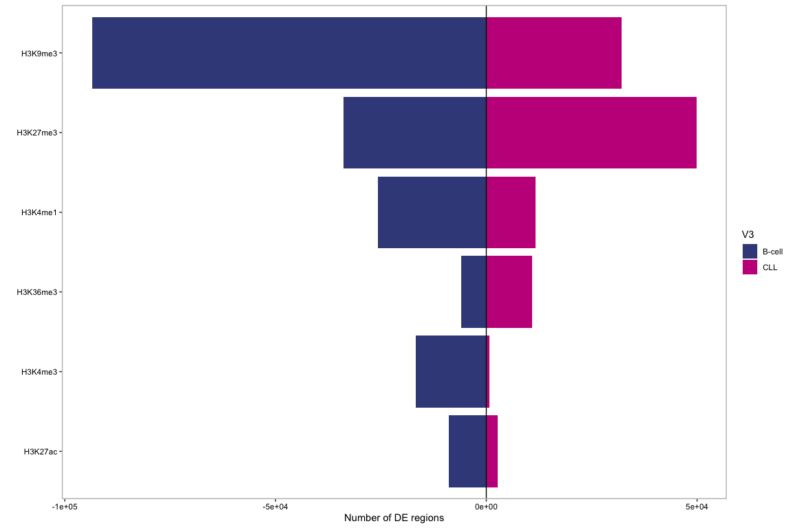<!-- -->

```r
ggsave("../plot/Num_DE_regions_CLL_vs_others.pdf", width = 20, height = 20, units = "cm")

x = read.table("../data/de_chipseq/enrichement_over_each_other/de_up_dn_all_cell.txt")
x$V2 = factor(x$V2, levels = c("H3K27ac", "H3K4me3", "H3K36me3",  "H3K4me1", "H3K27me3", "H3K9me3"))
x$V3 = factor(x$V3, levels = c( "NBC", "GCBC", "MBC",  "PBC", "CLL"))

c = x %>% filter(V3 == "CLL") %>% filter(V4 == "enriched") %>%  group_by(V2) %>% summarise(sum(abs(V1)))
cn = x %>% filter(V3 == "CLL") %>% filter(V4 == "not") %>%  group_by(V2) %>% summarise(sum(abs(V1)))
g = x %>% filter(V3 == "GCBC") %>% filter(V4 == "enriched") %>%  group_by(V2) %>% summarise(sum(abs(V1)))
gn = x %>% filter(V3 == "GCBC") %>% filter(V4 == "not") %>%  group_by(V2) %>% summarise(sum(abs(V1)))
t = x %>% group_by(V2) %>% summarise(sum(abs(V1)))
# % cll specific enrichment
mean(c$`sum(abs(V1))`/t$`sum(abs(V1))`)*100
```

```
## [1] 7.887001
```

```r
mean(cn$`sum(abs(V1))`/t$`sum(abs(V1))`)*100
```

```
## [1] 18.88159
```

```r
mean(g$`sum(abs(V1))`/t$`sum(abs(V1))`)*100
```

```
## [1] 22.78602
```

```r
mean(gn$`sum(abs(V1))`/t$`sum(abs(V1))`)*100
```

```
## [1] 19.08837
```

```r
ggplot(x, aes(V2, V1, fill = V3)) +
  geom_bar(stat = "identity", position = "dodge") +
  xlab("") +
  ylab("Number of DE regions") +
  geom_hline(yintercept = 0) +
  scale_fill_manual(values = c("#636363", "#35B779FF", "#26828EFF", "#3E4A89FF",  "#C61D8A")) +
  theme_bw() +
  coord_flip()
```

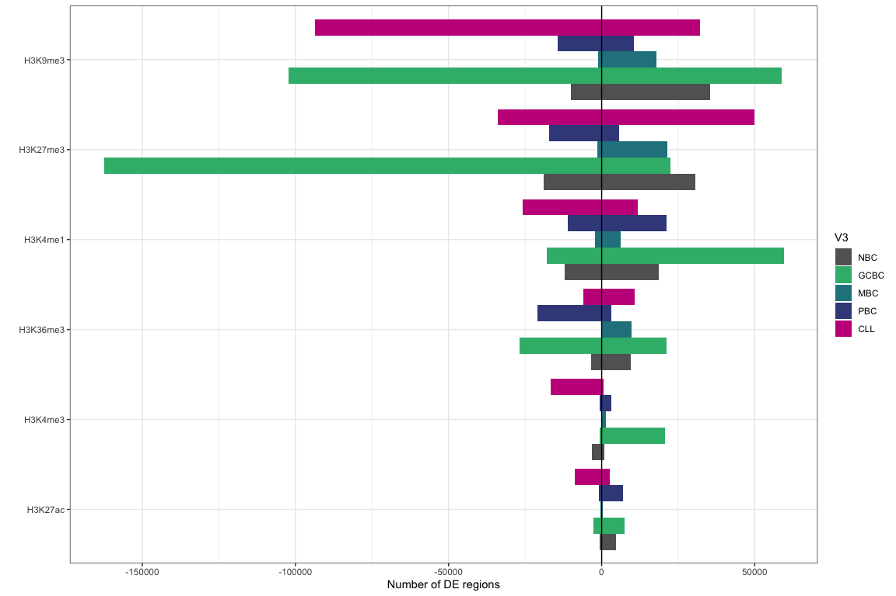<!-- -->

```r
ggsave("../plot/Num_DE_regions_cell_vs_others_6marks.pdf", width = 20, height = 20, units = "cm")

#great
library(forcats)
x = read_tsv("../data/de_chipseq/greatExportAll_H3K4me1_CLL.tsv")
```

```
## Warning: 20 parsing failures.
## row col   expected     actual                                                file
##   1  -- 13 columns 14 columns '../data/de_chipseq/greatExportAll_H3K4me1_CLL.tsv'
##   2  -- 13 columns 14 columns '../data/de_chipseq/greatExportAll_H3K4me1_CLL.tsv'
##   3  -- 13 columns 14 columns '../data/de_chipseq/greatExportAll_H3K4me1_CLL.tsv'
##   4  -- 13 columns 14 columns '../data/de_chipseq/greatExportAll_H3K4me1_CLL.tsv'
##   5  -- 13 columns 14 columns '../data/de_chipseq/greatExportAll_H3K4me1_CLL.tsv'
## ... ... .......... .......... ...................................................
## See problems(...) for more details.
```

```r
x %>% filter(Hyper_FDR_QVal <= 0.01) %>%
  mutate(TermName = fct_reorder(TermName, -log10(Hyper_FDR_QVal))) %>%
  ggplot(aes(x = TermName, y = -log10(Hyper_FDR_QVal))) + 
  geom_col() +
  coord_flip() +
  xlab("") +
  ylab("-log10(Hypergeometric FDR Q-Value)") +
  theme_bw()
```

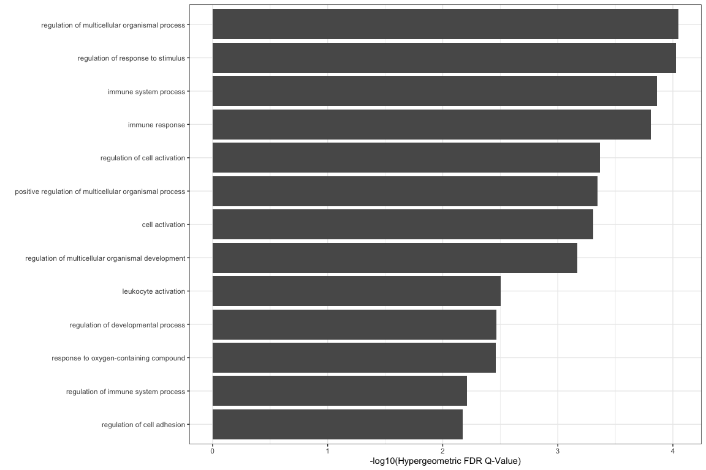<!-- -->

```r
ggsave("../plot/H3K4me1_CLL_GREAT.pdf", width = 20, height = 20, units = "cm")
```

# expression of lef1 targets


```r
e = read.table("../data/table_EGA_CEMT.txt", head = T)

#lef target
#lef = read_tsv("../data/cll_manuscript/genebody_cll_UPgenes.txt", col_names = F)
lef = read_tsv("../data/cll_manuscript/TSS5kb_cll_UPgenes.txt", col_names = F)
#lef = read_tsv("../data/cll_manuscript/TSS5kb_genebody_cll_UPgenes_v2.txt", col_names = F)

colnames(lef) = "ENSG"
e2 = left_join(lef, e) %>% select(starts_with("CLL")) %>% 
  melt() %>%
  mutate(Type = "lef-target")

#non-lef target
nlef = read.table("../data/RNA-seq/DESeq2_uCLL_mCLL_Bcells/Bcell_vs_CLL_DN.txt.genebody.pc")
nlef = data.frame(ENSG = unique(nlef$V7)) 
nlef = anti_join(nlef, lef)

e3 = left_join(nlef, e) %>% select(starts_with("CLL")) %>% 
  melt() %>%
  mutate(Type = "non-lef")
 
rbind(e2, e3) %>%
  ggplot(aes(Type, log10(value+0.001))) +
  geom_boxplot(outlier.shape = NA)  +
  theme(panel.background = element_rect(fill = "white"),
        panel.border = element_rect(fill = NA, colour = "gray", size = 1),
        strip.background =element_rect(fill="white"),
        axis.text = element_text(color = "black"),
        legend.position = "bottom")
```

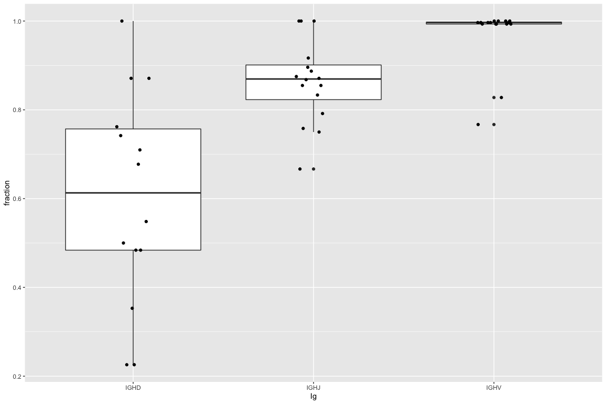<!-- -->

```r
ggsave(filename=paste("../plot/CLL_manuscript/lef_target_exp.pdf"), width = 12, height = 16, units = "cm", device = 'pdf')

t.test(e2$value, e3$value)
```

```
## 
## 	Welch Two Sample t-test
## 
## data:  e2$value and e3$value
## t = 12.876, df = 10113, p-value < 2.2e-16
## alternative hypothesis: true difference in means is not equal to 0
## 95 percent confidence interval:
##  24.92220 33.87263
## sample estimates:
## mean of x mean of y 
##  52.19060  22.79318
```
