## PCA


```r
#h3k27ac
nbc = read_tsv("../data/de_chipseq/H3K27ac.NBC.enriched_over4cell_0.75percent_matrix.tsv")
n1 = nrow(nbc)

gcbc = read_tsv("../data/de_chipseq/H3K27ac.GCBC.enriched_over4cell_0.75percent_matrix.tsv")
n2 = nrow(gcbc)

mbc = read_tsv("../data/de_chipseq/H3K27ac.MBC.enriched_over4cell_0.75percent_matrix.tsv")
n3 = nrow(mbc)

pbc = read_tsv("../data/de_chipseq/H3K27ac.PBC.enriched_over4cell_0.75percent_matrix.tsv")
n4 = nrow(pbc)

cll = read_tsv("../data/de_chipseq/H3K27ac.CLL.enriched_over4cell_0.75percent_matrix.tsv")
n5 = nrow(cll)

ucll = read_tsv("../data/de_chipseq/H3K27ac.mCLL_uCLL_unmutated_enriched_matirx.tsv")
names(ucll)[1]<-paste("A.intersect.value")
n6 = nrow(ucll)

mcll = read_tsv("../data/de_chipseq/H3K27ac.mCLL_uCLL_mutated_enriched_matirx.tsv")
names(mcll)[1]<-paste("A.intersect.value")
n7 = nrow(mcll)

x = rbind(nbc, gcbc, mbc, pbc, cll, ucll, mcll)

x = x %>% select(-contains("MACS2NoInput")) 

nbc = x %>% select(contains("NBC"))
gcb = x %>% select(contains("GCBC"))
mbc = x %>% select(contains("MBC"))
pbc = x %>% select(contains("PBC"))

u = c("CEMT_92", "CEMT_95", "CEMT_30", "CEMT_27", "CEMT_29", "CEMT_4", "EGAN00001202788", "EGAN00001202787")
m = c("CEMT_97", "CEMT_93", "CEMT_96", "CEMT_94", "CEMT_6", "CEMT_28", "CEMT_5", "CEMT_26", "CEMT_25",  "CEMT_1", "EGAN00001202789",  "EGAN00001265750", "EGAN00001295796", "EGAN00001235813", "EGAN00001202786")

ucll = x %>% select(contains(u)) # R function does not work in this step
mcll = x %>% select(contains(m)) %>% select(-contains("CEMT_129"), -contains("CEMT_13")) #rem gcb
#setdiff(colnames(cll), union(colnames(mcll),colnames(ucll)))

x2 = cbind(nbc, gcb, mbc, pbc, ucll, mcll)

dim(x2)
```

```
## [1] 22845    45
```

```r
#num of de regions
c(n1, n2, n3, n4, n5, n6, n7)
```

```
## [1] 4571 7354  376 6897 2730  847   70
```

```r
sum(n1, n2, n3, n4, n5, n6, n7)
```

```
## [1] 22845
```

```r
#total
nrow(x2)
```

```
## [1] 22845
```

```r
#pca
x3 = data.frame(t(x2))
res.pca <- prcomp(x3, scale = TRUE)

res.pca <- prcomp(x3)
#fviz_eig(res.pca)
#fviz_pca_ind(res.pca) 

pca = data.frame(res.pca$x)

u = colnames(ucll)


pca$Cells <- ifelse(rownames(pca) %in% u, "uCLL",
                           ifelse(grepl("MBC", rownames(pca), ignore.case = T), "MBC", 
                                  ifelse(grepl("HMPC", rownames(pca), ignore.case = T), "HMPC",
                           ifelse(grepl("NBC", rownames(pca), ignore.case = T), "NBC",
                           ifelse(grepl("PBC", rownames(pca), ignore.case = T), "PBC",
                           ifelse(grepl("PreBC", rownames(pca), ignore.case = T), "PreBC",
                           ifelse(grepl("GCBC", rownames(pca), ignore.case = T), "GCBC", "mCLL")))))))

pca$Cells = factor(pca$Cells, levels = c("NBC", "GCBC", "MBC",  "PBC", "uCLL", "mCLL"))

H3K27ac = ggplot(pca, aes(PC1, PC2, color = Cells)) +
  scale_color_manual(values=c("#636363", "#35B779FF", "#26828EFF", "#3E4A89FF", "#F59EB5", "#C61D8A")) +
  geom_point(size = 6.5, alpha = 1) +
  xlab("PC1 (49%)") +
  ylab("PC2 (14%)") +
  ggtitle("H3K27ac") +
  theme(panel.background = element_rect(fill = "white"),
        panel.border = element_rect(fill = NA, colour = "gray", size = 1),
        strip.background =element_rect(fill="white"),
        axis.text=element_blank(),
        legend.position = "none")

#H3K27ac 

#H3K27me3
nbc = read_tsv("../data/de_chipseq/H3K27me3.NBC.enriched_over4cell_0.75percent_matrix.tsv")
n1 = nrow(nbc)

gcbc = read_tsv("../data/de_chipseq/H3K27me3.GCBC.enriched_over4cell_0.75percent_matrix.tsv")
n2 = nrow(gcbc)

mbc = read_tsv("../data/de_chipseq/H3K27me3.MBC.enriched_over4cell_0.75percent_matrix.tsv")
n3 = nrow(mbc)

pbc = read_tsv("../data/de_chipseq/H3K27me3.PBC.enriched_over4cell_0.75percent_matrix.tsv")
n4 = nrow(pbc)

cll = read_tsv("../data/de_chipseq/H3K27me3.CLL.enriched_over4cell_0.75percent_matrix.tsv")
n5 = nrow(cll)

ucll = read_tsv("../data/de_chipseq/H3K27me3.mCLL_uCLL_unmutated_enriched_matirx.tsv")
names(ucll)[1]<-paste("A.intersect.value")
n6 = nrow(ucll)

mcll = read_tsv("../data/de_chipseq/H3K27me3.mCLL_uCLL_mutated_enriched_matirx.tsv")
names(mcll)[1]<-paste("A.intersect.value")
n7 = nrow(mcll)

x = rbind(nbc, gcbc, mbc, pbc, cll, ucll, mcll)

x = x %>% select(-contains("MACS2NoInput")) 

nbc = x %>% select(contains("NBC"))
gcb = x %>% select(contains("GCBC"))
mbc = x %>% select(contains("MBC"))
pbc = x %>% select(contains("PBC"))

u = c("CEMT_92", "CEMT_95", "CEMT_30", "CEMT_27", "CEMT_29", "CEMT_4", "EGAN00001202788", "EGAN00001202787")
m = c("CEMT_97", "CEMT_93", "CEMT_96", "CEMT_94", "CEMT_6", "CEMT_28", "CEMT_5", "CEMT_26", "CEMT_25",  "CEMT_1", "EGAN00001202789",  "EGAN00001265750", "EGAN00001295796", "EGAN00001235813", "EGAN00001202786")

ucll = x %>% select(contains(u)) # R function does not work in this step
mcll = x %>% select(contains(m)) %>% select(-contains("CEMT_129"), -contains("CEMT_13")) #rem gcb
#setdiff(colnames(cll), union(colnames(mcll),colnames(ucll)))

x2 = cbind(nbc, gcb, mbc, pbc, ucll, mcll)

dim(x2)
```

```
## [1] 143447     49
```

```r
#num of de regions
c(n1, n2, n3, n4, n5, n6, n7)
```

```
## [1] 30710 22586 21323  5637 49874  1707 11610
```

```r
#total
nrow(x2)
```

```
## [1] 143447
```

```r
#pca
x3 = data.frame(t(x2))
res.pca <- prcomp(x3, scale = TRUE)

res.pca <- prcomp(x3)
#fviz_eig(res.pca)
#fviz_pca_ind(res.pca) 

pca = data.frame(res.pca$x)

u = colnames(ucll)


pca$Cells <- ifelse(rownames(pca) %in% u, "uCLL",
                           ifelse(grepl("MBC", rownames(pca), ignore.case = T), "MBC", 
                                  ifelse(grepl("HMPC", rownames(pca), ignore.case = T), "HMPC",
                           ifelse(grepl("NBC", rownames(pca), ignore.case = T), "NBC",
                           ifelse(grepl("PBC", rownames(pca), ignore.case = T), "PBC",
                           ifelse(grepl("PreBC", rownames(pca), ignore.case = T), "PreBC",
                           ifelse(grepl("GCBC", rownames(pca), ignore.case = T), "GCBC", "mCLL")))))))

pca$Cells = factor(pca$Cells, levels = c("NBC", "GCBC", "MBC",  "PBC", "uCLL", "mCLL"))

H3K27me3 = ggplot(pca, aes(PC1, PC2, color = Cells)) +
  scale_color_manual(values=c("#636363", "#35B779FF", "#26828EFF", "#3E4A89FF", "#F59EB5", "#C61D8A")) +
  geom_point(size = 6.5, alpha = 1) +
  xlab("PC1 (43%)") +
  ylab("PC2 (20%)") +
  ggtitle("H3K27me3") +
  theme(panel.background = element_rect(fill = "white"),
        panel.border = element_rect(fill = NA, colour = "gray", size = 1),
        strip.background =element_rect(fill="white"),
        axis.text=element_blank(),
        legend.position = "none")
#H3K27me3

#H3K36me3
nbc = read_tsv("../data/de_chipseq/H3K36me3.NBC.enriched_over4cell_0.75percent_matrix.tsv")
n1 = nrow(nbc)

gcbc = read_tsv("../data/de_chipseq/H3K36me3.GCBC.enriched_over4cell_0.75percent_matrix.tsv")
n2 = nrow(gcbc)

mbc = read_tsv("../data/de_chipseq/H3K36me3.MBC.enriched_over4cell_0.75percent_matrix.tsv")
n3 = nrow(mbc)

pbc = read_tsv("../data/de_chipseq/H3K36me3.PBC.enriched_over4cell_0.75percent_matrix.tsv")
n4 = nrow(pbc)

cll = read_tsv("../data/de_chipseq/H3K36me3.CLL.enriched_over4cell_0.75percent_matrix.tsv")
n5 = nrow(cll)

ucll = read_tsv("../data/de_chipseq/H3K36me3.mCLL_uCLL_unmutated_enriched_matirx.tsv")
names(ucll)[1]<-paste("A.intersect.value")
n6 = nrow(ucll)

mcll = read_tsv("../data/de_chipseq/H3K36me3.mCLL_uCLL_mutated_enriched_matirx.tsv")
names(mcll)[1]<-paste("A.intersect.value")
n7 = nrow(mcll)

x = rbind(nbc, gcbc, mbc, pbc, cll, ucll, mcll)

x = x %>% select(-contains("MACS2NoInput")) 

nbc = x %>% select(contains("NBC"))
gcb = x %>% select(contains("GCBC"))
mbc = x %>% select(contains("MBC"))
pbc = x %>% select(contains("PBC"))

u = c("CEMT_92", "CEMT_95", "CEMT_30", "CEMT_27", "CEMT_29", "CEMT_4", "EGAN00001202788", "EGAN00001202787")
m = c("CEMT_97", "CEMT_93", "CEMT_96", "CEMT_94", "CEMT_6", "CEMT_28", "CEMT_5", "CEMT_26", "CEMT_25",  "CEMT_1", "EGAN00001202789",  "EGAN00001265750", "EGAN00001295796", "EGAN00001235813", "EGAN00001202786")

ucll = x %>% select(contains(u)) # R function does not work in this step
mcll = x %>% select(contains(m)) %>% select(-contains("CEMT_129"), -contains("CEMT_13")) #rem gcb
#setdiff(colnames(cll), union(colnames(mcll),colnames(ucll)))

x2 = cbind(nbc, gcb, mbc, pbc, ucll, mcll)

dim(x2)
```

```
## [1] 56256    50
```

```r
#num of de regions
c(n1, n2, n3, n4, n5, n6, n7)
```

```
## [1]  9383 21171  9800  3180 10870  1418   434
```

```r
#total
nrow(x2)
```

```
## [1] 56256
```

```r
#pca
x3 = data.frame(t(x2))
res.pca <- prcomp(x3, scale = TRUE)

res.pca <- prcomp(x3)
#fviz_eig(res.pca)
#fviz_pca_ind(res.pca) 

pca = data.frame(res.pca$x)

u = colnames(ucll)


pca$Cells <- ifelse(rownames(pca) %in% u, "uCLL",
                           ifelse(grepl("MBC", rownames(pca), ignore.case = T), "MBC", 
                                  ifelse(grepl("HMPC", rownames(pca), ignore.case = T), "HMPC",
                           ifelse(grepl("NBC", rownames(pca), ignore.case = T), "NBC",
                           ifelse(grepl("PBC", rownames(pca), ignore.case = T), "PBC",
                           ifelse(grepl("PreBC", rownames(pca), ignore.case = T), "PreBC",
                           ifelse(grepl("GCBC", rownames(pca), ignore.case = T), "GCBC", "mCLL")))))))

pca$Cells = factor(pca$Cells, levels = c("NBC", "GCBC", "MBC",  "PBC", "uCLL", "mCLL"))

H3K36me3 = ggplot(pca, aes(PC1, PC2, color = Cells)) +
  scale_color_manual(values=c("#636363", "#35B779FF", "#26828EFF", "#3E4A89FF", "#F59EB5", "#C61D8A")) +
  geom_point(size = 6.5, alpha = 1) +
  xlab("PC1 (55%)") +
  ylab("PC2 (15%)") +
  ggtitle("H3K36me3") +
  theme(panel.background = element_rect(fill = "white"),
        panel.border = element_rect(fill = NA, colour = "gray", size = 1),
        strip.background =element_rect(fill="white"),
        axis.text=element_blank(),
        legend.position = "none")
#H3K36me3

#H3k4me1
nbc = read_tsv("../data/de_chipseq/H3K4me1.NBC.enriched_over4cell_0.75percent_matrix.tsv")
n1 = nrow(nbc)

gcbc = read_tsv("../data/de_chipseq/H3K4me1.GCBC.enriched_over4cell_0.75percent_matrix.tsv")
n2 = nrow(gcbc)

mbc = read_tsv("../data/de_chipseq/H3K4me1.MBC.enriched_over4cell_0.75percent_matrix.tsv")
n3 = nrow(mbc)

pbc = read_tsv("../data/de_chipseq/H3K4me1.PBC.enriched_over4cell_0.75percent_matrix.tsv")
n4 = nrow(pbc)

cll = read_tsv("../data/de_chipseq/H3K4me1.CLL.enriched_over4cell_0.75percent_matrix.tsv")
n5 = nrow(cll)

ucll = read_tsv("../data/de_chipseq/H3K4me1.mCLL_uCLL_unmutated_enriched_matirx.tsv")
names(ucll)[1]<-paste("A.intersect.value")
n6 = nrow(ucll)

mcll = read_tsv("../data/de_chipseq/H3K4me1.mCLL_uCLL_mutated_enriched_matirx.tsv")
names(mcll)[1]<-paste("A.intersect.value")
n7 = nrow(mcll)

x = rbind(nbc, gcbc, mbc, pbc, cll, ucll, mcll)

x = x %>% select(-contains("MACS2NoInput")) 

nbc = x %>% select(contains("NBC"))
gcb = x %>% select(contains("GCBC"))
mbc = x %>% select(contains("MBC"))
pbc = x %>% select(contains("PBC"))

u = c("CEMT_92", "CEMT_95", "CEMT_30", "CEMT_27", "CEMT_29", "CEMT_4", "EGAN00001202788", "EGAN00001202787")
m = c("CEMT_97", "CEMT_93", "CEMT_96", "CEMT_94", "CEMT_6", "CEMT_28", "CEMT_5", "CEMT_26", "CEMT_25",  "CEMT_1", "EGAN00001202789",  "EGAN00001265750", "EGAN00001295796", "EGAN00001235813", "EGAN00001202786")

ucll = x %>% select(contains(u)) # R function does not work in this step
mcll = x %>% select(contains(m)) %>% select(-contains("CEMT_129"), -contains("CEMT_13")) #rem gcb
#setdiff(colnames(cll), union(colnames(mcll),colnames(ucll)))

x2 = cbind(nbc, gcb, mbc, pbc, ucll, mcll)

dim(x2)
```

```
## [1] 119899     48
```

```r
#num of de regions
c(n1, n2, n3, n4, n5, n6, n7)
```

```
## [1] 18739 59430  6119 21156 11709   987  1759
```

```r
#total
nrow(x2)
```

```
## [1] 119899
```

```r
x3 = data.frame(t(x2))
res.pca <- prcomp(x3, scale = TRUE)

res.pca <- prcomp(x3)
#fviz_eig(res.pca)
#fviz_pca_ind(res.pca) 

pca = data.frame(res.pca$x)

u = colnames(ucll)


pca$Cells <- ifelse(rownames(pca) %in% u, "uCLL",
                           ifelse(grepl("MBC", rownames(pca), ignore.case = T), "MBC", 
                                  ifelse(grepl("HMPC", rownames(pca), ignore.case = T), "HMPC",
                           ifelse(grepl("NBC", rownames(pca), ignore.case = T), "NBC",
                           ifelse(grepl("PBC", rownames(pca), ignore.case = T), "PBC",
                           ifelse(grepl("PreBC", rownames(pca), ignore.case = T), "PreBC",
                           ifelse(grepl("GCBC", rownames(pca), ignore.case = T), "GCBC", "mCLL")))))))

pca$Cells = factor(pca$Cells, levels = c("NBC", "GCBC", "MBC",  "PBC", "uCLL", "mCLL"))

H3K4me1 = ggplot(pca, aes(PC1, PC2, color = Cells)) +
  scale_color_manual(values=c("#636363", "#35B779FF", "#26828EFF", "#3E4A89FF", "#F59EB5", "#C61D8A")) +
  geom_point(size = 6.5, alpha = 1) +
  xlab("PC1 (62%)") +
  ylab("PC2 (11%)") +
  ggtitle("H3K4me1") +
  theme(panel.background = element_rect(fill = "white"),
        panel.border = element_rect(fill = NA, colour = "gray", size = 1),
        strip.background =element_rect(fill="white"),
        axis.text=element_blank(),
        legend.position = "none")
#H3K4me1

#H3K4me3
nbc = read_tsv("../data/de_chipseq/H3K4me3.NBC.enriched_over4cell_0.75percent_matrix.tsv")
n1 = nrow(nbc)

gcbc = read_tsv("../data/de_chipseq/H3K4me3.GCBC.enriched_over4cell_0.75percent_matrix.tsv")
n2 = nrow(gcbc)

mbc = read_tsv("../data/de_chipseq/H3K4me3.MBC.enriched_over4cell_0.75percent_matrix.tsv")
n3 = nrow(mbc)

pbc = read_tsv("../data/de_chipseq/H3K4me3.PBC.enriched_over4cell_0.75percent_matrix.tsv")
n4 = nrow(pbc)

cll = read_tsv("../data/de_chipseq/H3K4me3.CLL.enriched_over4cell_0.75percent_matrix.tsv")
n5 = nrow(cll)

ucll = read_tsv("../data/de_chipseq/H3K4me3.mCLL_uCLL_unmutated_enriched_matirx.tsv")
names(ucll)[1]<-paste("A.intersect.value")
n6 = nrow(ucll)

mcll = read_tsv("../data/de_chipseq/H3K4me3.mCLL_uCLL_mutated_enriched_matirx.tsv")
names(mcll)[1]<-paste("A.intersect.value")
n7 = nrow(mcll)

x = rbind(nbc, gcbc, mbc, pbc, cll, ucll, mcll)

x = x %>% select(-contains("MACS2NoInput")) 

nbc = x %>% select(contains("NBC"))
gcb = x %>% select(contains("GCBC"))
mbc = x %>% select(contains("MBC"))
pbc = x %>% select(contains("PBC"))

u = c("CEMT_92", "CEMT_95", "CEMT_30", "CEMT_27", "CEMT_29", "CEMT_4", "EGAN00001202788", "EGAN00001202787")
m = c("CEMT_97", "CEMT_93", "CEMT_96", "CEMT_94", "CEMT_6", "CEMT_28", "CEMT_5", "CEMT_26", "CEMT_25",  "CEMT_1", "EGAN00001202789",  "EGAN00001265750", "EGAN00001295796", "EGAN00001235813", "EGAN00001202786")

ucll = x %>% select(contains(u)) # R function does not work in this step
mcll = x %>% select(contains(m)) %>% select(-contains("CEMT_129"), -contains("CEMT_13")) #rem gcb
#setdiff(colnames(cll), union(colnames(mcll),colnames(ucll)))

x2 = cbind(nbc, gcb, mbc, pbc, ucll, mcll)

dim(x2)
```

```
## [1] 27101    51
```

```r
#num of de regions
c(n1, n2, n3, n4, n5, n6, n7)
```

```
## [1]   819 20792  1445  3086   666   219    74
```

```r
#total
nrow(x2)
```

```
## [1] 27101
```

```r
x3 = data.frame(t(x2))
res.pca <- prcomp(x3, scale = TRUE)

res.pca <- prcomp(x3)
#fviz_eig(res.pca)
#fviz_pca_ind(res.pca) 

pca = data.frame(res.pca$x)

u = colnames(ucll)


pca$Cells <- ifelse(rownames(pca) %in% u, "uCLL",
                           ifelse(grepl("MBC", rownames(pca), ignore.case = T), "MBC", 
                                  ifelse(grepl("HMPC", rownames(pca), ignore.case = T), "HMPC",
                           ifelse(grepl("NBC", rownames(pca), ignore.case = T), "NBC",
                           ifelse(grepl("PBC", rownames(pca), ignore.case = T), "PBC",
                           ifelse(grepl("PreBC", rownames(pca), ignore.case = T), "PreBC",
                           ifelse(grepl("GCBC", rownames(pca), ignore.case = T), "GCBC", "mCLL")))))))

pca$Cells = factor(pca$Cells, levels = c("NBC", "GCBC", "MBC",  "PBC", "uCLL", "mCLL"))

H3K4me3 = ggplot(pca, aes(PC1, PC2, color = Cells)) +
  scale_color_manual(values=c("#636363", "#35B779FF", "#26828EFF", "#3E4A89FF", "#F59EB5", "#C61D8A")) +
  geom_point(size = 6.5, alpha = 1) +
  xlab("PC1 (76%)") +
  ylab("PC2 (6%)") +
  ggtitle("H3K4me3") +
  theme(panel.background = element_rect(fill = "white"),
        panel.border = element_rect(fill = NA, colour = "gray", size = 1),
        strip.background =element_rect(fill="white"),
        axis.text=element_blank(),
        legend.position = "none")
#H3K4me3


#H3K9me3
nbc = read_tsv("../data/de_chipseq/H3K9me3.NBC.enriched_over4cell_0.75percent_matrix.tsv")
n1 = nrow(nbc)

gcbc = read_tsv("../data/de_chipseq/H3K9me3.GCBC.enriched_over4cell_0.75percent_matrix.tsv")
n2 = nrow(gcbc)

mbc = read_tsv("../data/de_chipseq/H3K9me3.MBC.enriched_over4cell_0.75percent_matrix.tsv")
n3 = nrow(mbc)

pbc = read_tsv("../data/de_chipseq/H3K9me3.PBC.enriched_over4cell_0.75percent_matrix.tsv")
n4 = nrow(pbc)

cll = read_tsv("../data/de_chipseq/H3K9me3.CLL.enriched_over4cell_0.75percent_matrix.tsv")
n5 = nrow(cll)

ucll = read_tsv("../data/de_chipseq/H3K9me3.mCLL_uCLL_unmutated_enriched_matirx.tsv")
names(ucll)[1]<-paste("A.intersect.value")
n6 = nrow(ucll)

mcll = read_tsv("../data/de_chipseq/H3K9me3.mCLL_uCLL_mutated_enriched_matirx.tsv")
names(mcll)[1]<-paste("A.intersect.value")
n7 = nrow(mcll)

x = rbind(nbc, gcbc, mbc, pbc, cll, ucll, mcll)

x = x %>% select(-contains("MACS2NoInput")) 

nbc = x %>% select(contains("NBC"))
gcb = x %>% select(contains("GCBC"))
mbc = x %>% select(contains("MBC"))
pbc = x %>% select(contains("PBC"))

u = c("CEMT_92", "CEMT_95", "CEMT_30", "CEMT_27", "CEMT_29", "CEMT_4", "EGAN00001202788", "EGAN00001202787")
m = c("CEMT_97", "CEMT_93", "CEMT_96", "CEMT_94", "CEMT_6", "CEMT_28", "CEMT_5", "CEMT_26", "CEMT_25",  "CEMT_1", "EGAN00001202789",  "EGAN00001265750", "EGAN00001295796", "EGAN00001235813", "EGAN00001202786")

ucll = x %>% select(contains(u)) # R function does not work in this step
mcll = x %>% select(contains(m)) %>% select(-contains("CEMT_129"), -contains("CEMT_13")) #rem gcb
#setdiff(colnames(cll), union(colnames(mcll),colnames(ucll)))

x2 = cbind(nbc, gcb, mbc, pbc, ucll, mcll)

dim(x2)
```

```
## [1] 174281     49
```

```r
#num of de regions
c(n1, n2, n3, n4, n5, n6, n7)
```

```
## [1] 35464 58684 17857 10481 32095   210 19490
```

```r
#total
nrow(x2)
```

```
## [1] 174281
```

```r
x3 = data.frame(t(x2))
res.pca <- prcomp(x3, scale = TRUE)

res.pca <- prcomp(x3)
#fviz_eig(res.pca)
#fviz_pca_ind(res.pca) 

pca = data.frame(res.pca$x)

u = colnames(ucll)


pca$Cells <- ifelse(rownames(pca) %in% u, "uCLL",
                           ifelse(grepl("MBC", rownames(pca), ignore.case = T), "MBC", 
                                  ifelse(grepl("HMPC", rownames(pca), ignore.case = T), "HMPC",
                           ifelse(grepl("NBC", rownames(pca), ignore.case = T), "NBC",
                           ifelse(grepl("PBC", rownames(pca), ignore.case = T), "PBC",
                           ifelse(grepl("PreBC", rownames(pca), ignore.case = T), "PreBC",
                           ifelse(grepl("GCBC", rownames(pca), ignore.case = T), "GCBC", "mCLL")))))))

pca$Cells = factor(pca$Cells, levels = c("NBC", "GCBC", "MBC",  "PBC", "uCLL", "mCLL"))

H3K9me3 = ggplot(pca, aes(PC1, PC2, color = Cells)) +
  scale_color_manual(values=c("#636363", "#35B779FF", "#26828EFF", "#3E4A89FF", "#F59EB5", "#C61D8A")) +
  geom_point( size = 6.5, alpha = 1) +
  xlab("PC1 (37%)") +
  ylab("PC2 (17%)") +
  ggtitle("H3K9me3") +
  theme(panel.background = element_rect(fill = "white"),
        panel.border = element_rect(fill = NA, colour = "gray", size = 1),
        strip.background =element_rect(fill="white"),
        axis.text=element_blank(),
        legend.position = "none")
#H3K9me3

#DNAme
x = read.table("../data/DNAme/PCA.table_metValue_hg38_NA-to-0-3outliers.txt")

ucll = c("EGAN00001343492:CLL.12:12CLL", "EGAN00001343490:CLL.182:182CLL", "CLL_95", "CLL_30", "CLL_30.large", "CLL_30.small", "CLL_27", "CLL_29", "CLL_4")

x$Cells <- ifelse(x$Cell %in% ucll, "uCLL",
                           ifelse(grepl("MBC", x$Cell, ignore.case = T), "MBC", 
                                  ifelse(grepl("HMPC", x$Cell, ignore.case = T), "HMPC",
                           ifelse(grepl("NBC", x$Cell, ignore.case = T), "NBC",
                           ifelse(grepl("PBC", x$Cell, ignore.case = T), "PBC",
                           ifelse(grepl("PreBC", x$Cell, ignore.case = T), "PreBC",
                           ifelse(grepl("GCBC", x$Cell, ignore.case = T), "GCBC", "mCLL")))))))

x$Cells = factor(x$Cells, levels = c("HMPC", "PreBC", "NBC", "GCBC", "MBC", "PBC", "uCLL", "mCLL"))

DNAme = ggplot(x, aes(PC1, PC2, color = Cells)) +
  scale_color_manual(values=c("#f0f0f0", "#bdbdbd", "#636363", "#35B779FF", "#26828EFF", "#3E4A89FF", "#fa9fb5", "#c51b8a")) +
  geom_point(size = 6.5, alpha = 1) +
  xlab("PC1 (28%)") +
  ylab("PC2 (06%)") +
  ggtitle("WGBS") +
  theme(panel.background = element_rect(fill = "white"),
        panel.border = element_rect(fill = NA, colour = "gray", size = 1),
        strip.background =element_rect(fill="white"),
        axis.text=element_blank(),
        legend.position = "none")
#DNAme

#RNA
pcaData = read.table("../data/RNA-seq/PCA_RNAseq_with_HMPC.tsv") #need to use this in final plot
#pcaData = read.table("../data/RNA-seq/PCA_RNAseq.tsv") # this data exclude HMPC. We can add HMPC in future from PCA_RNAseq_with_HMPC.tsv.
#pcaData$group = factor(pcaData$group, levels = c("NBC", "GCBC", "MBC", "PBC", "uCLL", "mCLL"))
pcaData$group = factor(pcaData$group, levels = c("HMPC", "NBC", "GCBC", "MBC", "PBC", "uCLL", "mCLL"))

RNA = ggplot(pcaData, aes(PC1, PC2, color = group)) +
  scale_color_manual(values=c("#f0f0f0", "#636363", "#35B779FF", "#26828EFF", "#3E4A89FF", "#fa9fb5", "#c51b8a")) +
  geom_point(size = 5.5, alpha = 1) +
  xlab("PC1 (41%)") +
  ylab("PC2 (20%)") +
  ggtitle("RNA-seq") +
  theme(panel.background = element_rect(fill = "white"),
        panel.border = element_rect(fill = NA, colour = "gray", size = 1),
        strip.background =element_rect(fill="white"),
        axis.text=element_blank(),
        legend.position = "none")
#RNA

library(patchwork)

(H3K27ac + H3K27me3 + H3K36me3 + H3K4me1 + H3K4me3 + H3K9me3 + DNAme + RNA) + plot_layout(ncol = 4)
```

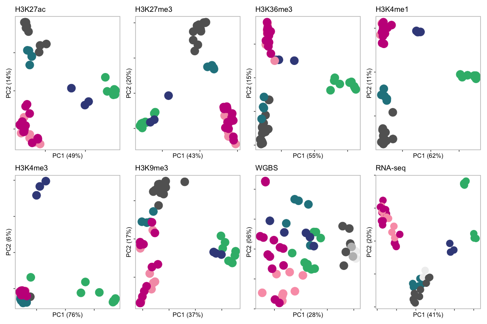<!-- -->

```r
ggsave("../plot/PCA_ALL_v2.pdf", width = 50, height = 20, units = "cm")
```


## H3K4me1 heatmap


```r
nbc = read_tsv("../data/de_chipseq/H3K4me1.NBC.enriched_over4cell_0.75percent_matrix.tsv")
n1 = nrow(nbc)

gcbc = read_tsv("../data/de_chipseq/H3K4me1.GCBC.enriched_over4cell_0.75percent_matrix.tsv")
n2 = nrow(gcbc)

mbc = read_tsv("../data/de_chipseq/H3K4me1.MBC.enriched_over4cell_0.75percent_matrix.tsv")
n3 = nrow(mbc)

pbc = read_tsv("../data/de_chipseq/H3K4me1.PBC.enriched_over4cell_0.75percent_matrix.tsv")
n4 = nrow(pbc)

cll = read_tsv("../data/de_chipseq/H3K4me1.CLL.enriched_over4cell_0.75percent_matrix.tsv")
n5 = nrow(cll)

ucll = read_tsv("../data/de_chipseq/H3K4me1.mCLL_uCLL_unmutated_enriched_matirx.tsv")
names(ucll)[1]<-paste("A.intersect.value")
n6 = nrow(ucll)

mcll = read_tsv("../data/de_chipseq/H3K4me1.mCLL_uCLL_mutated_enriched_matirx.tsv")
names(mcll)[1]<-paste("A.intersect.value")
n7 = nrow(mcll)

x = rbind(nbc, gcbc, mbc, pbc, cll, ucll, mcll)

x = x %>% select(-contains("MACS2NoInput")) 

#cll = x %>% select(contains("CLL")) %>% select(-contains("EGAN00001358538"), -contains("EGAN00001358558")) #rem unknown IGHV
#row normalize
#x$row_maximum = rowMaxs(as.matrix(x[,2:51]))
#x2 = x[,2:51]/x$row_maximum
#x2 = rescale(as.matrix(x[,2:51]))

nbc = x %>% select(contains("NBC"))
gcb = x %>% select(contains("GCBC"))
mbc = x %>% select(contains("MBC"))
pbc = x %>% select(contains("PBC"))

u = c("CEMT_92", "CEMT_95", "CEMT_30", "CEMT_27", "CEMT_29", "CEMT_4", "EGAN00001202788", "EGAN00001202787")
m = c("CEMT_97", "CEMT_93", "CEMT_96", "CEMT_94", "CEMT_6", "CEMT_28", "CEMT_5", "CEMT_26", "CEMT_25",  "CEMT_1", "EGAN00001202789",  "EGAN00001265750", "EGAN00001295796", "EGAN00001235813", "EGAN00001202786")

ucll = x %>% select(contains(u)) # R function does not work in this step
mcll = x %>% select(contains(m)) %>% select(-contains("CEMT_129"), -contains("CEMT_13")) #rem gcb
#setdiff(colnames(cll), union(colnames(mcll),colnames(ucll)))

x2 = cbind(nbc, gcb, mbc, pbc, ucll, mcll)

dim(x2)

anno = data.frame("Cell" = c(rep("NBC",ncol(nbc)),rep("GCBC",ncol(gcb)),rep("MBC",ncol(mbc)),rep("PBC",ncol(pbc)),rep("uCLL",ncol(ucll)), rep("mCLL",ncol(mcll))))
rownames(anno) = colnames(x2)

my_colour = list(
    Cell = c(NBC = "#636363", GCBC = "#35B779FF", MBC = "#26828EFF", PBC = "#3E4A89FF", uCLL = "#F59EB5", mCLL = "#C61D8A"))

#plot.new()
#png("../plot/CLL_manuscript/h3k4me1_dynamic_v8.png", width = 800, height = 1000)

pheatmap(x2, annotation_col = anno, 
         annotation_colors = my_colour,
         cluster_rows = F, 
         cluster_cols = F, 
         show_rownames = F, 
         show_colnames = F, 
         scale = "row", 
         border_color = NA,
         #gaps_col = ncol(x2)-ncol(ucll)-ncol(mcll),
         gaps_col = c(12, 12+9, 12+9+5, 12+9+5+3, 12+9+5+3+7, 12+9+5+3+7+12),
         gaps_row = c(n1, n1+n2, n1+n2+n3, n1+n2+n3+n4, n1+n2+n3+n4+n5, n1+n2+n3+n4+n5+n6, n1+n2+n3+n4+n5+n6+n7))

#dev.off()

#num of de regions
c(n1, n2, n3, n4, n5, n6, n7) #18739 59430  6119 21156 11709   987  1759
#total
nrow(x2) #119899

#comment: to make clear heatmap colors; i need to plot heatmap by cell types and merge in illustrator

#coordinates; cll specific gain of H3K4me1
#XKR6: chr8:10,864,881-11,042,575
#B4GALT1-AS1: chr9:33,168,832-33,202,131
#PMID: 25101192: More distal to the BCR are PTPN22, SHP-1, PTPN2, and PTP-PEST, which are primarily involved in downregulation of BCR signaling. PTPRN2: chr7:158,516,764-158,593,763
```

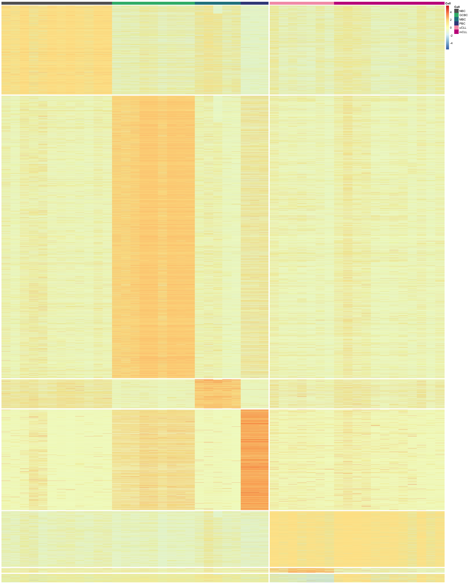

## RPKM Boxplot


```r
k = read.table("../data/table_EGA_CEMT.txt", head = T)
gene = read.table("../data/hg38v79/hg38v79_genes", header = T)[,c(1,7)]
k2 = left_join(gene, k,  by = c( "stable_id" = "ENSG")) %>% na.omit() %>% select(-stable_id)
xm = melt(k2)

mcll = c( "CLL.110", "CLL.1228",  "CLL.1525", "CLL.1532",  "CLL.3", "CLL_97", "CLL_93", "CLL_96", "CLL_94", "CLL_6", "CLL_28", "CLL_5", "CLL_26", "CLL_25",  "CLL_1")
ucll = c("CLL.12", "CLL.182", "CLL_92", "CLL_95", "CLL_30", "CLL_27", "CLL_29", "CLL_4")


cll_expr <- select(k,1, matches("CLL"))
names(cll_expr)[1] <- "NAME"
cll_expr$DESCRIPTION <- NA

cll_expr <- select(cll_expr,1,25, matches("CLL"))
cll_expr[,c(3:25)] <- cll_expr[,c(3:25)] + 0.001
write.table(cll_expr, "../data/bivalent_promoter/expression/cll_only_all_finite.txt",
            quote = FALSE,row.names = FALSE, sep = "\t", col.names = T)

xm$Cell <- ifelse(xm$variable %in% mcll, "mCLL", 
                          ifelse(xm$variable %in% ucll, "uCLL",
                           ifelse(grepl("MBC", xm$variable, ignore.case = T), "MBC", 
                                  ifelse(grepl("HMPC", xm$variable, ignore.case = T), "HMPC",
                           ifelse(grepl("NBC", xm$variable, ignore.case = T), "NBC",
                           ifelse(grepl("PBC", xm$variable, ignore.case = T), "PBC",
                           ifelse(grepl("PreBC", xm$variable, ignore.case = T), "PreBC", # no rna-seq data
                           ifelse(grepl("GCBC", xm$variable, ignore.case = T), "GCBC", 
                           ifelse(grepl("CLP", xm$variable, ignore.case = T), "CLP", "nothing")))))))))

#xm2 = xm %>% filter(Cell != "remove") 
xm2 = xm 
xm2 = xm2 %>% filter(Cell != "HMPC") %>% filter(Cell !=  "CLP")

xm2$Cell = factor(xm2$Cell, levels = c("NBC", "GCBC", "MBC", "PBC", "uCLL", "mCLL"))

xm2 %>% distinct(Cell, variable, .keep_all = TRUE) %>%
   group_by(Cell) %>% 
   summarise(replicates = n())
```

```
## # A tibble: 6 x 2
##   Cell  replicates
##   <fct>      <int>
## 1 NBC            9
## 2 GCBC           9
## 3 MBC            5
## 4 PBC            3
## 5 uCLL           8
## 6 mCLL          15
```

```r
gene_expression = function(geneName)
{
plot = xm2 %>% filter(display_label == geneName) %>%
  ggplot(aes(Cell, value, fill = Cell)) +
  scale_fill_manual(values=c("#636363", "#35B779FF", "#26828EFF", "#3E4A89FF", "#fa9fb5", "#c51b8a")) +
  geom_boxplot() +
  geom_dotplot(binaxis = "y", stackdir = "center", stackratio = .5) +
  #geom_point() +
  #geom_dotplot(binaxis = "y", stackdir = "center") +
  #theme_bw() +
  ylab("RPKM") +
  xlab(geneName) +
  scale_y_continuous(position = "right") +
  theme(panel.background = element_rect(fill = "white"),
        panel.border = element_rect(fill = NA, colour = "gray", size = 1),
        strip.background =element_rect(fill="white"),
        axis.text = element_text(color = "black"),
        axis.text.x = element_text(color = "black", angle = 90, hjust = 1),
        legend.position = "none")

print(plot)
ggsave(filename=paste("../plot/RNA-seq/", geneName,"_boxplot.pdf"), width = 16, height = 12, units = "cm", device = 'pdf')
}

# cll specific H3K4me1 gain regions (>1kb); overlap with cosmic onco
#[1] "ARNT"    "ATF1"    "BCL2"    "BRD4"    "CACNA1D" "CARD11"  "CBFA2T3" "CCND2"   "CREB3L2" "CREBBP"  "CRTC1"   "ETV6"    "FLT3"   
#[14] "FOXP1"   "JAK1"    "KAT6B"   "LCK"     "LEF1"    "LPP"     "MAML2"   "MAP2K1"  "MAP2K2"  "MAPK1"   "MSI2"    "MTOR"    "PTPN11" 
#[27] "RAD51B"  "RPL22"   "SH3GL1"  "STAT5B"  "TAF15"   "TCF7L2" 

#uniquely expressed in CLL
gene_expression("LEF1") #chr4:108,040,003-108,181,134
```

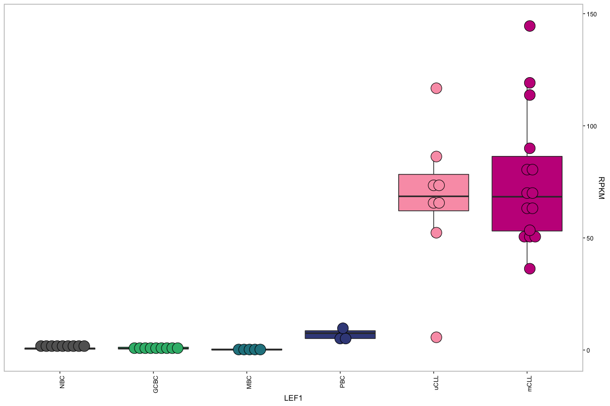<!-- -->

```r
gene_expression("BCL2") #chr18:63,120,162-63,324,334
```

<!-- -->

```r
gene_expression("CBFA2T3") #final: chr16:88,869,712-88,950,221; other views: chr16:88,861,001-88,910,000; chr16:88,869,155-88,980,514; 
```

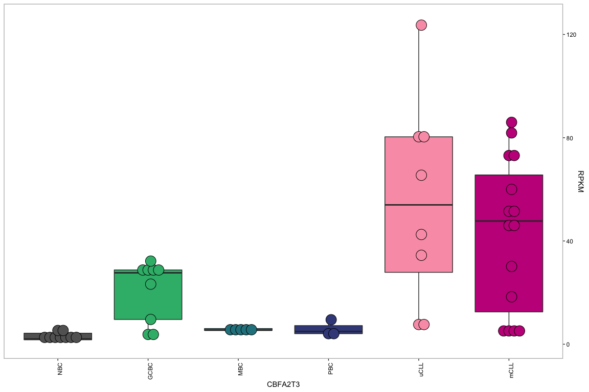<!-- -->

```r
gene_expression("CRTC1") #chr19:18,679,431-18,780,982
```

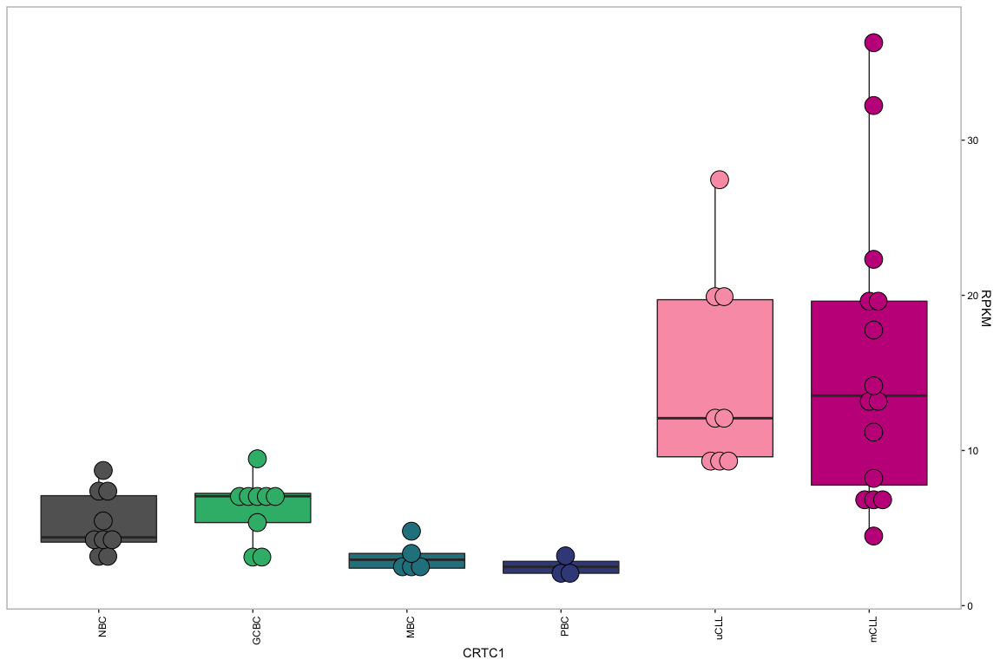<!-- -->

```r
gene_expression("WNT3") 
```

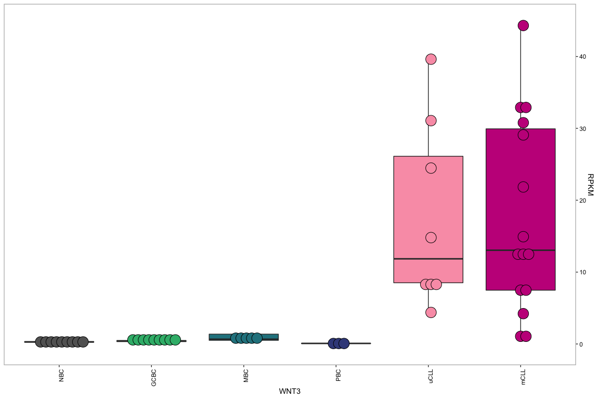<!-- -->

```r
gene_expression("WNT10A") 
```

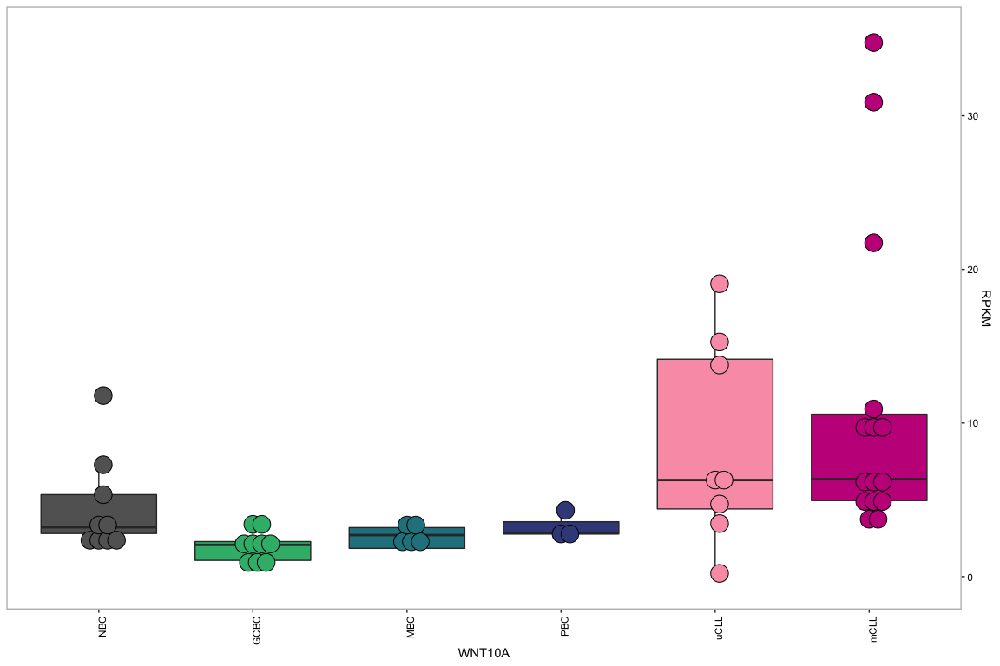<!-- -->

```r
gene_expression("ROR1") 
```

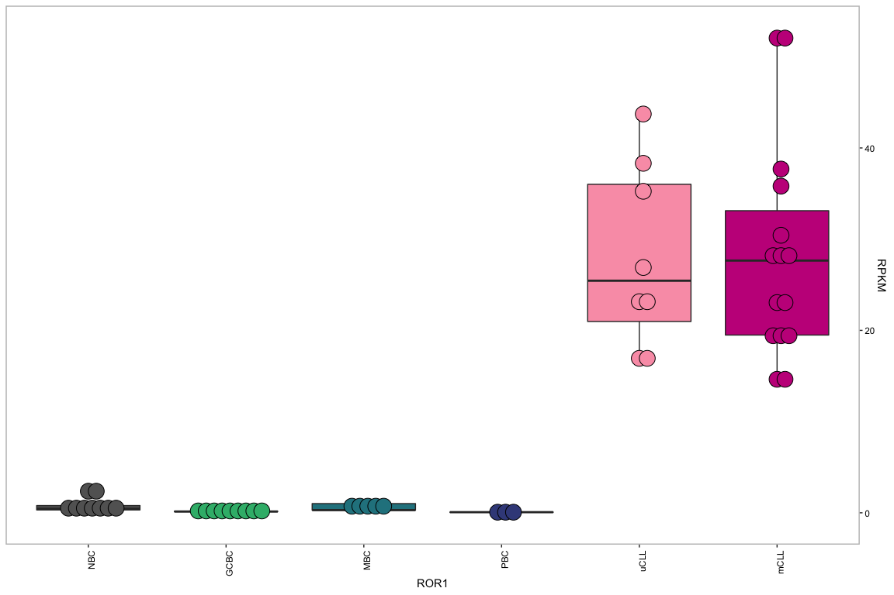<!-- -->

```r
gene_expression("MAPK3") 
```

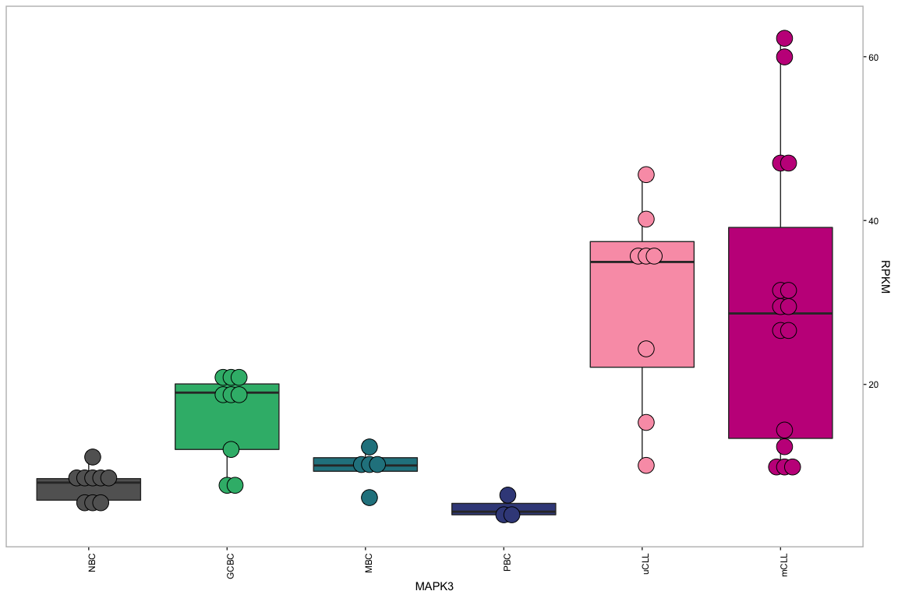<!-- -->

```r
gene_expression("LILRB3")
```

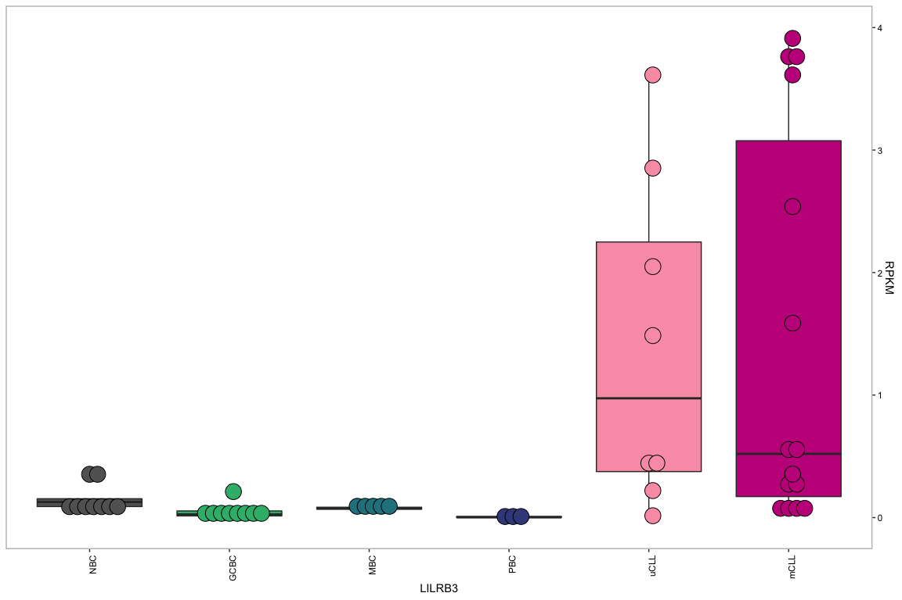<!-- -->

## DE regions


```r
## cll vs others
#total de count
x = read.table("../data/cll_bcell/count_enriched_u.mcll.txt")
x$V2 = factor(x$V2, levels = c("H3K27ac", "H3K4me3", "H3K36me3",  "H3K4me1", "H3K27me3", "H3K9me3"))


ggplot(x, aes(V2, V1, fill = V3)) +
  geom_bar(stat = "identity") +
  xlab("") +
  ylab("Number of DE regions") +
  geom_hline(yintercept = 0) +
  scale_fill_manual(values = c("#3E4A89FF", "#c51b8a")) +
   theme(panel.background = element_rect(fill = "white"),
        panel.border = element_rect(fill = NA, colour = "gray", size = 1),
        strip.background =element_rect(fill="white"),
        axis.text = element_text(color = "black")) +
  coord_flip()
```

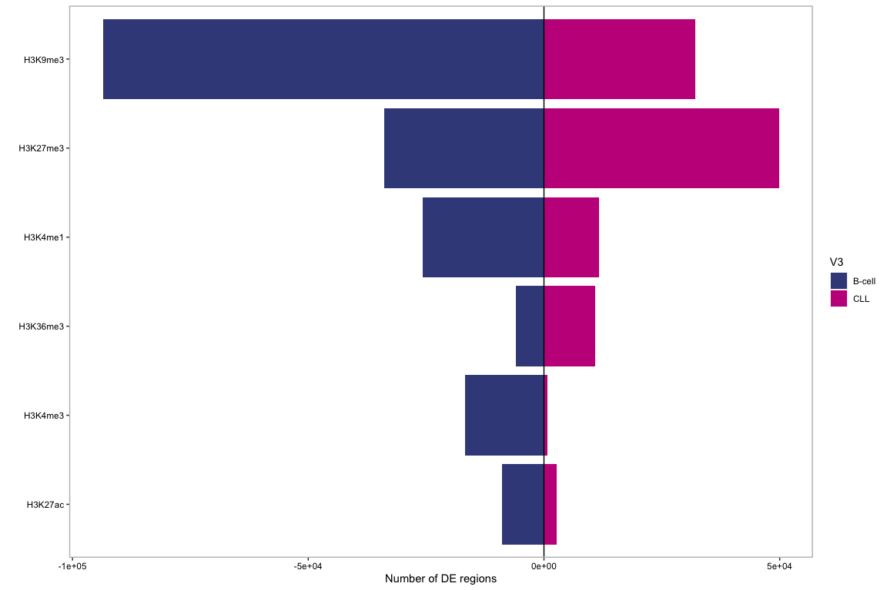<!-- -->

```r
ggsave("../plot/Num_DE_regions_CLL_vs_others.pdf", width = 20, height = 20, units = "cm")

x = read.table("../data/de_chipseq/enrichement_over_each_other/de_up_dn_all_cell.txt")
x$V2 = factor(x$V2, levels = c("H3K27ac", "H3K4me3", "H3K36me3",  "H3K4me1", "H3K27me3", "H3K9me3"))
x$V3 = factor(x$V3, levels = c( "NBC", "GCBC", "MBC",  "PBC", "CLL"))

c = x %>% filter(V3 == "CLL") %>% filter(V4 == "enriched") %>%  group_by(V2) %>% summarise(sum(abs(V1)))
cn = x %>% filter(V3 == "CLL") %>% filter(V4 == "not") %>%  group_by(V2) %>% summarise(sum(abs(V1)))
g = x %>% filter(V3 == "GCBC") %>% filter(V4 == "enriched") %>%  group_by(V2) %>% summarise(sum(abs(V1)))
gn = x %>% filter(V3 == "GCBC") %>% filter(V4 == "not") %>%  group_by(V2) %>% summarise(sum(abs(V1)))
t = x %>% group_by(V2) %>% summarise(sum(abs(V1)))
# % cll specific enrichment
mean(c$`sum(abs(V1))`/t$`sum(abs(V1))`)*100
```

```
## [1] 7.887001
```

```r
mean(cn$`sum(abs(V1))`/t$`sum(abs(V1))`)*100
```

```
## [1] 18.88159
```

```r
mean(g$`sum(abs(V1))`/t$`sum(abs(V1))`)*100
```

```
## [1] 22.78602
```

```r
mean(gn$`sum(abs(V1))`/t$`sum(abs(V1))`)*100
```

```
## [1] 19.08837
```

```r
ggplot(x, aes(V2, V1, fill = V3)) +
  geom_bar(stat = "identity", position = "dodge") +
  xlab("") +
  ylab("Number of DE regions") +
  geom_hline(yintercept = 0) +
  scale_fill_manual(values = c("#636363", "#35B779FF", "#26828EFF", "#3E4A89FF",  "#C61D8A")) +
  theme_bw() +
  coord_flip()
```

<!-- -->

```r
ggsave("../plot/Num_DE_regions_cell_vs_others_6marks.pdf", width = 20, height = 20, units = "cm")

#great
library(forcats)
x = read_tsv("../data/de_chipseq/greatExportAll_H3K4me1_CLL.tsv")
```

```r
x %>% filter(Hyper_FDR_QVal <= 0.01) %>%
  mutate(TermName = fct_reorder(TermName, -log10(Hyper_FDR_QVal))) %>%
  ggplot(aes(x = TermName, y = -log10(Hyper_FDR_QVal))) + 
  geom_col() +
  coord_flip() +
  xlab("") +
  ylab("-log10(Hypergeometric FDR Q-Value)") +
  theme_bw()
```

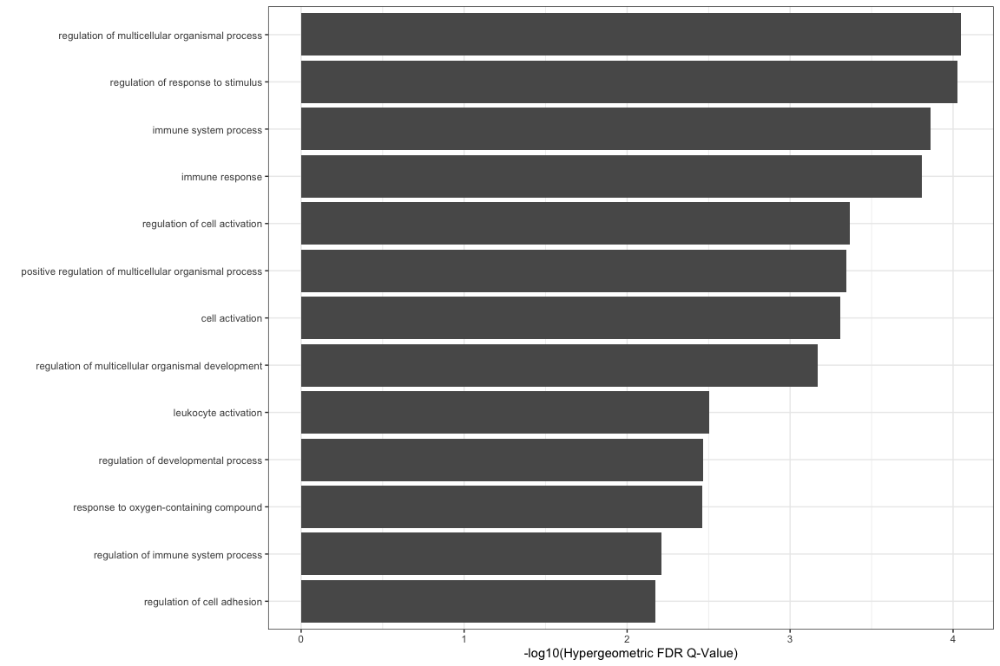<!-- -->

```r
ggsave("../plot/H3K4me1_CLL_GREAT.pdf", width = 20, height = 20, units = "cm")
```

# expression of lef1 targets


```r
e = read.table("../data/table_EGA_CEMT.txt", head = T)

#lef target
#lef = read_tsv("../data/cll_manuscript/genebody_cll_UPgenes.txt", col_names = F)
lef = read_tsv("../data/cll_manuscript/TSS5kb_cll_UPgenes.txt", col_names = F)
#lef = read_tsv("../data/cll_manuscript/TSS5kb_genebody_cll_UPgenes_v2.txt", col_names = F)

colnames(lef) = "ENSG"
e2 = left_join(lef, e) %>% select(starts_with("CLL")) %>% 
  melt() %>%
  mutate(Type = "lef-target")

#non-lef target
nlef = read.table("../data/RNA-seq/DESeq2_uCLL_mCLL_Bcells/Bcell_vs_CLL_DN.txt.genebody.pc")
nlef = data.frame(ENSG = unique(nlef$V7)) 
nlef = anti_join(nlef, lef)

e3 = left_join(nlef, e) %>% select(starts_with("CLL")) %>% 
  melt() %>%
  mutate(Type = "non-lef")
 
rbind(e2, e3) %>%
  ggplot(aes(Type, log10(value+0.001))) +
  geom_boxplot(outlier.shape = NA)  +
  theme(panel.background = element_rect(fill = "white"),
        panel.border = element_rect(fill = NA, colour = "gray", size = 1),
        strip.background =element_rect(fill="white"),
        axis.text = element_text(color = "black"),
        legend.position = "bottom")
```

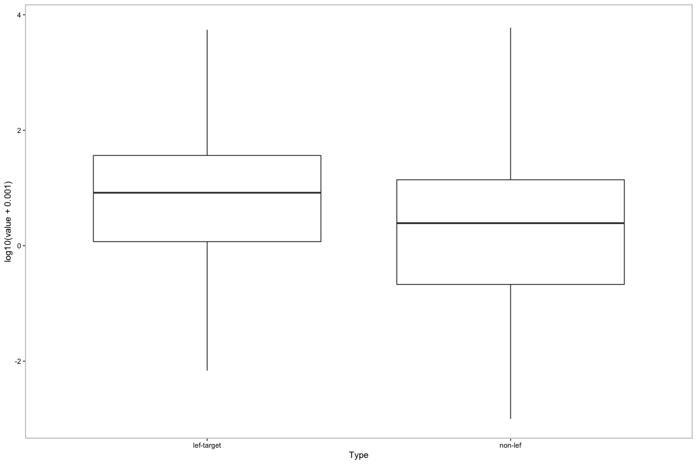<!-- -->

```r
ggsave(filename=paste("../plot/CLL_manuscript/lef_target_exp.pdf"), width = 12, height = 16, units = "cm", device = 'pdf')

t.test(e2$value, e3$value)
```

```
## 
## 	Welch Two Sample t-test
## 
## data:  e2$value and e3$value
## t = 12.876, df = 10113, p-value < 2.2e-16
## alternative hypothesis: true difference in means is not equal to 0
## 95 percent confidence interval:
##  24.92220 33.87263
## sample estimates:
## mean of x mean of y 
##  52.19060  22.79318
```

# H3k27ac heatmap 


```r
x = read_tsv("../data/de_chipseq/H3K27ac.CLL.enriched_over4cell_0.75percent_matrix.tsv")
#x = read_tsv("../data/de_chipseq/H3K27acCLL_not_enriched_over4cell_0.75percent_matrix.tsv")

x = x %>% select(-contains("MACS2NoInput")) 

nbc = x %>% select(contains("NBC"))
n1=ncol(nbc)
gcb = x %>% select(contains("GCBC"))
n2=ncol(gcb)
mbc = x %>% select(contains("MBC"))
n3=ncol(mbc)
pbc = x %>% select(contains("PBC"))
n4=ncol(pbc)
cll = x %>% select(contains("CLL"))
n5=ncol(cll)

x2 = cbind(nbc, gcb, mbc, pbc, cll)
dim(x2)
```

```
## [1] 2730   58
```

```r
anno = data.frame("Cell" = c(rep("NBC",ncol(nbc)),rep("GCBC",ncol(gcb)),rep("MBC",ncol(mbc)),rep("PBC",ncol(pbc)), rep("CLL",ncol(cll))))
rownames(anno) = colnames(x2)

my_colour = list(
    Cell = c(NBC = "#636363", GCBC = "#35B779FF", MBC = "#26828EFF", PBC = "#3E4A89FF", CLL = "#C61D8A"))


# plot.new()
# #png("../plot/h3k4me1_DE_134genes_v2.png", width = 2400, height = 2000)
# pdf("../plot/H2K27ac_heatmap_CLL_bcell_v4.pdf", width = 16, height = 12)
pheatmap(x2, 
         annotation_col = anno, 
         annotation_colors = my_colour, 
         cluster_rows = F, 
         cluster_cols = F, 
         show_rownames = F, 
         show_colnames = F, 
         scale = "row", 
         gaps_col = c(n1, n1+n2, n1+n2+n3, n1+n2+n3+n4, n1+n2+n3+n4+n5))
```

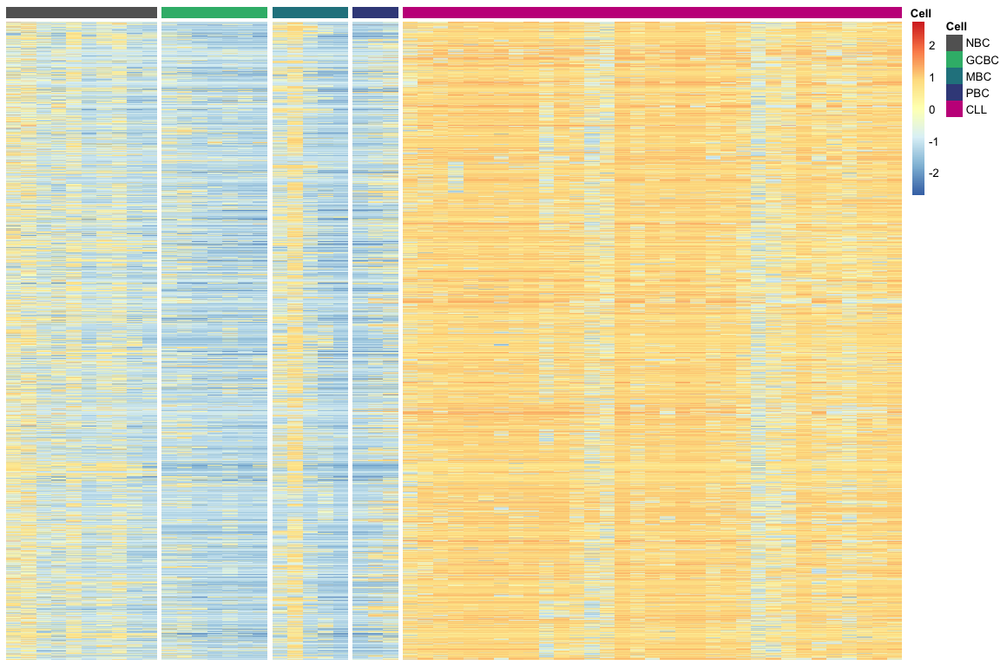<!-- -->

```r
#dev.off()
```

## RPKM Boxplot


```r
k = read.table("../data/table_EGA_CEMT.txt", head = T)
gene = read.table("../data/hg38v79/hg38v79_genes", header = T)[,c(1,7)]
k2 = left_join(gene, k,  by = c( "stable_id" = "ENSG")) %>% na.omit() %>% select(-stable_id)
xm = melt(k2)

#temp
t = k2 %>% select(starts_with("CLL"))
t$mean = (rowSums(t, dims = 1))/ncol(t)
t$ENSG = k$ENSG 
t2 = t %>% select(mean, ENSG)
#end temp

mcll = c( "CLL.110", "CLL.1228",  "CLL.1525", "CLL.1532",  "CLL.3", "CLL_97", "CLL_93", "CLL_96", "CLL_94", "CLL_6", "CLL_28", "CLL_5", "CLL_26", "CLL_25",  "CLL_1")
ucll = c("CLL.12", "CLL.182", "CLL_92", "CLL_95", "CLL_30", "CLL_27", "CLL_29", "CLL_4")

cll_expr <- select(k,1, matches("CLL"))
names(cll_expr)[1] <- "NAME"
cll_expr$DESCRIPTION <- NA

cll_expr <- select(cll_expr,1,25, matches("CLL"))
cll_expr[,c(3:25)] <- cll_expr[,c(3:25)] + 0.001
write.table(cll_expr, "../data/bivalent_promoter/expression/cll_only_all_finite.txt",
            quote = FALSE,row.names = FALSE, sep = "\t", col.names = T)

xm$Cell <- ifelse(xm$variable %in% mcll, "mCLL", 
                          ifelse(xm$variable %in% ucll, "uCLL",
                           ifelse(grepl("MBC", xm$variable, ignore.case = T), "MBC", 
                                  ifelse(grepl("HMPC", xm$variable, ignore.case = T), "HMPC",
                           ifelse(grepl("NBC", xm$variable, ignore.case = T), "NBC",
                           ifelse(grepl("PBC", xm$variable, ignore.case = T), "PBC",
                           ifelse(grepl("PreBC", xm$variable, ignore.case = T), "PreBC", # no rna-seq data
                           ifelse(grepl("GCBC", xm$variable, ignore.case = T), "GCBC", 
                           ifelse(grepl("CLP", xm$variable, ignore.case = T), "CLP", "nothing")))))))))

#xm2 = xm %>% filter(Cell != "remove") 
xm2 = xm 
xm2 = xm2 %>% filter(Cell != "HMPC") %>% filter(Cell !=  "CLP")

xm2$Cell = factor(xm2$Cell, levels = c("NBC", "GCBC", "MBC", "PBC", "uCLL", "mCLL"))

xm2 %>% distinct(Cell, variable, .keep_all = TRUE) %>%
   group_by(Cell) %>% 
   summarise(replicates = n())
```

```
## # A tibble: 6 x 2
##   Cell  replicates
##   <fct>      <int>
## 1 NBC            9
## 2 GCBC           9
## 3 MBC            5
## 4 PBC            3
## 5 uCLL           8
## 6 mCLL          15
```

```r
gene_expression = function(geneName)
{
plot = xm2 %>% filter(display_label == geneName) %>%
  ggplot(aes(Cell, value, fill = Cell)) +
  scale_fill_manual(values=c("#636363", "#35B779FF", "#26828EFF", "#3E4A89FF", "#fa9fb5", "#c51b8a")) +
  geom_boxplot() +
  geom_dotplot(binaxis = "y", stackdir = "center", stackratio = .5) +
  #geom_point() +
  #geom_dotplot(binaxis = "y", stackdir = "center") +
  #theme_bw() +
  ylab("RPKM") +
  xlab(geneName) +
  scale_y_continuous(position = "right") +
  theme(panel.background = element_rect(fill = "white"),
        panel.border = element_rect(fill = NA, colour = "gray", size = 1),
        strip.background =element_rect(fill="white"),
        axis.text = element_text(color = "black"),
        axis.text.x = element_text(color = "black", angle = 90, hjust = 1),
        legend.position = "none")

print(plot)
ggsave(filename=paste("../plot/RNA-seq/", geneName,"_boxplot.pdf"), width = 16, height = 12, units = "cm", device = 'pdf')
}

gene_expression("EP300") 
```

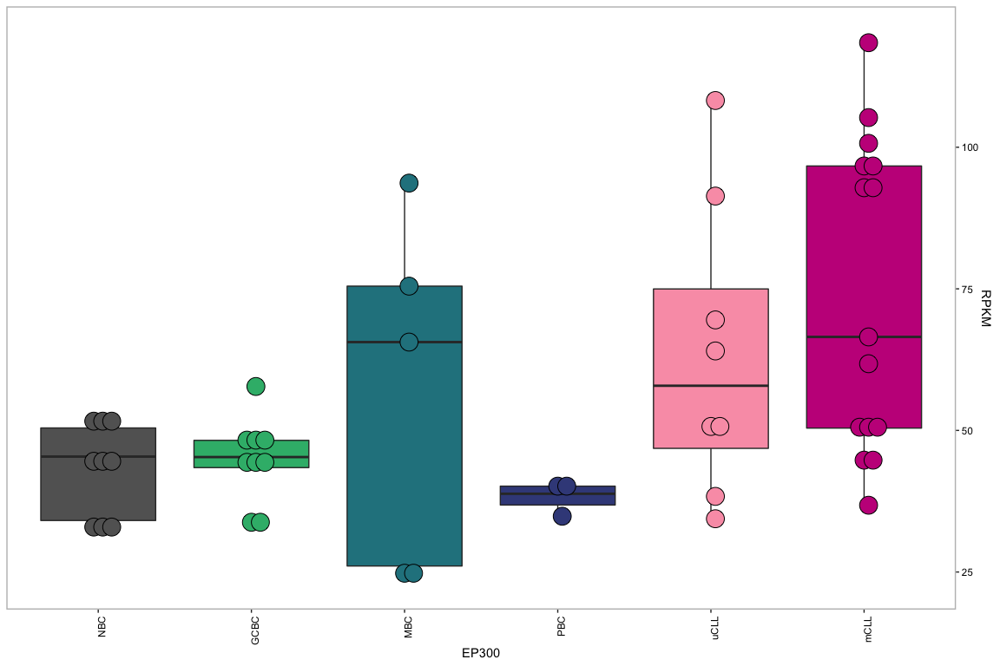<!-- -->

```r
gene_expression("CREBBP") 
```

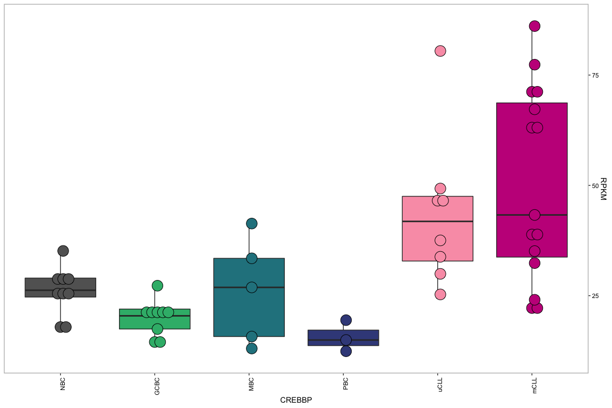<!-- -->

```r
# de expressed in CLL
gene_expression("BCL2") 
```

<!-- -->

```r
gene_expression("CBFA2T3") 
```

<!-- -->

```r
gene_expression("CCR7") 
```

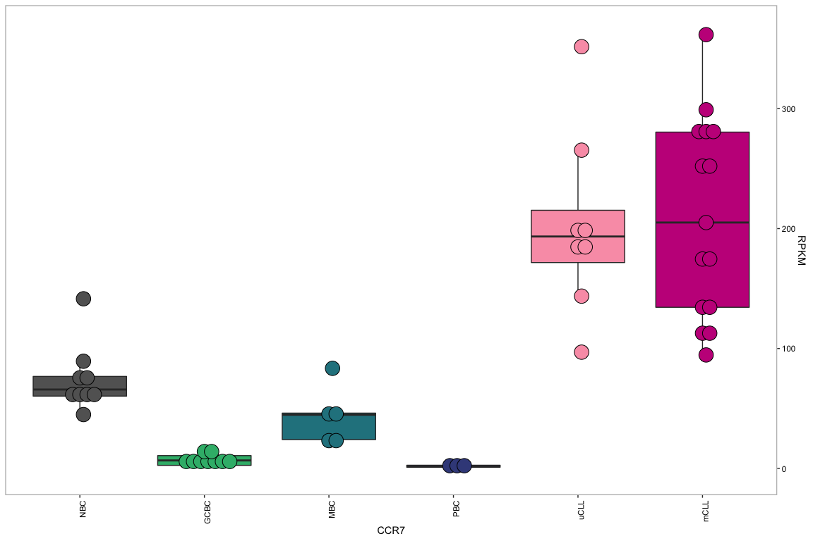<!-- -->

```r
gene_expression("ETV6") 
```

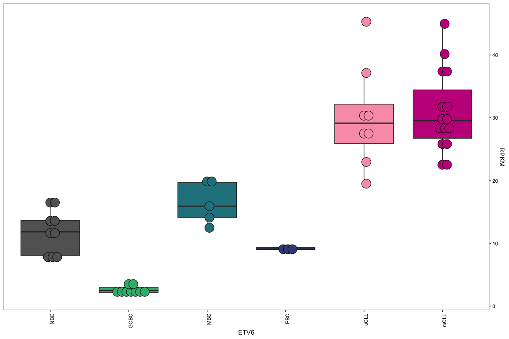<!-- -->

```r
gene_expression("FGR") 
```

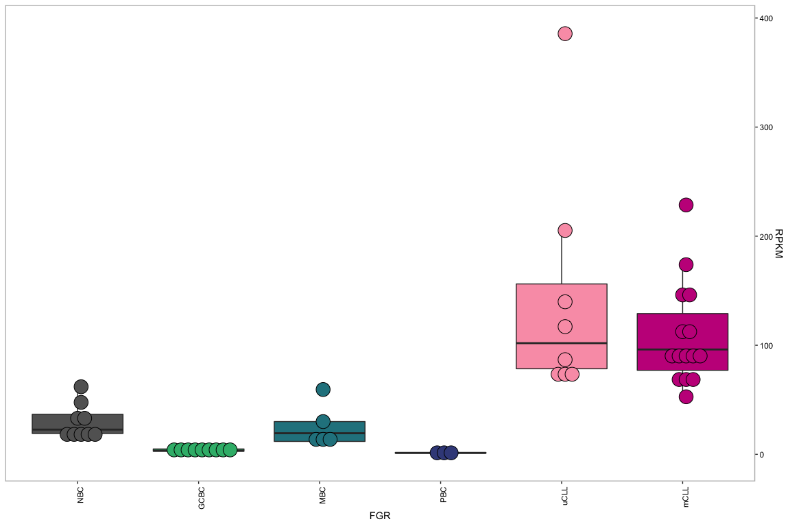<!-- -->

```r
#expression by de h3k27ac
up = read.table("../data/de_chipseq/greatExportAll_H3K27ac.CLL.enriched_over4cell_0.75percent_genelist.txt")
dn = read.table("../data/de_chipseq/greatExportAll_lost_H3K27ac_CLL_geneslist.txt")
#up2 = left_join(up, xm2, by = c("V1" = "display_label")) %>% mutate(type = ifelse(grepl("CLL", Cell, ignore.case = T), "CLL", "B-cell")) 
#dn2 = left_join(dn, xm2, by = c("V1" = "display_label")) %>% mutate(type = ifelse(grepl("CLL", Cell, ignore.case = T), "CLL", "B-cell")) 
#rem = anti_join(xm2, rbind(up, dn), by = c( "display_label" = "V1" )) %>% mutate(type = ifelse(grepl("CLL", Cell, ignore.case = T), "CLL", "B-cell")) 
#rem2 = data.frame(V1 = rem$display_label)

#
k2 = k2 %>% select(-contains("HMPC")) %>% select(-contains("CLP"))

up3 = inner_join(up, k2, by = c("V1" = "display_label" )) %>% 
  melt() %>%
  mutate(type = ifelse(grepl("CLL", variable, ignore.case = T), "CLL", "B-cell")) %>%
  mutate(de = "UP")

dn3 = inner_join(dn, k2, by = c("V1" = "display_label" )) %>% 
  distinct(V1, .keep_all = T)  %>% 
  melt() %>%
  mutate(type = ifelse(grepl("CLL", variable, ignore.case = T), "CLL", "B-cell")) %>%
  mutate(de = "DN")

rem3 = anti_join(k2, rbind(up, dn), by = c( "display_label" = "V1" )) %>% 
  melt() %>%
  mutate(type = ifelse(grepl("CLL", variable, ignore.case = T), "CLL", "B-cell")) %>%
  mutate(de = "stable")

colnames(rem3) = c("V1", "variable", "value", "type", "de" ) 

data = rbind(dn3, up3, rem3) 
data$de = factor(data$de, levels = c("UP", "DN", "stable"))

#
data %>% 
  ggplot(aes(de, log10(value+0.001))) +
  geom_boxplot(aes(colour = type), outlier.color = "white") +
  scale_colour_manual(values=c("#3E4A89FF", "#c51b8a")) +
  ylab("log10(RPKM + 0.001)") +
  xlab("") +
  theme(panel.background = element_rect(fill = "white"),
        panel.border = element_rect(fill = NA, colour = "gray", size = 1),
        strip.background =element_rect(fill="white"),
        axis.text = element_text(color = "black"),
        axis.text.x = element_text(color = "black", angle = 0, hjust = 1),
        legend.position = "none")
```

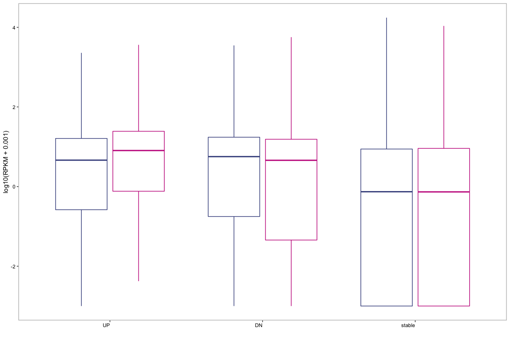<!-- -->

```r
ggsave(filename=paste("../plot/RNA-seq/de_h3k27ac_3cat_v2.pdf"), width = 16, height = 12, units = "cm", device = 'pdf')

#num of genes
up.g = inner_join(up, k2, by = c("V1" = "display_label" )) 
dn.g = inner_join(dn, k2, by = c("V1" = "display_label" )) 
rem.g = anti_join(k2, rbind(up, dn), by = c( "display_label" = "V1" ))
nrow(up.g) + nrow(dn.g) + nrow(rem.g)
```

```
## [1] 20117
```

```r
# 
a = (up3 %>% filter(type == "CLL") %>% select(value))
b =(up3 %>% filter(type == "B-cell")) %>% select(value)
wilcox.test(a$value, b$value)
```

```
## 
## 	Wilcoxon rank sum test with continuity correction
## 
## data:  a$value and b$value
## W = 798839860, p-value < 2.2e-16
## alternative hypothesis: true location shift is not equal to 0
```

```r
t.test(a$value, b$value)
```

```
## 
## 	Welch Two Sample t-test
## 
## data:  a$value and b$value
## t = 15.772, df = 57974, p-value < 2.2e-16
## alternative hypothesis: true difference in means is not equal to 0
## 95 percent confidence interval:
##   8.39452 10.77693
## sample estimates:
## mean of x mean of y 
##  27.61488  18.02916
```

```r
a = (dn3 %>% filter(type == "CLL") %>% select(value))
b =(dn3 %>% filter(type == "B-cell")) %>% select(value)
wilcox.test(a$value, b$value)
```

```
## 
## 	Wilcoxon rank sum test with continuity correction
## 
## data:  a$value and b$value
## W = 7152220310, p-value < 2.2e-16
## alternative hypothesis: true location shift is not equal to 0
```

```r
t.test(a$value, b$value)
```

```
## 
## 	Welch Two Sample t-test
## 
## data:  a$value and b$value
## t = -6.7671, df = 234036, p-value = 1.317e-11
## alternative hypothesis: true difference in means is not equal to 0
## 95 percent confidence interval:
##  -1.88693 -1.03938
## sample estimates:
## mean of x mean of y 
##  14.96797  16.43112
```

```r
a = (rem3 %>% filter(type == "CLL") %>% select(value))
b =(rem3 %>% filter(type == "B-cell")) %>% select(value)
wilcox.test(a$value, b$value)
```

```
## 
## 	Wilcoxon rank sum test with continuity correction
## 
## data:  a$value and b$value
## W = 5.4096e+10, p-value = 6.585e-09
## alternative hypothesis: true location shift is not equal to 0
```

```r
t.test(a$value, b$value)
```

```
## 
## 	Welch Two Sample t-test
## 
## data:  a$value and b$value
## t = 3.4058, df = 627847, p-value = 0.0006596
## alternative hypothesis: true difference in means is not equal to 0
## 95 percent confidence interval:
##  0.336385 1.248365
## sample estimates:
## mean of x mean of y 
##  12.79245  12.00007
```

##  SE H3K27ac 134 genes 


```r
# SE overlap; Fisher's exact test
#sum(dhyper(intersect:smaller_sub, larger_sub, total_population - larger_sub, smaller_sub))
sum(dhyper(1247:647, 2730, 22845 - 2730, 647)) # total_population = all dynamic H3K27ac
```

```
## [1] 0
```

```r
x = read.table("../data/de_chipseq/greatExportAll_H3K27ac_CLL_geneslist.txt")
dn = read.table("../data/RNA-seq/DESeq2_uCLL_mCLL_Bcells/Bcell_vs_CLL_DN.txt.genebody.pc")
#up = read.table("../data/RNA-seq/DESeq2_uCLL_mCLL_Bcells/Bcell_vs_CLL_UP.txt")
x2 = data.frame(display_label = intersect(x$V1, dn$V5))

#### rpkm
k = read.table("../data/table_EGA_CEMT.txt", head = T)
gene = read.table("../data/hg38v79/hg38v79_genes", header = T)[,c(1,7)]
k2 = left_join(gene, k,  by = c( "stable_id" = "ENSG")) %>% na.omit() %>% select(-stable_id)

k_temp = left_join(x2, k2)

k3 = left_join(x2, k2) %>% 
  select(-display_label) %>% 
  select(-contains("CLP")) %>% 
  select(-contains("HMPC")) 

x = k3
nbc = x %>% select(contains("NBC"))
n1 = ncol(nbc)
gcb = x %>% select(contains("GCBC"))
n2 = ncol(gcb)
mbc = x %>% select(contains("MBC"))
n3 = ncol(mbc)
pbc = x %>% select(contains("PBC"))
n4 = ncol(pbc)
cll = x %>% select(contains("CLL"))
n5 = ncol(cll)

x2 = cbind(nbc, gcb, mbc, pbc, cll)

dim(x2)
```

```
## [1] 134  49
```

```r
anno = data.frame("Cell" = c(rep("NBC",ncol(nbc)),rep("GCBC",ncol(gcb)),rep("MBC",ncol(mbc)),rep("PBC",ncol(pbc)),rep("CLL",ncol(cll))))
rownames(anno) = colnames(x2)

my_colour = list(
    Cell = c(NBC = "#636363", GCBC = "#35B779FF", MBC = "#26828EFF", PBC = "#3E4A89FF", CLL = "#C61D8A"))

# plot.new()
# pdf("../plot/h3k27ac_DE_134genes_v2.pdf", width = 20, height = 16)
pheatmap(log(x2+0.001), 
         ccolor = colorRampPalette(c("blue", "white", "red"))(100),
         annotation_col = anno,
         annotation_colors = my_colour, 
         cluster_rows = F, 
         cluster_cols = F, 
         show_rownames = F, 
         show_colnames = F, 
         scale = "row", 
         border_color = NA,
         gaps_col = c(n1, n1+n2, n1+n2+n3, n1+n2+n3+n4))
```

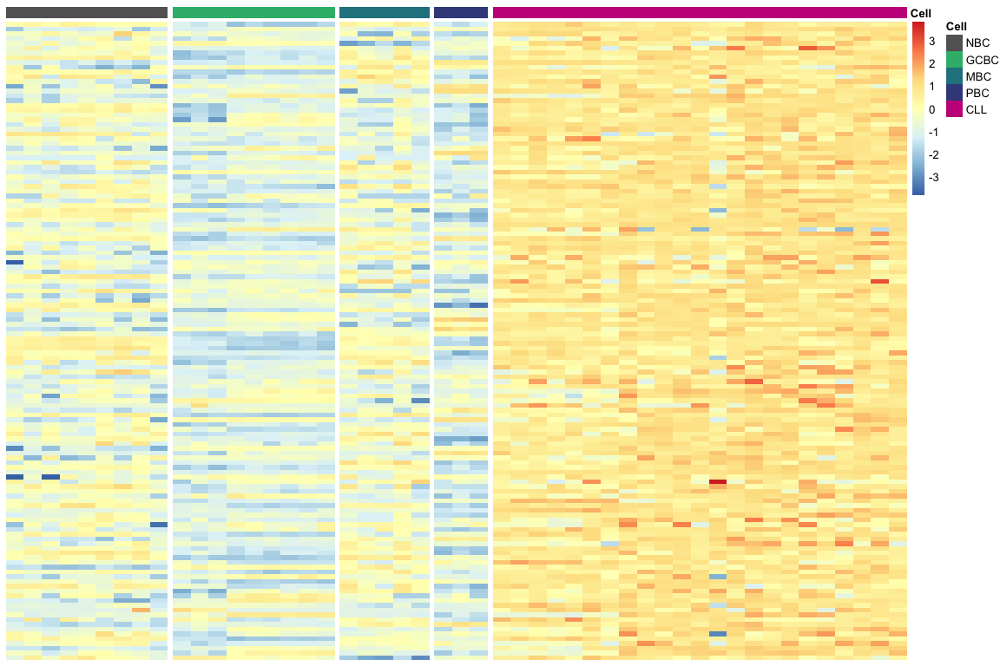<!-- -->

```r
#dev.off()

## cosmic tsg+onco
x = read.csv("../data/Census_allMon_Mar_22_00_53_34_2021.csv")
x2 = x %>% filter(x$Role.in.Cancer != "") %>% select(Gene.Symbol, Role.in.Cancer) %>% 
  filter(Role.in.Cancer != "fusion") %>%
  filter(Role.in.Cancer != "TSG") 

intersect(x2$Gene.Symbol, k_temp$display_label)
```

```
##  [1] "BCL2"    "CBFA2T3" "CCR7"    "CREB3L2" "CXCR4"   "ETV6"    "LEF1"   
##  [8] "MAML2"   "PIM1"    "SETBP1"
```

```r
#"BCL2"    "CBFA2T3" "CCR7"    "CREB3L2" "CXCR4"   "ETV6"    "LEF1"    "MAML2"   "PIM1"    "SETBP1" 
```

## great gene list


```r
k4 = read.table("../data/de_chipseq/greatExportAll_H3K4me1_CLL_geneslist.txt")
ac = read.table("../data/de_chipseq/greatExportAll_H3K27ac.CLL.enriched_over4cell_0.75percent_genelist.txt")

df = data.frame(gene_list = intersect(ac$V1, k4$V1))
write.table(df, "../data/de_chipseq/greatExportAll_H3K4me1_H3K27ac_1459CLL_geneslist.txt",
            quote = FALSE,row.names = FALSE, sep = "\t", col.names = F)

#gene table
k = read.table("../data/table_EGA_CEMT.txt", head = T)
gene = read.table("../data/hg38v79/hg38v79_genes", header = T)[,c(1,7)]
k2 = left_join(gene, k,  by = c( "stable_id" = "ENSG")) %>% na.omit() %>% select(-stable_id)
xm = melt(k2)

#
t = k2 %>% select(starts_with("CLL"))
t$mean = (rowSums(t, dims = 1))/ncol(t)
t$display_label = k2$display_label
t2 = t %>% select(mean, display_label)
colnames(k4) = "display_label"
t3 = inner_join(k4, t2) %>% filter(mean >= 1)
#length(intersect(k4$display_label, t2$display_label))
write.table(t3$display_label, "../data/de_chipseq/greatExportAll_H3K4me1_1RPKM_geneslist.txt",
            quote = FALSE, row.names = FALSE, sep = "\t", col.names = F)
```


```r
x = read.table("../data/cll_manuscript/AvgMeth_H3K27ac_CLL_enriched_over4cell_0.75percent.txt")
x = x %>%
  filter(!grepl("shuffle", V2)) %>% 
  select(-V2) %>%
  mutate(type = "Enh_met")
colnames(x) = c("id", "met", "type")

y = read.table("../data/cll_manuscript/avgMetGenomeWide_53samples_v2.txt")
y = y %>%
  mutate(type = "global")
colnames(y) = c("id", "met", "type")
y$id <- gsub('.bed', '', y$id)

df = rbind(x,y)


df = df %>% 
  #filter(!grepl("EGAN00001235812", id)) %>% 
  filter(!grepl("EGAN00001286337", id)) %>% 
  filter(!grepl("CLL_29", id)) 

df$id <- gsub('.bed.combine.5mC.CpG', '', df$id)
df$id <- gsub('.combine.5mC.CpG', '', df$id)

ucll = c("EGAN00001343492:CLL.12:12CLL", "EGAN00001343490:CLL.182:182CLL", "CLL_95", "CLL_30", "CLL_30.large", "CLL_30.small", "CLL_27", "CLL_29", "CLL_4")

df$Cell <- ifelse(df$id %in% ucll, "uCLL",
                    ifelse(grepl("GCBC", df$id, ignore.case = T), "GCBC", 
                           ifelse(grepl("csMBC", df$id, ignore.case = T), "MBC", 
                                  ifelse(grepl("HMPC", df$id, ignore.case = T), "HMPC",
                           ifelse(grepl("NBC", df$id, ignore.case = T), "NBC",
                           ifelse(grepl("PBC", df$id, ignore.case = T), "PBC",
                           ifelse(grepl("PreBC", df$id, ignore.case = T), "PreBC",
                           ifelse(grepl("MBC", df$id, ignore.case = T), "MBC", "mCLL"))))))))

df$Cell = factor(df$Cell, levels = c("HMPC","PreBC" , "NBC", "GCBC", "MBC", "PBC", "uCLL", "mCLL"))

#df$type <- ifelse(grepl("shuffle", df$V2, ignore.case = T), "Random", "H3K27ac") 

df %>%
    ggplot(aes(Cell, met)) +
    geom_dotplot(aes(fill = type, color = NA), binaxis = "y", stackdir = "center", stackratio = .5, position = "dodge", dotsize = .5, alpha = .7) +
    geom_boxplot(aes(color = type), alpha = .1) +
    scale_color_manual(values = c("#c51b8a", "black")) +
    scale_fill_manual(values = c("#c51b8a", "black")) +
    xlab("") +
    ylab("Average methylation") +
  theme_bw() +
  theme(panel.background = element_rect(fill = "white"),
        panel.border = element_rect(fill = NA, colour = "gray", size = 1),
        strip.background =element_rect(fill="white"),
        axis.text = element_text(color = "black"),
        legend.position = "bottom")
```

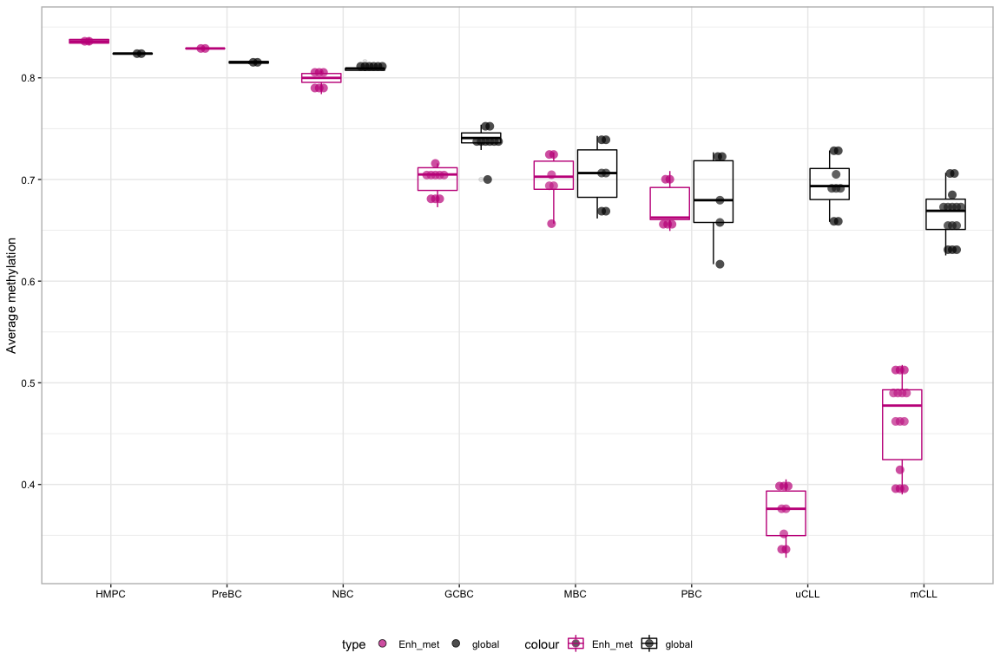<!-- -->

```r
ggsave(filename=paste("../plot/CLL_manuscript/avg_meth.pdf"), width = 16, height = 10, units = "cm", device = 'pdf')

t = df %>% filter(Cell == "HMPC") %>% 
  spread(type, met) 
t.test(t$Enh_met, t$global)
```

```
## 
## 	Welch Two Sample t-test
## 
## data:  t$Enh_met and t$global
## t = 3.2265, df = 1.0781, p-value = 0.1767
## alternative hypothesis: true difference in means is not equal to 0
## 95 percent confidence interval:
##  -0.02823547  0.05253447
## sample estimates:
## mean of x mean of y 
## 0.8359410 0.8237915
```

```r
t = df %>% filter(Cell == "PreBC") %>% 
  spread(type, met) 
t.test(t$Enh_met, t$global)
```

```
## 
## 	Welch Two Sample t-test
## 
## data:  t$Enh_met and t$global
## t = 8.606, df = 1.0236, p-value = 0.07031
## alternative hypothesis: true difference in means is not equal to 0
## 95 percent confidence interval:
##  -0.005423281  0.032657281
## sample estimates:
## mean of x mean of y 
##  0.828873  0.815256
```

```r
t = df %>% filter(Cell == "NBC") %>% 
  spread(type, met) 
t.test(t$Enh_met, t$global)
```

```
## 
## 	Welch Two Sample t-test
## 
## data:  t$Enh_met and t$global
## t = -2.9971, df = 6.5329, p-value = 0.02174
## alternative hypothesis: true difference in means is not equal to 0
## 95 percent confidence interval:
##  -0.020069836 -0.002223164
## sample estimates:
## mean of x mean of y 
## 0.7983783 0.8095248
```

```r
t = df %>% filter(Cell == "GCBC") %>% 
  spread(type, met) 
t.test(t$Enh_met, t$global)
```

```
## 
## 	Welch Two Sample t-test
## 
## data:  t$Enh_met and t$global
## t = -5.2509, df = 15.921, p-value = 8.048e-05
## alternative hypothesis: true difference in means is not equal to 0
## 95 percent confidence interval:
##  -0.05369112 -0.02279822
## sample estimates:
## mean of x mean of y 
## 0.6992959 0.7375406
```

```r
t = df %>% filter(Cell == "MBC") %>% 
  spread(type, met) 
t.test(t$Enh_met, t$global)
```

```
## 
## 	Welch Two Sample t-test
## 
## data:  t$Enh_met and t$global
## t = -0.30164, df = 9.5569, p-value = 0.7694
## alternative hypothesis: true difference in means is not equal to 0
## 95 percent confidence interval:
##  -0.04260329  0.03249995
## sample estimates:
## mean of x mean of y 
## 0.6996708 0.7047225
```

```r
t = df %>% filter(Cell == "PBC") %>% 
  spread(type, met) 
t.test(t$Enh_met, t$global)
```

```
## 
## 	Welch Two Sample t-test
## 
## data:  t$Enh_met and t$global
## t = -0.22864, df = 6.1822, p-value = 0.8265
## alternative hypothesis: true difference in means is not equal to 0
## 95 percent confidence interval:
##  -0.06115964  0.05063844
## sample estimates:
## mean of x mean of y 
## 0.6745800 0.6798406
```

```r
t = df %>% filter(Cell == "uCLL") %>% 
  spread(type, met) 
t.test(t$Enh_met, t$global)
```

```
## 
## 	Welch Two Sample t-test
## 
## data:  t$Enh_met and t$global
## t = -23.732, df = 13.982, p-value = 1.072e-12
## alternative hypothesis: true difference in means is not equal to 0
## 95 percent confidence interval:
##  -0.3519271 -0.2935824
## sample estimates:
## mean of x mean of y 
## 0.3714341 0.6941889
```

```r
t = df %>% filter(Cell == "mCLL") %>% 
  spread(type, met) 
t.test(t$Enh_met, t$global)
```

```
## 
## 	Welch Two Sample t-test
## 
## data:  t$Enh_met and t$global
## t = -14.842, df = 20.143, p-value = 2.608e-12
## alternative hypothesis: true difference in means is not equal to 0
## 95 percent confidence interval:
##  -0.2329994 -0.1755986
## sample estimates:
## mean of x mean of y 
## 0.4627194 0.6670184
```

```r
#
df %>% filter(type != "Enh_met") %>%
  group_by(Cell) %>%
  summarise(mean(met))
```

```
## # A tibble: 8 x 2
##   Cell  `mean(met)`
##   <fct>       <dbl>
## 1 HMPC        0.824
## 2 PreBC       0.815
## 3 NBC         0.810
## 4 GCBC        0.738
## 5 MBC         0.705
## 6 PBC         0.680
## 7 uCLL        0.694
## 8 mCLL        0.667
```

```r
df %>% filter(type == "Enh_met") %>%
  group_by(Cell) %>%
  summarise(mean(met))
```

```
## # A tibble: 8 x 2
##   Cell  `mean(met)`
##   <fct>       <dbl>
## 1 HMPC        0.836
## 2 PreBC       0.829
## 3 NBC         0.798
## 4 GCBC        0.699
## 5 MBC         0.700
## 6 PBC         0.675
## 7 uCLL        0.371
## 8 mCLL        0.463
```

```r
df %>% filter(type != "Enh_met") %>%
  mutate(cell_type = ifelse(grepl("CLL", Cell), "CLL", "Bcell")) %>%
  group_by(cell_type) %>%
  summarise(mean(met))
```

```
## # A tibble: 2 x 2
##   cell_type `mean(met)`
##   <chr>           <dbl>
## 1 Bcell           0.747
## 2 CLL             0.677
```

```r
df %>% filter(type == "Enh_met") %>%
  mutate(cell_type = ifelse(grepl("CLL", Cell), "CLL", "Bcell")) %>%
  group_by(cell_type) %>%
  summarise(mean(met))
```

```
## # A tibble: 2 x 2
##   cell_type `mean(met)`
##   <chr>           <dbl>
## 1 Bcell           0.733
## 2 CLL             0.430
```


## DNAme at enhancer by cell type


```r
x = read.table("../data/cll_manuscript/AvgMeth_5celltype_H3K27ac_enriched_over4cell_0.75percent.txt")
colnames(x) = c("id", "type", "met")

y = read.table("../data/cll_manuscript/avgMetGenomeWide_53samples_v2.txt")
y = y %>%
  mutate(type = "global")
colnames(y) = c("id", "met", "type")
y$id <- gsub('.bed', '', y$id)

df = rbind(x,y)


df = df %>% 
  #filter(!grepl("EGAN00001235812", id)) %>% 
  filter(!grepl("EGAN00001286337", id)) %>% 
  filter(!grepl("CLL_29", id)) 

df$id <- gsub('.bed.combine.5mC.CpG', '', df$id)
df$id <- gsub('.combine.5mC.CpG', '', df$id)
df$type <- gsub('.enriched_over4cell_0.75percent_matrix.tsv.4col', '', df$type)
df$type <- gsub('H3K27ac.', '', df$type)

ucll = c("EGAN00001343492:CLL.12:12CLL", "EGAN00001343490:CLL.182:182CLL", "CLL_95", "CLL_30", "CLL_30.large", "CLL_30.small", "CLL_27", "CLL_29", "CLL_4")

df$Cell <- ifelse(df$id %in% ucll, "uCLL",
                    ifelse(grepl("GCBC", df$id, ignore.case = T), "GCBC", 
                           ifelse(grepl("csMBC", df$id, ignore.case = T), "MBC", 
                                  ifelse(grepl("HMPC", df$id, ignore.case = T), "HMPC",
                           ifelse(grepl("NBC", df$id, ignore.case = T), "NBC",
                           ifelse(grepl("PBC", df$id, ignore.case = T), "PBC",
                           ifelse(grepl("PreBC", df$id, ignore.case = T), "PreBC",
                           ifelse(grepl("MBC", df$id, ignore.case = T), "MBC", "mCLL"))))))))

df$Cell = factor(df$Cell, levels = c("HMPC","PreBC" , "NBC", "GCBC", "MBC", "PBC", "uCLL", "mCLL"))
#df$type = factor(df$type, levels = c("global","NBC", "GCBC", "MBC", "PBC", "CLL"))

df %>%
    ggplot(aes(Cell, met)) +
    geom_boxplot(aes(color = Cell)) +
    scale_color_manual(values = c("#636363", "#636363",  "#636363", "#35B779FF", "#26828EFF", "#3E4A89FF", "#fa9fb5", "#c51b8a")) +
    #scale_fill_manual(values = c("#c51b8a", "black")) +
    xlab("") +
    ylab("Average methylation") +
  facet_grid(~type) +
  theme_bw() +
  theme(panel.background = element_rect(fill = "white"),
        panel.border = element_rect(fill = NA, colour = "gray", size = 1),
        strip.background =element_rect(fill="white"),
        axis.text = element_text(color = "black"),
        legend.position = "bottom",
        axis.text.x=element_blank(),
        axis.ticks.x=element_blank())
```

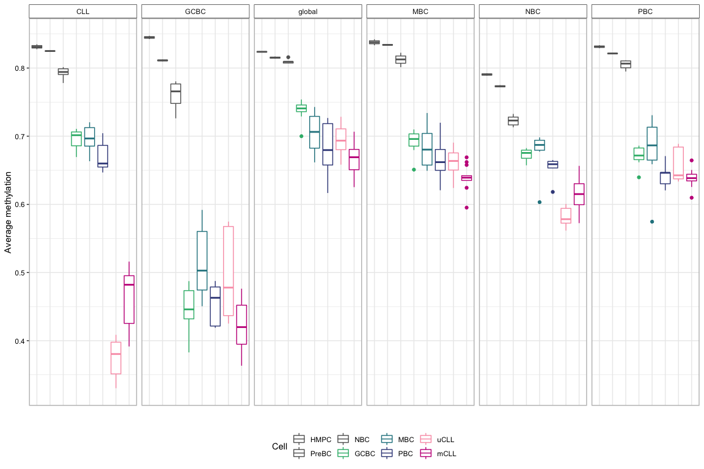<!-- -->

```r
ggsave(filename=paste("../plot/CLL_manuscript/avg_meth_celltype_enhancers.pdf"), width = 16, height = 10, units = "cm", device = 'pdf')
```

## cemt survival


```r
x = read_tsv("../data/cll_manuscript/H3K27ac_CLL_enriched_over_others_dname.tsv")
x = x %>% na.omit() %>% select(-starts_with("CLL_30")) %>% select(-contains("small")) %>% select(-contains("large")) 
colnames(x) <- gsub('.bed.combine.5mC.CpG.dname', '', colnames(x))

anno = data.frame(IGHV = c("1", "1", "0", "1", "0", "0",  "1",  "1",  "1", "0", "1", "1"))
rownames(anno) = colnames(x)

# plot.new()
# pdf("../plot/CLL_manuscript/high_low_met_heatmap.pdf", page=1)
pheatmap(x, show_rownames = F, 
         cutree_cols = 2, 
         show_colnames = T, 
         annotation_col = anno)
```

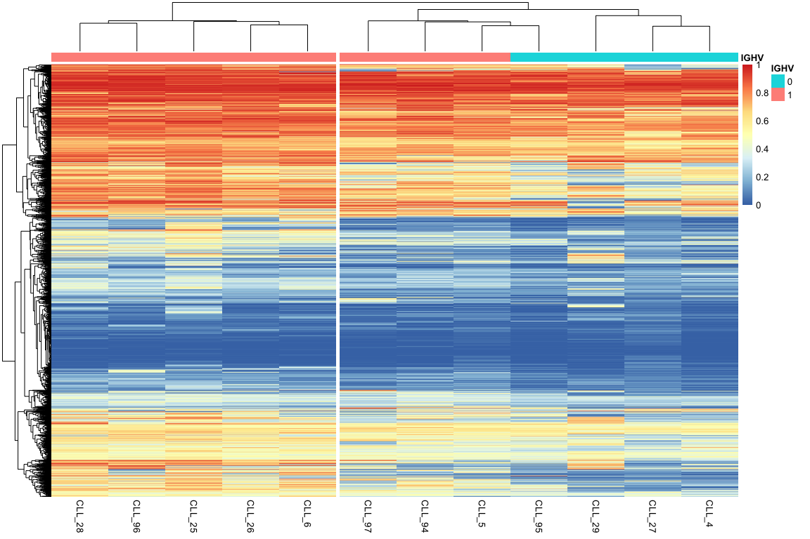<!-- -->

```r
#dev.off()

xm = melt(x)
#xm$variable <- gsub('.bed.combine.5mC.CpG.dname', '', xm$variable)

xm %>% group_by(variable) %>%
  summarise(m = mean(value)) %>% arrange(m)
```

```
## # A tibble: 12 x 2
##    variable     m
##    <fct>    <dbl>
##  1 CLL_27   0.333
##  2 CLL_4    0.348
##  3 CLL_95   0.355
##  4 CLL_29   0.378
##  5 CLL_97   0.399
##  6 CLL_5    0.406
##  7 CLL_94   0.418
##  8 CLL_26   0.459
##  9 CLL_6    0.466
## 10 CLL_96   0.477
## 11 CLL_28   0.494
## 12 CLL_25   0.519
```

```r
#high: cemt-96,26,6,25,28; low: 97,94,5,95,29,27,4 #30 is outlier

high = c("CLL_96", "CLL_26", "CLL_6", "CLL_25", "CLL_28")

xm$type <- ifelse(xm$variable %in% high, "High", "Low") 

ggplot(xm, aes(type, value, color = type)) +
  geom_boxplot() +
  #geom_jitter()
  ylab("Methylation") +
  xlab("") +
  scale_color_manual(values = c("red", "blue")) +
  theme(panel.background = element_rect(fill = "white"),
        panel.border = element_rect(fill = NA, colour = "gray", size = 1),
        strip.background =element_rect(fill="white"),
        axis.text = element_text(color = "black"),
        legend.position = "bottom")
```

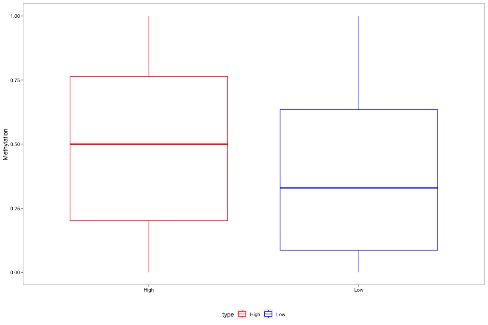<!-- -->

```r
ggsave(filename=paste("../plot/CLL_manuscript/high_low_met.pdf"), width = 12, height = 16, units = "cm", device = 'pdf')

t = xm %>% filter(type == "High")
t2 = xm %>% filter(type == "Low")

t.test(t$value, t2$value)
```

```
## 
## 	Welch Two Sample t-test
## 
## data:  t$value and t2$value
## t = 29.79, df = 27274, p-value < 2.2e-16
## alternative hypothesis: true difference in means is not equal to 0
## 95 percent confidence interval:
##  0.09954772 0.11356985
## sample estimates:
## mean of x mean of y 
## 0.4832410 0.3766822
```

```r
library(survival)
library(survminer)
#library(lubridate)

x = read.xls("../data/cll_manuscript/2016.02.23_qCEMT_patient_sample_info_Joseph_Connors.xls")
os = x %>% filter(Enh_met != "") %>% filter(!grepl("CEMT_30", StudySubCode)) # cemt_30 has 12.99 years of survival and possibly an outlier

os %>% select(Progression.free.survival..y., treatment_at_epi,Condition.during.Epi, CAUSE_DEATH_binary, DTDX, DTepigen, DTFUP, Enh_met)
```

```
##    Progression.free.survival..y. treatment_at_epi Condition.during.Epi
## 1                      2.6064339                0         No treatment
## 2                      8.8925390                0         No treatment
## 3                      5.8672142                0       In observation
## 4                     12.9746752                1         In treatment
## 5                      0.5557837                1         In treatment
## 6                      4.1615334                1         In treatment
## 7                      3.7070498                1         In treatment
## 8                      7.6194386                0       In observation
## 9                      3.2470911                1         In treatment
## 10                     7.7344284                1         In treatment
## 11                     0.3203285                1         In treatment
## 12                     4.9746747                0         No treatment
##    CAUSE_DEATH_binary       DTDX   DTepigen      DTFUP Enh_met
## 1                   0 2012-09-06 2012-11-01 2015-12-01    High
## 2                   0 2006-08-16 2012-11-22 2016-02-23    High
## 3                   0 2007-02-14 2012-12-03 2015-10-01     Low
## 4                   0 1999-07-01 2013-01-07 2015-12-02    High
## 5                   1 2010-08-12 2013-01-07 2014-06-16     Low
## 6                   0 2005-03-09 2012-07-16 2016-02-09     Low
## 7                   1 1995-07-10 2012-07-16 2013-10-31     Low
## 8                   0 2004-12-30 2012-07-30 2016-02-26    High
## 9                   0 2012-02-12 2015-06-02 2016-02-23     Low
## 10                  0 2005-03-08 2015-06-02 2016-02-12     Low
## 11                  0 2015-04-10 2015-07-30 2016-02-23    High
## 12                  0 2011-02-07 2015-08-20 2016-01-29     Low
```

```r
# Progression-free survival (PFS) is "the length of time during and after the treatment of a disease, such as cancer, that a patient lives with the disease but it does not get worse". Here treatment is used as "event". 
fit <- survfit(Surv(Progression.free.survival..y., treatment_at_epi) ~ Enh_met, data = os)
#fit <- survfit(Surv(Progression.free.survival..y., CAUSE_DEATH_binary) ~ Enh_met, data = os)

#calculate p-value
surv_pvalue(
  fit,
  data = NULL,
  method = "FH_p=1_q=1",
  test.for.trend = FALSE,
  combine = FALSE
)
```

```
##   variable   pval                        method  pval.txt
## 1  Enh_met 0.0426 Fleming-Harrington (p=1, q=1) p = 0.043
```

```r
ggsurvplot(fit,
          pval = F, conf.int = F,
          risk.table = F, # Add risk table
          risk.table.col = "strata", # Change risk table color by groups
          #linetype = "strata", # Change line type by groups
          #surv.median.line = "hv", # Specify median survival
          ggtheme = theme_bw(), # Change ggplot2 theme
          palette = c("red", "blue"))
```

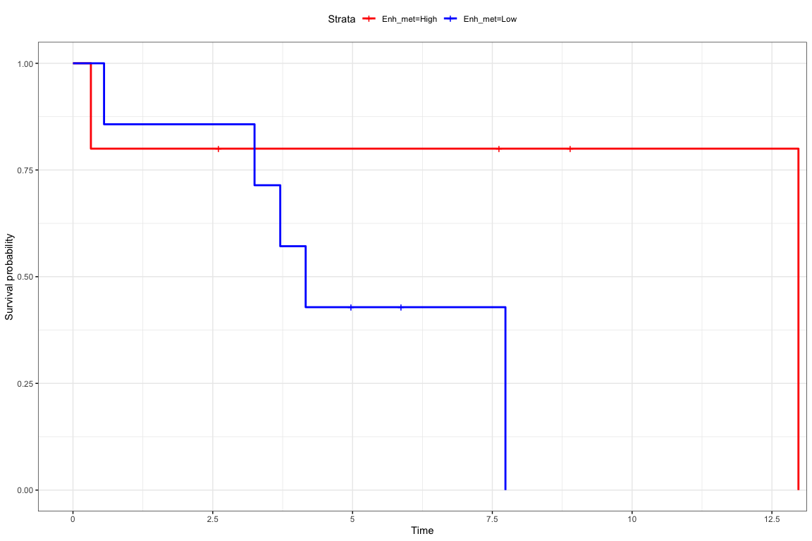<!-- -->

```r
ggsave(filename=paste("../plot/CLL_manuscript/cemt_ggsurvplot_v2.pdf"), width = 16, height = 12, units = "cm", device = 'pdf')

# expression
k = read.table("../data/table_EGA_CEMT.txt", head = T)
gene = read.table("../data/hg38v79/hg38v79_genes", header = T)[,c(1,7)]
k2 = left_join(gene, k,  by = c( "stable_id" = "ENSG")) %>% na.omit() %>% select(-stable_id) %>%
  select(starts_with("CLL_") | starts_with("display_label"))
xm = melt(k2)

high = c("CLL_96", "CLL_26", "CLL_6", "CLL_25", "CLL_28")
low = c("CLL_97", "CLL_94", "CLL_5", "CLL_95", "CLL_29", "CLL_27", "CLL_4")

xm$type <- ifelse(xm$variable %in% high, "high", 
                          ifelse(xm$variable %in% low, "low", "nothing")) 
xm2 = xm %>% filter(type != "nothing")

xm2 %>% 
  filter(display_label == "NFATC1") %>%
  ggplot(aes(type, value)) +
  geom_boxplot() +
  geom_jitter()
```

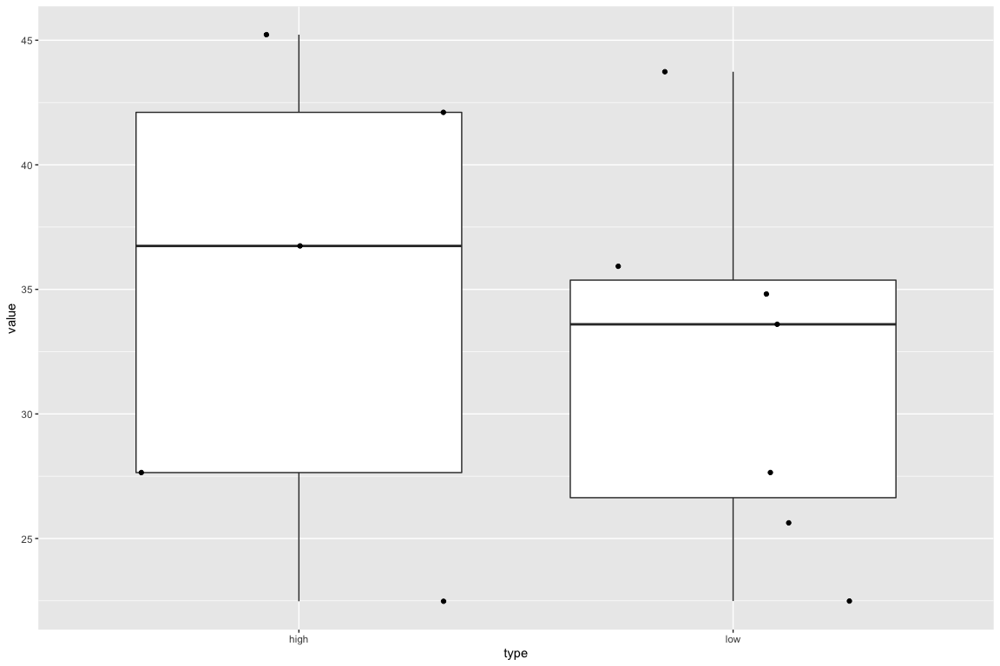<!-- -->

